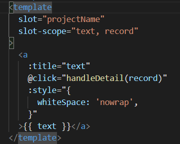
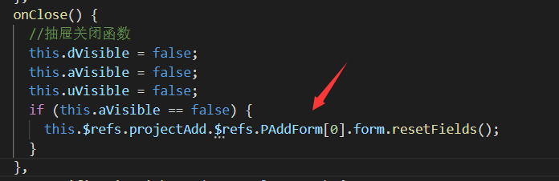
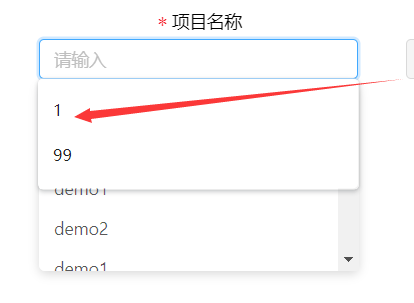
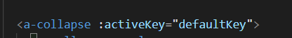

# 说明

本文档记录的都是开发过程中觉得有必要记录下来的知识点

重复搬砖的、过于简单的活就没必要记录了


# 刚用antd不久

1、接收前端项目文件，记得如果有node包，先删除。否则直接`npm i`可能会出问题

2、升级组件等`node`依赖项，记得要删掉node包和 lock文件，再安装

3、后端要求仅仅右侧内容区域有滚动条，菜单栏不能有：

解决方案：写一个全局样式


4、后端说表格的标题有的会竖向排列，很难看

解决方案：设置表格`columns`的固定宽度，使得标题排列不会随窗口大小变化而变化


5、要求把滚动条放在最下方


解决方案：暂时想不到完美粘贴在底部的方案【后面已完美解决】，改成动态获取右侧区域的高度，并把这个宽度赋值给表格的高度：


然后在挂载时、路由切换时调用

知识点：有时候`$nextTick`不管用，可以试试用延时函数替代，并且设置延时为0，原理是等待同步函数结束之后才执行


6、`ant-design-vue`组件库的表格知识点：


`columns`表示的是列项：


`dataSource`表示的是数据源，键名与`columns`中的`dataIndex`对应


如果有某列是特殊的，例如不放数值或字符串，要放个图标或者链接什么的，要在`columns`中的这一列配置中写入

`scopedSlots: { customRender: "operation" }`

这里的`operation`不是`dataIndex`，而是专属的`slot`名称；然后在表格里面写入`template`即可：


这里的`slot-scope`的值可以写三个：参数分别为当前行的值，当前行数据，行索引。


例如这里点击这个名称，当前行的值就是名称，行数据就是整行的数据

但是某列的值是个图标时，就没有所谓的当前行的值，等于`null`

7、上面那个滚动条固定的需求，似乎有了比较好的替代方法：


这个属性的作用是固定头和列，但是要给列指定宽度，否则可能会出现不对齐的情况


8、发现项目名称换不了行


我以为要给整个表格设置样式，但其实这是特殊列，是可以直接定义样式的



把`nowrap`删掉就能自动换行了


9、我想把全局样式换成`scss`，下面是过程：

我先是直接安装了`node-sass和sass-loader`，没有指定版本，便默认安装了最新的版本。报错提示查资料说是要升级node版本，我便升级了`node`版本到16，然后npm的版本是8，太高了；7.X以上的版本对安装会比以往更严格，导致安装sass失败。降低npm的版本也还会有新的问题，那干脆直接安装`nvm`来切换`node`版本：https://github.com/coreybutler/nvm-windows/releases

用法：

`nvm ls available`查看可下载的`node`版本

`nvm ls`已安装的版本

`nvm install [版本号]`安装版本

`nvm uninstall [版本号]`删除版本

`nvm use [版本号] ` 切换版本

然后指定`node-sass`为4.x，`sass-loader`为7.x即可

`npm install node-sass@4.14.1 --save-dev`安装和卸载时，均出现了提示没有权限的原因，结果重启了编译器居然好了。。


10、给OA办公系统做了分辨率自适应效果，解决方案是安装

还有`post-loader`

配置：


然后在`main,js`引入这个`rem.js`就好了

如果想针对某个地方不想让它转为rem的话，在这里写：


# 22.3.17

今天需求方给出了需求表，提出了很多需求

1、以下这个表格`item`放的是一个输入框，`label-col` 指的是文字部分的宽度；`wrapper-col`指的是输入框部分的宽度，加起来一共24；其实这个`item`就相当于一个格栅布局了


2、人员下拉列表太长了，ant design官网找不到自带的控制下拉菜单高度的属性，于是：


但是这样也会影响到其他短菜单，造成没有多少项，依旧会显示滚动条的难看效果

解决方案：


3、`a-input`双向绑定好像没用？暂时用这种写法：（后面发现是v-decorator和v-model不能同时写）


4、前端提交代码逻辑：通过表格的验证方法的第二个参数，拿到表格数据；表格数据的识别是靠`a-form-item`里面的`v-decorator`的第一个值指定的：


5、`bindInput`多态写法：每个下拉菜单选择之后，把选择的这个`a-form-item`对应的键值对传给这个方法；

注意这个`setFieldsValue`里面的“键”要用方括号括起来


# 22.3.18

1、需求：动态调整必填项


解决：`required`被变量赋值

然后重点在于：


2、发现新增窗口中的表单，在关闭之后数据还会存在的问题

结构层次是这样的：

```
<project-list>
      <project-add>
          <p-add-form>
          </p-add-form>
      </project-add>
</project-list>
```

`<a-modal>`写在了`<project-list>`，我想在这个组件的关闭回调函数上写入重置表单功能，解决办法：



还有种方法简便一点，不过性能会差点，因为这种写法是销毁销毁 `Modal` 里的子元素，所以每打开一次都会重新渲染一遍：


3、`a-input-number`计算总金额的功能，要放在`nextTick`里面，否则结果会是上次更新的结果


4、数字输入框的`defaultValue`没有用，因为：


于是：


还有一种思路可以解决：


# 22.3.21

1、实现一个下拉框的禁用，不是写在`input`属性上面，而是下拉框属性上面：


2、修复了点击新增窗口中的新增条目，再删除中间的条目时，会出现页面卡死的BUG；并且也由于这个BUG，会导致点击提交条目的时候，即时目前有3个条目需要提交，但结果提交的都是最后一条条目的BUG

并且这个添加条目以及删除的逻辑功能也没写好


解决代码：


`index`属性是我自定义的，用来实现：新增条目时，所新增的条目数应该是当前条目数目最大再+1的功能


3、有个很恶心的地方：


刚接手项目时我就发现这个东西了，明明这东西什么用都没有，现在出于美观原因，想把他去掉

然后查看代码：发现好像没什么毛病，因为默认数据就写了一个条目，但它就是会出现这么一个关闭按钮

再经过一番细心摸索排查最终发现：原来它这个提交按钮写在了`<a-tabs>`里面，结果被当成一个`pane`处理了，妈的= =

把它移出去就好了


4、这段代码的意义是什么？很迷惑；而且这样会导致每个条目都会单独发起一次`post`请求，并不是把条目集中到一起组成一个对象数组再`post`


每个条目都会单独`post`的原因：每个条目都是一个单独的`form`，也就是各自都会有一个**同名**的`submitAll`绑定到了全局事件总线上，所以点击提交的时候，会把所有`form`的`submitAll`函数都给执行一遍= =


改正写法：把上面那段意义不明的注释掉，然后：


# 22.3.22

1、发现翻页功能的代码只传递了页数和大小，没有传搜索参数，现在给它加上去，结果如何还要等后端测试


2、详情查看窗口，我直接用了新增窗口的代码，改了一下标题，然后把输入框全都禁用了；至于输入框里面的值，则是通过

点击某一行获取数据：


然后就是传值：


然后`PDeatailForm`再直接取值


就是爷爷传儿子，儿子传孙子；因为刚好只有三代人，所以就不用`$attrs`了


# 22.3.23

1、

**实现动态增减表单项**

思路：`v-for`循环`<a-row>`

循环的来源就是定义好的数组，数组最少有一组记录；`v-decorator`的注册记录用了数组的键值

注意这个`v-for`的`key`不能用循环的下标，否则删除表单项的时候会出现表单项后面所有的项的值，都被清空了的情况。这是因为diff算法对比虚拟DOM的原理，发现原来的`key`和现在对比的不一样，vue便以为这是新的元素，便直接新建一个真实DOM元素了，所以输入框中的值自然就被清空了

所以便在`list`数组里面加了一个`id`来替代常用的下标索引：


`index`的作用就是唯一标识每个`form-item`，即每个表单项：


删除和添加按钮功能的实现，就是一直增加这两个属性；其实我一开始想的肯定是增加就+，删除就-

但是后面发现会出现**撞车**现象：本来有个`projectName1`了，但是我经过增减操作，可以又创个`projectName1`出来，导致了新添加记录会出现值自动的被赋予和上个表单项一样的值的情况；为了解决这个BUG，改成一直+就好了


这种`input`自带的：如果点击提交过，它就会自带保存这个建议，并且在你下次输入的时候自动弹出这个建议出来，但是这样就会两个建议选择框同时弹出来了，而我想要的是百度搜索框那种效果；

解决：`<input>`自带的`autocomplete`设置为`off`就好了，这个属性只要是个`input`都会有的，不关UI组件库的事




最后的数据整合传给后端，我想整理成：

```
{
订单基本信息..
..
children:
[
	{
		订单分解到具体项目..
	},
	{
		订单分解到具体项目..
	}
]

}
```


这样的话我要分成两个`form`会比较好处理一点：


接下来是两个表单的校验：


不要忘了绑定第二个表单：


2、先取消新增订单窗口的+号，日后有需求再开发


# 22.3.24

1、这里我想按照**数组中下标索引的方式**拿到这个对象里面的某个`key`或者`value`，方法如下：


**注意**：这里我按照下标取值的话，意味着以后我要按照后端传值过来的形式看清每个属性对应的下标，再更改代码

2、订单表的新增和更新，`pmProjectDOList.projectChildren`这个数组里存放的是对象，每个对象都是一个订单分解到具体项目的数据，而我现在必须要在这个对象里面加一个字段：id，用于我在前端代码里面开发新增和更新功能

3、发现的一个BUG：重复打开和关闭订单表的新增和更新窗口，会导致多次表单验证的现象；后来发现是因为每一个`form`的`created`里面都会往全局事件总线上绑定一个函数，但没有在`beforeDestory`里面解绑，所以多次打开就多次绑定= =

4、订单表的编辑功能：我用了两个`list`来存储，一个专门存储已有的，一个存储新增的


这么设计的原因是因为，已有的对象形式是这样的：


而新增的形式是这样的：


这就导致了一个前面的数据绑定必须这么写：


而后面的形式还是按照新增表单老样子写法：


因为`v-decorator`的第一个值存放的是`form-item`的注册信息，是一个字符串；到后面的表单验证、`post`请求都要用到这个字符串，而这个字符串是动态变化的，所以分成两种设计来比较方便开发；可能是比较啰嗦了点，但是好使


# 22.3.26

1、循环遍历一个对象的值并修改


# 22.3.27

1、


2、在某输入框的change事件上绑定了一个函数，在这个函数中我` console.log(this.form.getFieldValue("这个输入框"))`的值

这时候会发现输出的值永远都会**慢一步**，也就是输出的值永远都是上一次输入框变化的值，而不是最新的。这是因为change事件的优先级比较高，这个事件执行完了，输入框的值才会更新出来

解决办法：写在`$nextTick`里面就行了


# 22.3.28

1、	要求对这个表格进行修改和删除，但是删除的方式是前端把金额设置为0传给后端，并不是真正意义上的删除


然后我一般删除是用`filter`过滤掉要删除的记录，这时候因为记录是放在数组里面存放的；数组里面少了记录，那么因为这个动态表格也是以这个数组为数据源的，循环出来的表单项自然会相应减少；

这时候如果还想用UI库表格的`getFieldsValue`就会被删除的数据都是`undefined`，因为连表单项都没了，DOM元素都没了自然查不到

解决办法：


意思就是拿另外一个数组，里面放的是被删除的记录；最后拿`getFieldsValue`查到的数据，加上这个数组push在一起提交就好了

# 22.3.29

1、解决了用后台API开发时发现URL地址没有路由信息，以及刷新页面会跳转到首页的问题


因为后台没有只传了username，其他四个参数没有，所以不符合路由。这也就是为什么URL没有路由信息的原因


所以刷新会跳回到首页：


2、ant design 的模态框

嵌套使用的话，第二个对话框的取消函数名，不能叫`onClose`；我也不知道为什么；否则第二个对话框会出现关不掉的情况

（这个BUG费了好几个小时才排查出来）


3、**setFieldsValue方法动态变量赋值**（重点在于别忘了方括号）


# 22.3.30

1、日期初始化


2、**ant design 中所有用`v-decorator`注册的表格项，如果要赋值的话，都应该用这种方式赋值，或者组件初始化时用`setFieldsValue`也行**


# 22.3.31

1、以前就发现了表单中有的输入框会很卡，但是当时没时间理，能用就行；现在有时间了，查了一下发现就是和其他`item`关联太多了，例如很多输入框的值都会根据这个输入框的值变化而变化，这样就会很卡；

还有就是不要把太多数据存到前端数据里面，例如前端调接口获取一个长度为600的数组，如果存下来的话肯定会很卡


但是发现还有个神奇的属性：


这可以完美解决卡顿的情况，并且目前没有发现有什么坏处

# 22.4.4

1、到款表的更新实际复杂度比想象中的要复杂，因为要每个到款表的主表和明细表都分别支持更新操作

意味着每个到款表都有两个`form`，所以这回是动态生成一整个`form`：

**（后面回过头来看，当时这里思路是错误的，其实整个组件只用一个`form`就可以了，因为每个表单项注册的名字都是名称+id的组合，这就决定了表单校验的时候其实是可以精确的选到某些表单项的。并且因为当时习惯性的去以为表单校验只能对整个form进行校验，忽略了其实是可以单独对一些表单项进行校验的:**

**)**


2、上面那个思路不知道为什么在`<a-form>`中提示期望一个对象却得到一个数组，改用：


3、循环数据源这么写不知道为什么不对


改成


4、默认展开所有折叠面板：定义一个数组




5、付款阶段：更新过程中如果想提交的是空的，应该传空字符串，而不是传null，这应该是后端设计的

6、明细表初始化：会发现明细乱套的现象，这是因为这种写法不一定能保证请求顺序一定跟预先设定的一样

因为forEach是同步方法


改成for..of循环就可以了


此时已经能保证按顺序执行了


# 22.4.6

1、解决了每个表格不能单独完美控制高度的难题；可以做到自适应分辨率效果，任何屏幕都不会出现网页下拉滚动条了，只有表格的滚动条


解决方案：

2、或者单独控制样式：  `/deep/`或者`>>>`都可以


3、到款表和完工表要重构成表格的形式：大致demo为可展开的嵌套子表格：


3、现在我想的事就是：有两个表格，是嵌套关系，我想让外面的表格`min-height: 14rem`，让里面的表格`min-height: 0rem;`


解决方案：给里面的表格加个类名`son`


4、额外的这一行，用的foot插槽


# 22.4.8

1、监控表中发现这里不会随着分辨率的变化而成比例变化，原因是因为当时写的宽度不是rem，而是px；改过来就好了


# 22.4.11

1、要实现页面标签化：


实现思路：利用`keep alive`动态绑定一个数组，数组里面就是标签页


# 22.4.13

1、发现blur事件的优先级高于click事件，而我想想让它反过来；把click换成mousedown.native 就好

2、【动态改变表单项的required注意】项目中的表单，如果有多个输入框，用户可以在下拉框中设置哪些是必填、哪些是选填的话，这种业务情景下记得加上这个参数，意思上对校验过的表单进行再次校验；如果不开启的话，会发生某些字段是必填的，但用户即时不填也能通过校验的BUG


# 22.4.20

把`<a-dropdown>`里面的输入框改成输入框改成按钮式的效果：

1、点击才触发下拉菜单

2、输入框禁止输入（原理是聚焦就立马移除焦点）、指针改为pointer

# 22.4.22（最心累的）

**这两个BUG总共耗了我一天半时间**

1、**v-for中已经循环渲染好了的东西，如果你想在一些方法中更新其中的数据，需要强制更新` this.$forceUpdate()`，否则不会主动更新**

2、问题是这样的：这里我想通过点击来切换表格中的输入框，但是我发现页面不会重新渲染


解决方案：因为问题出现在嵌套子表格里面，所以要给子表格的dataSource重新赋值，让`<a-table>`检测到数据源变动了，它才会重新渲染，并且一定要是新地址的数据源，，直接写`var temp=item.detailList[0]`是没用的


# 22.4.25

1、奇怪的一个BUG：上线之后有时候会加载不出来，即时这个时候网络请求也已经完成了


原先是这么写的：


后来觉得应该跟我之前那个视图不重新渲染的原理一样，得给整个dataSource重新赋值才会触发视图更新，发现果然没错：


这样问题就解决了

2、发现前端打包越来越大，把这东西关了，打包大小从27MB变成1.2MB，牛逼


# 22.4.27

1、在服务器上更新网站的图片内容时，打开网页发现还是原来的照片，这是因为url没变，浏览器便以为图片内容没变，于是便用的浏览器缓存。

解决方案：图片url代码加个随机参数就好：


# 22.5.6

1、我发现这个弹窗的位置不是处于浏览器可视窗口的中间位置，并且这个弹窗太长了的话，会造成整个窗口处于中下的位置，现在要把它调往上一点，一开始想的是`transform: translate`，但是发现这么写会有一个打开瞬间还是老样子，得大概半秒钟才会往上移动的延迟效果。

改成`top: xxrem`就不会有这种延迟移动的效果了


# 22.5.13

1、这几天做的改动比较大的主要需求是表格由可展开的嵌套子表格改为这种形式


详情页面和编辑页面都要这种形式，那么详情和编辑的代码写法就有点不同，首先基本思路是：如上图所示其实共有7行数据，这种前三行数据同属于一行数据的效果其实是把这个共同数据放在**第一行**数据里面，然后设置这个共同数据的每一列的`rowSpan`属性为子项目的个数之和，而其他行的`rowSpan`直接设置为0，就可以隐藏掉，从而实现这种同属于一行数据的效果

​																				**这个共同数据存在第一行项目数据里面**


详情页面实现代码：


value、row、index分别代表：当前行当前列的数据；当前行的数据；当前行的下标

row中的num和length是我在获取数据方法中自行加进去的属性，length作用在于判断这个订单下有多少个项目，算出这个length来计算rowSpan到底应该为多少行。num作用在于判断当前行数据是不是这个订单的第一个项目，是的话才显示这些项目的共同数据，否则直接隐藏

编辑页面实现代码：


**上面的`className`写错了，应该是直接写`class`**

注意：`customRender`和`scopedSlots`是不能共存的，这意味着编辑页面的模板代码得从`scopedSlots`中迁移到`customRender`的`children`中，在这里面要遵循`JSX`语法，这个语法有很多细节

例如原本的`@click="demo"`要写成` onClick={() => this.demo()}`，`@change`也同理

又例如这个语法是不能写v-for的，原本的代码：


要改成：


诸如此类语法细节百度即可

2、表格列固定，刚打开页面是正常的，但是发现如果使得某一行的高度发生变化，例如这个多选框选多一点数据，那么这个固定列每一行的高度并不会随之变化


查看DOM元素：


发现这个固定列每一行都会有个行内样式的固定宽度，这个宽度应该是组件在初始化时候根据每一行的高度自动计算的，但是为什么当某一行的高度发生变化后不会自动重新计算呢？当时第一次发现这个问题，去官网看下了文档、逛了下CDSN什么的，说的都是指定固定列宽度、指定rowKey什么的，都不管用，最后又回到起点想了下：既然查看DOM元素时这个固定列每一行都是有行内样式指定高度的，说明它能够自动计算当前行的高度，既然初始化时能计算，那为什么我主动改变当前行高度不能自动计算？想到这里发现可能又是视图没有重新渲染的原因，于是在付款阶段这个输入框写个`onChange`绑定个方法，写上`forceUpdate`，果然问题解决了


