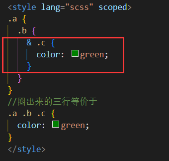
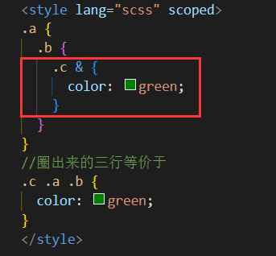
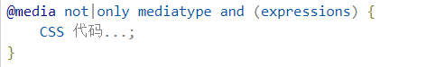
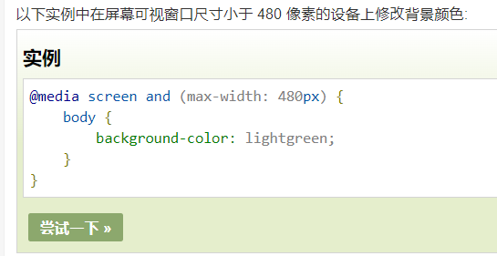
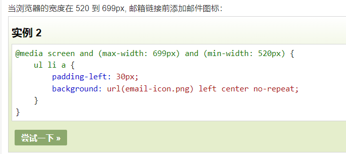

# 选择器

p{ }: 为所有 p 元素指定一个样式。
.marked{ }: 为所有 class="marked" 的元素指定一个样式。
.marked p{ }: 为所有 class="marked" 元素内的 p 元素指定一个样式。
p.marked{ }: 为所有 class="marked" 的 p 元素指定一个样式。

后代选择器（以空格为分隔）：div p，它后代都能生效
子元素选择器（以`>`分隔）：div>p，只要是它的子元素，都能生效；孙子及再往后的后代不能生效
相邻兄弟选择器（以`+`分隔）：div+p，第一个兄弟生效
普通兄弟选择器（以`~`分隔）：div~p，后续所有兄弟生效

**父选择器`&`（less或sass等预处理器支持）**

`&`代表了所有父元素，用法举例：

解析：`&`代表所有父选择器（也就是包含嵌套关系），所以`.c &`等于`.c .a .b`

这可以简便很多写法，例如：

```CSS
::v-deep .A {
  color: red;
}
::v-deep .B {
  color: blue;
}
::v-deep .C {
  color: yellow;
}
```

可以简便成：

```CSS
::v-deep {
  & .A {
  color: red;
  }
  & .B {
  color: blue;
  }
  & .C {
  color: yellow;
  }
}
```

更简洁、一目了然

**属性选择器**

```CSS
/* 存在 title 属性的<a> 元素 */
a[title] {
  color: red;
}
/*以下类推*/
/* 存在 href 属性并且属性值匹配"https://example.org"的<a> 元素 */
a[href="https://example.org"]
/* 存在 href 属性并且属性值包含"example"的<a> 元素 */
a[href*="example"] 
/* 存在 href 属性并且属性值结尾是".org"的<a> 元素 */
a[href$=".org"] 
/* 存在 id 属性并且属性值开头是"Jack"的<a> 元素 */
a[id^="Jack"] 
/* 存在 class 属性并且属性值包含以空格分隔的"logo"的<a>元素 */
a[class~="logo"] 
```


# 弹性盒子(flex)

## 概念

弹性容器通过设置 display 属性的值为 flex 或 inline-flex将其定义为弹性容器。
弹性容器外及弹性子元素内是正常渲染的。弹性盒子只定义了弹性子元素如何在弹性容器内布局。
弹性子元素通常在弹性盒子内一行显示。默认情况每个容器只有一行。

## 属性

**flex-direction** 

指定了弹性子元素在父容器中的位置，值有:
row：横向从左到右排列（左对齐），默认的排列方式。
row-reverse：反转横向排列（右对齐，从后往前排，最后一项排在最前面。
column：纵向排列。
column-reverse：反转纵向排列，从后往前排，最后一项排在最上面。

**justify-content**（横轴对齐）： 

flex-start | flex-end | center | space-between | space-around

**align-items**（竖轴对齐，写在弹性盒子上）：

 flex-start | flex-end | center | baseline | stretch
**align-self**（竖轴对齐，写在弹性子元素上）

auto | flex-start | flex-end | center | baseline | stretch

**flex-wrap**（换行方式）： 

nowrap | wrap | wrap-reverse | initial | inherit
nowrap - 默认， 弹性容器为单行。该情况下弹性子项可能会溢出容器。
wrap - 弹性容器为多行。该情况下弹性子项溢出的部分会被放置到新行，子项内部会发生断行
wrap-reverse -反转 wrap 排列。

**align-content**（设置弹性盒子内各行对齐方式）：

flex-start | flex-end | center | space-between | space-around | stretch
stretch - 默认。各行将会伸展以占用剩余的空间。
flex-start - 各行向弹性盒容器的起始位置堆叠。
flex-end - 各行向弹性盒容器的结束位置堆叠。
center -各行向弹性盒容器的中间位置堆叠。
space-between -各行在弹性盒容器中平均分布。
space-around - 各行在弹性盒容器中平均分布，两端保留子元素与子元素之间间距大小的一半。

# 动画

```CSS
.changeColor {
  //动画名，变化时长
  animation: changeColor 3s;
}
@keyframes changeColor {
  from {
    color: blue;
  }
  to {
    color: yellow;
  }
  //也可以精确到进度百分比
  // 0% {
  //   color: blue;
  // }
  // 73% {
  //   color: green;
  // }
  // 100% {
  //   color: yellow;
  // }
}
```

# 多媒体查询

@media多媒体查询，这个很有用，可以做到页面自适应显示效果

基本格式：



**案例：**





# 预处理语言

## Less

Less笔记最好用的其实就是它的官网https://less.bootcss.com/

### 变量

使用@作为变量标识

```CSS
@width: 10px;
@height: @width + 10px;

#header {
  width: @width;
  height: @height;
}
```


###  @规则嵌套和冒泡

```CSS
.component {
  width: 300px;//这一行开始往父级冒泡，得到【1】
  @media (min-width: 768px) {
    width: 600px;  //这一行开始往父级冒泡，得到【2】
    @media  (min-resolution: 192dpi) {
      background-image: url(/img/retina2x.png);//这一行开始往父级冒泡，得到【3】
    }
  }
  @media (min-width: 1280px) {
    width: 800px;//这一行开始往父级冒泡，得到【4】;如果有相同内容将取代父级的内容
  }
}
```

编译为：

```CSS
//【1】
.component {
  width: 300px;
}
//【2】
@media (min-width: 768px) {
  .component {
    width: 600px;
  }
}
//【3】
@media (min-width: 768px) and (min-resolution: 192dpi) {
  .component {
    background-image: url(/img/retina2x.png);
  }
}

//【4】
@media (min-width: 1280px) {
  .component {
    width: 800px;
  }
}
```

## Sass

安装：`npm i sass sass-loader -D`（sass有很多发行版本，`node-sass`已被弃用，`dart-sass`最为被推荐）

- dart-sass 和 node-sass都是用来将sass编译成css的工具，所以都依赖sass-loader。但node-sass 与 node.js 版本相关联，这就导致，一旦本地 node.js 升级，就会出现 node-sass 无法工作的情况
- npm 上的 dart-sass 包已被弃用，直接更名为 sass
- dart-sass 不支持`/deep/`，要改成`::v-deep`

**sass**和html一样**有严格的缩进风格**，和css编写规范有着很大的出入，是**不使用花括号和分号的**

而scss**需要使用**分号和花括号而不是换行和缩进

```
sass和scss其实是一样的css预处理语言，SCSS 是 Sass 3 引入新的语法，其后缀名是分别为 .sass和.scss两种。
SASS版本3.0之前的后缀名为.sass，而版本3.0之后的后缀名.scss。
```

推荐：`<style lang="scss">`

### 变量

使用**$**作为变量标识

```CSS
$highlight-color: #F90;
```

用中划线声明的变量可以使用下划线的方式引用：

```CSS
$link-color: blue;
a {
  color: $link_color;
}
```

### 混合器

**作用：减少重复性**

定义这么一句样式，现有明确需求：它会在以后被大量重复使用

```CSS
//rounded-corners是我们给这一段样式自定义的名字
@mixin rounded-corners {
  border-radius: 5px;
}
```

以后想在哪里用，直接 @include [自定义的名字]  就好**（sass的混合比Less要啰嗦，因为Less加个括号就行了）**

```CSS
notice {
  background-color: green;
  border: 2px solid #00aa00;
  @include rounded-corners;
}
```

### 继承

**作用：减少重复性**。

和混合器一个效果

```CSS
.error {
  border: 1px solid red;
  background-color: #fdd;
}
.seriousError {
  @extend .error;
  border-width: 3px;
}
```

