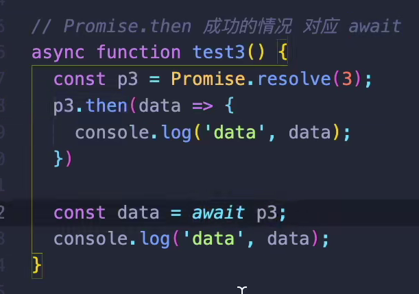
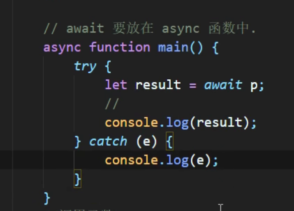
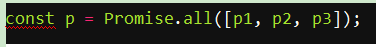
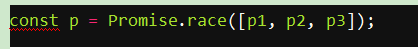
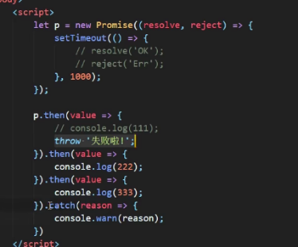
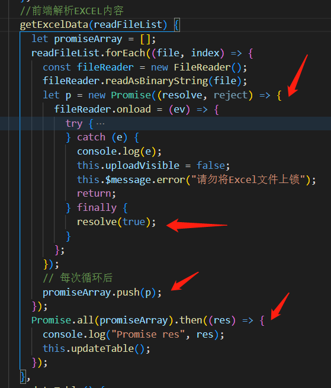
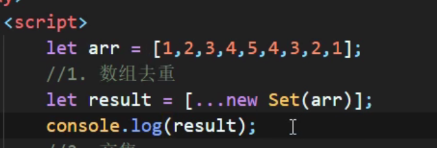

ES6 之前 JavaScript 没有块级作用域,只有全局作用域和函数作用域

let 是块级作用域，ES6 推荐在函数中使用 let 定义变量，而非 var：var可以重复命名，let不能

let 关键词声明的变量不具备变量提升（hoisting）特性

允许给函数形参赋初始值

 

const定义常量，一定要赋初始值，一般用大写，也是块级作用域

对用const定义的数组和对象的元素修改是可以的，但直接对数组和对象修改不行，故一般都用const定义数组和对象

箭头函数的this是静态的，即使用call也改变不了；不能作为构造实例化对象；函数内部不能用arguments变量

call()、apply()、bind() 都是用来重定义 this 这个对象的

arguments是类数组对象，arguments对象是所有（非箭头）函数中都可用的局部变量。你可以使用arguments对象在函数中引用函数的参数。此对象包含传递给函数的每个参数，第一个参数在索引0处。

ES6中的三个点 ... 有两个名字:rest参数和扩展运算符.

但是rest是放在函数形参，扩展运算符是放在调用的实参

 

For( let v of shuzu)  遍历数组，如果把of改成in就是遍历数组下标了

#  promise

Promise是构造函数，是解决异步任务的方案。构造出来的对象用来封装一个异步操作

支持链式调用，解**决回调地狱**问题

***\*并且为了代码更加具有可读性和可维护性，我们需要将数据请求（构造函数写了）与数据处理（.then方法写了）明确的区分开来，所以promise很重要\****

 

Promise对象代表一个异步操作，有三种状态：pending（进行中）、fulfilled（已成功）和rejected（已失败）

）一旦状态改变，就不会再变，任何时候都可以得到这个结果。Promise对象的状态改变，只有两种可能：从pending变为fulfilled和从pending变为rejected。只要这两种情况发生，状态就凝固了，不会再变了，会一直保持这个结果，这时就称为 resolved（已定型）

 

输出结果一样

Promise成功的情况对应的是await

失败的捕获用try catch 

 

async异步函数，该函数返回值为promise对象。在async函数内调用其他异步函数，不过不用使用then了，可以使用await

Await只能在异步函数中出现

有了这两个语法糖，几乎不再需要使用低层的promise对象，包括调用他们的.then  .catch等等

 

Promise.all()方法用于将多个 Promise 实例，包装成一个新的 Promise 实例。

p的状态由p1、p2、p3决定，分成两种情况。

（1）只有p1、p2、p3的状态都变成fulfilled，p的状态才会变成fulfilled，此时p1、p2、p3的返回值组成一个数组，传递给p的回调函数。

（2）只要p1、p2、p3之中有一个被rejected，p的状态就变成rejected，此时第一个被reject的实例的返回值，会传递给p的回调函数。

Promise.race()方法同样是将多个 Promise 实例，包装成一个新的 Promise 实例。

上面代码中，只要p1、p2、p3之中有一个实例率先改变状态，p的状态就跟着改变。那个率先改变的 Promise 实例的返回值，就传递给p的回调函数。

有时需要将现有对象转为 Promise 对象，Promise.resolve()方法就起到这个作用。

如果参数是 Promise 实例，那么Promise.resolve将不做任何修改、原封不动地返回这个实例。

如果参数是一个原始值，或者是一个不具有then()方法的对象，甚至没有参数，则Promise.resolve()方法返回一个新的 Promise 对象，状态为resolved。

Promise异常穿透：then链式调用，可以在最后指定失败的回调

promise应用场景之一：

forEach函数里面有异步函数，现在我想等待这个循环执行完毕之后，才执行另一个函数，怎么做？

把循环函数里面的异步函数包在promise里面，然后在异步函数里面`resolve(data)`，如果异步函数里面有想要存起来的数据，可以直接写成`resolve`的参数，这样在`Promise.all`的res就是会是一个数组的形式存起来，就得到了循环的最终结果

# set

新的数据结构，set()   类似于数组，特点是成员的值是唯一的，没有重复的

有什么用？举例，数组去重：

 方法有add  has  delete clear size 

set对象转为数组：

const a=Array.from(setObj);

 

 