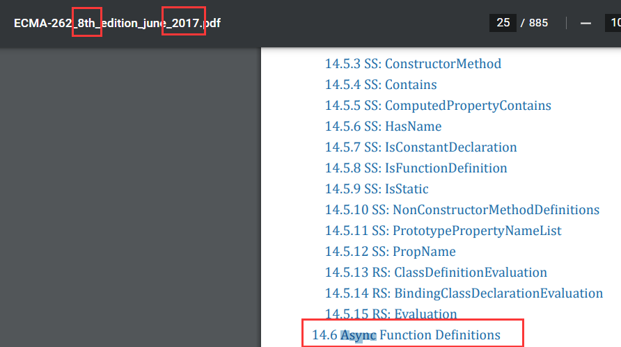
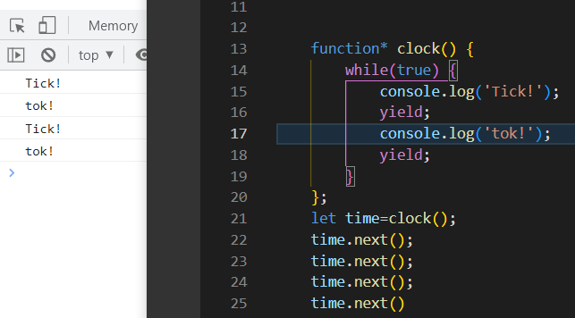

# ECMA介绍

​	ECMA国际组织，全称是Ecma International （以前叫 ECMA - European Computer Manufacturers Association - 欧洲计算机制造商协会）是个行业标准组织，它所通过的标准都是 ECMA-nnn 这样进行编号（**也就是这个组织很牛逼，能写很多行业认可的标准**）

ECMA-262：https://www.ecma-international.org/publications-and-standards/standards/ecma-262/
	由 ECMA 国际组织（Ecma International）负责管理（为了让最初的JavaScript 与最初的 JScript 能遵循同一套标准发展而诞生的 ECMAScript ，**正好排到了**作为 Ecma 的第 262 号标准，**所以262并没有什么特殊含义**）

出于商标版权的原因，规范标准中将这门语言称为 ECMAScript，所以原则上 JavaScript 与 ECMAScript 指的是同一个东西，只不过前者是后者的标准以及版本

​	ECMAScript 版本发展的简要时间线：

•ECMAScript 1（1997 年 6 月）：标准的第一个版本
•ECMAScript 2（1998 年 6 月）：使 ECMA-262 与 ISO 标准保持同步的小更新
•ECMAScript 3（1999 年 12 月）：增加了正则表达式、字符串处理、控制语句（do-while、switch）、异常处理（try-catch）等众多核心特性
•ECMAScript 4（2008 年 7 月废除)：本来是一次大规模升级（静态类型、模块、命名空间等），但跨度过大，出现了分歧，最终没能推广使用
•ECMAScript 5（2009 年 12 月）：一些小的改进，加入一些标准库特性和严格模式
•ECMAScript 5.1（2011 年 6 月）：小更新，使 Ecma 和 ISO 标准保持同步
•ECMAScript 6（2015 年 6 月）：一次大更新，实现了 ECMAScript 4 的许多设想。从这个版本开始按年份命名规范版本 - ECMAScript 2015
•ECMAScript 2016（2016 年 6 月）：第一个年度版本，与 ES6 相比，发布周期较短，新特性也相对少些
•ECMAScript 2017（2017 年 6 月）：第二个年度版本

后续的 ECMAScript 版本（ES2018 等）总是在 6 月获得批准生效。

# ES6+

ES6 之前 JavaScript 没有块级作用域,只有全局作用域和函数作用域

let 是块级作用域，ES6 推荐在函数中使用 let 定义变量，而非 var：var可以重复命名，let不能

let 关键词声明的变量不具备变量提升（hoisting）特性

允许给函数形参赋初始值

 

const定义常量，一定要赋初始值，一般用大写，也是块级作用域

对用const定义的数组和对象的元素修改是可以的，但直接对数组和对象修改不行，故一般都用const定义数组和对象

箭头函数的this是静态的，即使用call也改变不了；不能作为构造实例化对象；函数内部不能用arguments变量

call()、apply()、bind() 都是用来重定义 this 这个对象的

arguments是类数组对象，arguments对象是所有（非箭头）函数中都可用的局部变量。你可以使用arguments对象在函数中引用函数的参数。此对象包含传递给函数的每个参数，第一个参数在索引0处。

ES6中的三个点 ... 有两个名字:rest参数和扩展运算符.

但是rest是放在函数形参，扩展运算符是放在调用的实参

 

For( let v of shuzu)  遍历数组，如果把of改成in就是遍历数组下标了

##  promise


**Promise.all()**多用于某些业务场景需等待异步任务全部成功并结束（**确定所有异步任务都成功**）

**Promise.settled()**多用于某些业务场景需等待异步任务并结束（**全部异步任务结束即可，不管成功与否**）

**Promise.race()**多用于：超过设定的时间，自动执行某方法（**类似赛跑，哪个promise实例的状态先改变就会变成哪个的状态**）

**Promise.any()**多用于对若干异步任务来说，如果有一个实例成功了，就会成功；如果全部失败了，就会失败（**有种不愿放弃最后一丝希望的感觉**）


有时需要将现有对象转为 Promise 对象，Promise.resolve()方法就起到这个作用。

如果参数是 Promise 实例，那么Promise.resolve将不做任何修改、原封不动地返回这个实例。

如果参数是一个原始值，或者是一个不具有then()方法的对象，甚至没有参数，则Promise.resolve()方法返回一个新的 Promise 对象，状态为resolved。

Promise异常穿透：then链式调用，可以在最后指定失败的回调


promise应用场景之一：

forEach函数里面有异步函数，现在我想等待这个循环执行完毕之后，才执行另一个函数，怎么做？


把循环函数里面的异步函数包在promise里面，然后在异步函数里面`resolve(data)`，如果异步函数里面有想要存起来的数据，可以直接写成`resolve`的参数，这样在`Promise.all`的res就是会是一个数组的形式存起来，就得到了循环的最终结果

## async/await

- 是ES8（ES2017）的特性：




async异步函数，该函数返回值为promise对象。在async函数内调用其他异步函数，不过不用使用then了，可以使用await

Await只能在异步函数中出现

- `async`函数返回一个 Promise 对象。

`async`函数内部`return`语句返回的值，会成为`then`方法回调函数的参数。

```javascript
async function f() {
  return 'hello world';
}

f().then(v => console.log(v))
// "hello world"
```


## set

新的数据结构，set()   类似于数组，特点是成员的值是唯一的，没有重复的

有什么用？举例，数组去重：


 方法有add  has  delete clear size 

set对象转为数组：

const a=Array.from(setObj);

## generator

generator函数用于异步业务场景，该函数和普通函数不一样；普通函数是一旦调用，便会从头到尾执行整个函数，而generator是根据**yield**来一步步执行的：

举例说明：不借助外部变量实现简单的状态机



 

 


# 闭包

模拟堆栈：

```js
  function createStack() {
      return {
        items: [],
        push(item) {
          this.items.push(item);
        },
        pop() {
          return this.items.pop();
        },
      };
    }

    const stack = createStack();
    stack.push(10);
    stack.items = [];
    console.log(stack.items);//输出[]
```

以上代码可以看到，外界是可以随便修改items数组本身的

**经过封装：**

```js
    function createStack() {
      const items = [];
      return {
        push(item) {
          items.push(item);
        },
        pop() {
          return items.pop();
        },
      };
    }

    const stack = createStack();
    stack.push(10);
    console.log(stack.items); //输出undefined
```

由于此更改，从`createStack()`作用域外部无法访问或修改`items`数组。`items`现在是私有变量，堆栈被封装：只有`push()`和`pop()`方法是公共的。

`push()`和`pop()`方法，作为闭包，从`createStack()`函数作用域捕获变量`items`。


# Module语法

```javascript
// 写法一
export var m = 1;

// 写法二
var m = 1;
export {m};

// 写法三
var n = 1;
export {n as m};

【引用】
import { m } from 'XXX.js'

```

```javascript
// 报错
function f() {}
export f;

// 正确
export function f() {};

// 正确
function f() {}
export {f};

【引用】
import { f } from 'XXX.js'
```

```javascript
export default function f() {
}

// 或者写成
function f() {
}

export default foo;

【引用】
import 任意名字 from 'XXX.js'
```