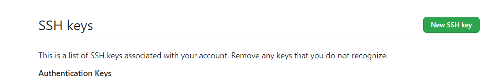

# GIT：分布式版本控制系统

## 基本流程

创建好一个远程仓库后，远程仓库什么都不用初始化。复制它的SSH，到VSCODE里面添加远程仓库→设置好别名再回车。

然后VSCODE里面暂存、提交所有本地文件

接着VSCODE终端输入GIT命令：git push -u origin master

这样远程仓库就有个master分支了

-u表示创建新的，origin表示保存的远程仓库别名，master表示分支

同理要创建新的其他远程分支可以直接：git push -u origin [分支名]

提交到远程指定分支：git push origin 分支名

 

合并分支：当写好某个功能之后往往需要合并到主分支

先切换到主分支，之后git merge [分支名]

 

## 命令

SSH连接方式：

一、**本地生成**

创建【SSH密钥】ssh-keygen -t rsa -C "youremail@example.com"

查看密钥：右键桌面 GIT bash here

1、`cd ~/.ssh`

2、`cat id_rsa.pub`就看到密钥了

二、**网站绑定（gitHub或者gitee）**

复制粘贴即可

### 登录或修改账号、邮箱

git config --global user.name

git config --global user.email

### 卸载全局账号

git config --global --unset user.name

git config --global --unset user.email

 

### 常用命令

从新建仓库到上传代码的流程：

git init

git remote add origin [仓库SSH地址]

git add .

git commit -m “提交备注信息”

git push -u origin master

当前master分支，想建个login分支来做login功能流程：

git checkout -b login

git push -u origin login

这样就推送到了远程新的login分支

本地关联远程分支：git branch --set-upstream-to origin/分支名

删除操作：不要站在将要删除的分支上

删除本地分支：git branch -D [分支名]

删除远程指定分支：git push origin --delete [分支名]

创建分支：

git branch [分支名]

跳转分支：

git checkout [分支名]

创建并跳转分支：

git checkout -b [分支名]

看已经连接的远程仓库：

git remote show

 看远程仓库地址：

git remote -v

拉取指定分支：

先创建并跳到本地这个分支：

git checkout -b [分支名]

再拉取：

git pull origin [分支名]

.gitignore 只对未跟踪的文件起作用！

解决办法：

git rm -r --cached .  即：清理在电脑上的暂存，全部转成未跟踪状态

git add .

git commit -m "update gitignore"

 

当前处于A分支进行开发中，假如这时想切换到B分支看看，一般是直接commit当前修改再切换，以前我都是这么做的；

其实这么随意commit不好，应该git stash（储藏），将没有提交的内容缓存并从当前分支中移除，再checkout到其他分支；

完事了再切回来之后，git stash pop就可以把之前缓存的内容拿出来了

在本地已经commit了，还没推送，此时想取消之前的commit：

git reset HEAD~

