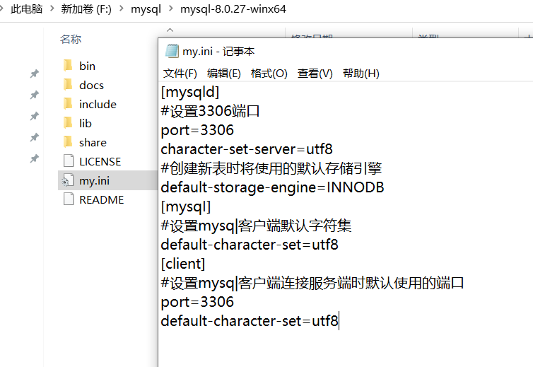

https://www.cnblogs.com/zhangkanghui/p/9613844.html教程

# 安装

目录下新建一个文件`my.ini`

然后设置环境变量：

直接新建一个，值为安装目录文件夹

编辑一个：

在安装目录下的**bin目录**下，用管理员权限打开`cmd`窗口，然后：

mysqld --initialize --user=mysql --console

mysqld --install

[mysqld]
#设置3306端口
port=3306
character-set-server=utf8
#创建新表时将使用的默认存储引擎
default-storage-engine=INNODB
[mysqI]
#设置mysq|客户端默认字符集
default-character-set=utf8
[client]
#设置mysq|客户端连接服务端时默认使用的端口
port=3306
default-character-set=utf8

# 卸载

# 破解navicat 15

https://blog.csdn.net/weixin_51560103/article/details/120894983

# navicat连接宝塔数据库

宝塔中的后台api中的node文件的`default.json`中的设置：

数据库名`database`、用户名`user`、密码`password`都是在宝塔中添加数据库时自己定义的，所以这里要保持一致

`protocol`标明是什么数据库，`host` 填服务器的地址，`port`填端口号

数据库权限记得设置**所有人**

然后连接即可

连接名是用户自定义的，只是为了方便自己识别是哪个数据库而已；然后对数据库进行修改直接保存，就能自动同步到宝塔了

# 基础概念

如数据库使用UTF-8，则英文占1个字节，中文占3个字节

最长的字符串数据类型：`longtext`：最大长度4294967295个字节

`text`类型：最大长度65535个字节，相当于能存储21845个汉字

# sql语法

## 增

`insert into [表名] (字段名...) values (值...)`

没有提到的字段，将会被赋予默认值

`insert into [表名] values (值...)`

不指明字段，默认给全部字段赋值，所以后面的值要全部写完

## 删

`delete from [表名] where [条件表达式]`

删除表中满足表达式的记录

`delete from [表名]`

删除该表所有记录，后续新增字段时，设置为**自动递增**的字段**会**从上次删除时的最大值继续加一

`truncate table [表名]`

删除该表所有记录，后续新增字段时，设置为**自动递增**的字段**不会**从上次删除时的最大值继续加一，而是从1开始重新计数

## 改

`update [表名] set [字段赋值] where [条件表达式]`

对该表中满足条件表达式的记录进行更新

`update [表名] set [字段赋值]`

对该表中的所有记录进行更新

## 查

`select * from [表名]`

查询该表所有记录

`select [字段...] from [表名] `

查询指定的字段记录

`select [字段...] from [表名]  where [条件表达式]`

查询满足条件表达式的字段记录

`select * from [表名] where [字段] in | not in (值) `

查询该表中字段存在（不存在）指定集合之内的记录，并展示这些记录的全部字段；如果不想展示全部，把`*`改成要展示的字段即可

`select * from [表名] where [字段] between 值 anb 值`     **闭合区间**

查询该表中字段存在指定范围之内的记录，并展示这些记录的全部字段；如果不想展示全部，把`*`改成要展示的字段即可

如果查询不在该范围内的记录，改成`not between`就好

# 服务器中常用命令

**查看数据库列表**：show databases;

**查看正在操作哪个数据库**：select database();

**使用某个数据库**：use 数据库名;

**查看所有表**：show tables;

**查看当前数据库状态**：status;

**建库以及删库**：

create database 库名
drop database 库名;

**导入sql文件**：

举例：先把sql文件传输进系统中，然后use想要导入的某个数据库，再`source /usr/local/bootdo.sql;`

# 报错不兼容：only_full_group_by

在win系统中mysql安装目录的my.ini文件编辑：

[mysqld]的下面加上：sql_mode='STRICT_TRANS_TABLES,NO_ZERO_IN_DATE,NO_ZERO_DATE,ERROR_FOR_DIVISION_BY_ZERO,NO_ENGINE_SUBSTITUTION'

之后重启mysql服务

