# Vue2

## 双向绑定

一、`v-model`

**用在组件上**：默认的props是`value`，默认的emits是`input`

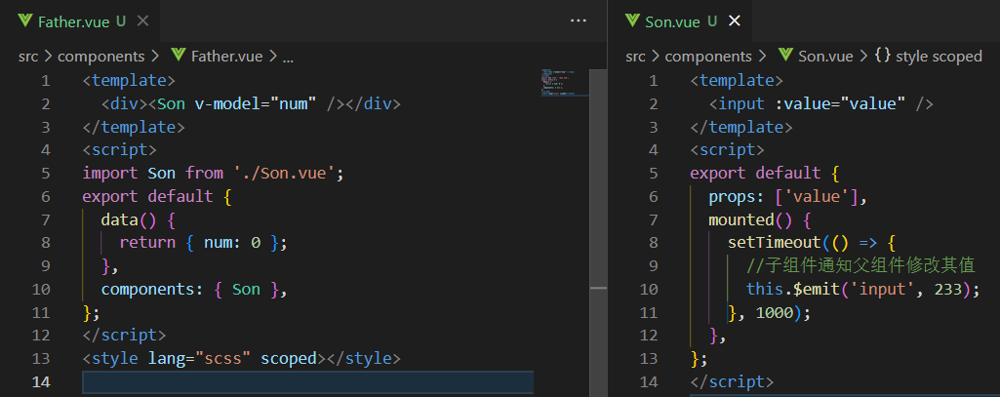

可以用`model`配置项更改这两个默认设定：

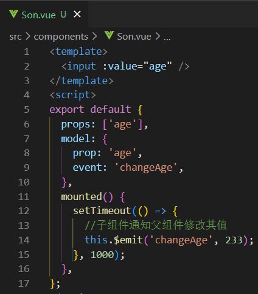


**用在标签上**：内部已经封装好了emits事件，直接实现双向绑定

```
<input v-model="num"/>
```

二、`.sync`修饰符：

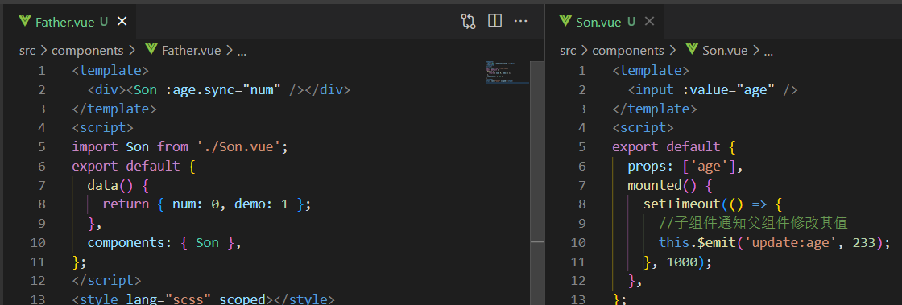

其中

```
<Son :age.sync="num">
等价于
<Son :age="num" @update="update" />
//update是父组件定义的修改num值的方法，所以.sync就是一个语法糖来简化操作而已，不用再额外定义事件传给子组件来修改父组件的值
```

两者区别：功能都是达成数据的双向绑定，区别在于语法的不同、`.sync`可以在一个组件或标签上使用多次，而`v-model`不行

## 条件、列表渲染

注意：当 `v-if` 与 `v-for` 一起使用时，`v-for` 具有比 `v-if` 更高的优先级。**这点与Vue3相反**

```VUE
    //因为v-for优先级高，所以v-if可以读取到todo属性，正常渲染
    //（能用，但是不应该用，todos应该换成计算属性，让其返回过滤后的列表，以此代替v-if完成判断）
    <li v-for="todo in todos" v-if="!todo.isComplete">
      {{ todo.name }}
    </li>
```

`v-for`：**以下用法与Vue3相同**

遍历对象：`v-for="(value, key, index) in object"`，括号内分别为：键值、键名、下标

遍历数组：`v-for="(value, index) in arr"`，括号内分别为：值，下标


## computed（计算属性）

详写：`getter`和`setter`：

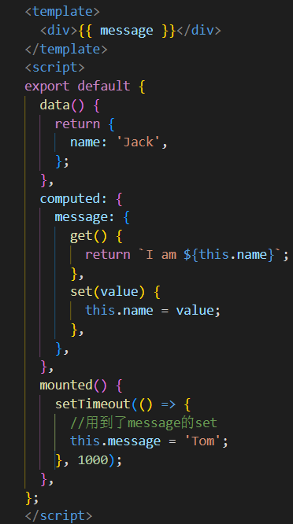

简写：

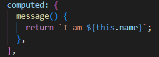


## watch（侦听器）

详写：

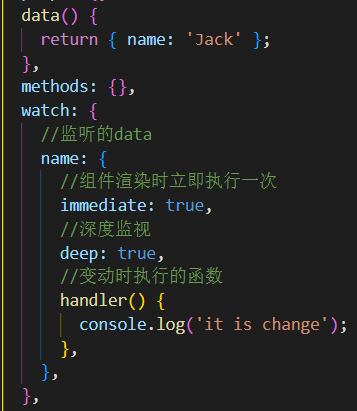

简写：

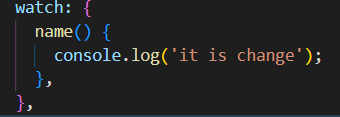

## 过滤器

Vue.js 允许你自定义过滤器，被用作一些常见的文本格式化。由"管道符"指示
`{{data|methods}}`，也可以再添加methods，用	|	间隔。添加之后它们之间的执行顺序是从左到右的：


## 混入

定义`mixins`：

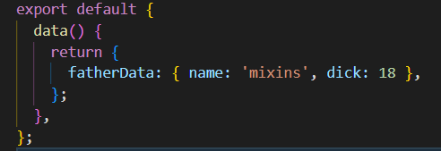

引入`mixins`的组件：

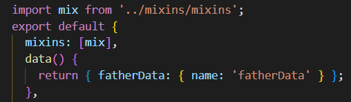

`fatherData`结果实际是：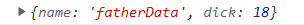

混入规则：

1、`data`会进行合并，有合并冲突则以组件为主；对象会对内部进行递归合并

2、同名钩子函数**不合并**，并且都将被调用，混入的钩子将在组件自身钩子**之前**调用

3、`methods`、`computed`等等发生合并冲突时，都以组件为主

4、多个混入的`JS`文件如发生冲突，会以`mixins`选项中引入顺序为标准，后引入优先级较高；其中同名钩子函数**相反**，先引入优先级较高。例如：`mixins: [mix, mix2]`，`mix`的钩子函数比`mix2`的优先级要高，其他的配置项则优先级较低

## 依赖注入

父组件：

```js
/* 和data平级的配置项 */
provide() {
    return {
      //可以将整个组件提供给后代
      father: this,
      //也可以暴露具体的数据和方法
      fatherData: this.fatherData,
      fatherMethod: this.fatherMethod,
    };
  }
```

子组件：

```js
  mounted() {
    this.father.fatherMethod();
    this.fatherMethod();
  },
  //引入整个组件，或者组件的具体数据和方法都可以
  inject: ['father', 'fatherMethod'],
```

后代组件也是一样的引入写法


## CSS变量由script传入

单文件组件的 `<style>` 标签支持使用 `v-bind` CSS 函数将 CSS 的值链接到动态的组件状态

```HTML
// <script>
let myColor='red';
// <style>
p {
  color: v-bind(myColor);
}
```


## 自定义指令

一、全局注册

```JS
Vue.directive('color', {
  //还有bind等钩子函数可选，详情看官网；常用的就inserted、bind
  inserted(el, binding) {
    el.style.color = binding.value;
  },
});
```

使用：

```vue
<div v-color="'pink'">test</div>
```

附带参数、修饰符、`binging`值等跟Vue3相差无几

二、局部注册

```JS
export default {
  directives: {
    color: {
      inserted(el, binding) {
        el.style.color = binding.value;
      },
    },
  },
};

//也可以简写，默认在 bind 和 update 时触发相同行为
 directives: {
    color: function (el, binding) {
      el.style.color = binding.value;
    },
  },
```

## transition（过渡效果）

本节只介绍和Vue3不同的地方，相同之处直接看下面Vue3章节

- 写在`<Transition>`上的自定义过渡类名：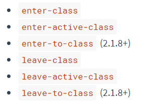

- CSS过渡类名，和Vue3相比，叫法少了个from

  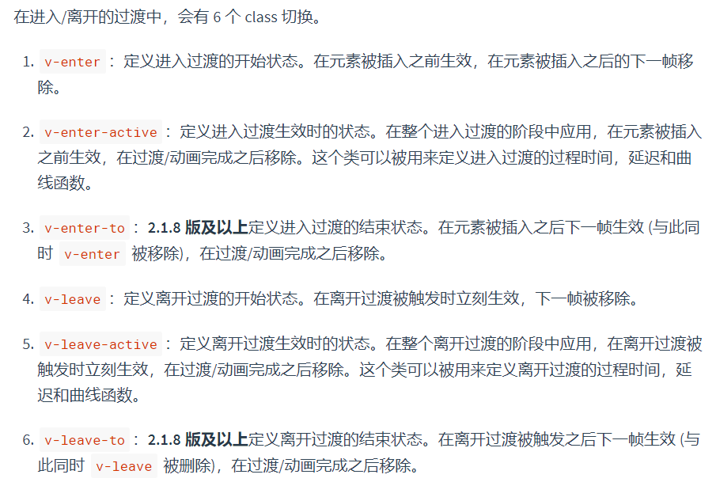


## `$listeners`和`$attrs`

用处：组件想要用到它的祖上组件绑定给它的子组件的属性或者事件时，通常的方法就是无限的写props以及向某组件的子组件绑定事件调用自身的`this.$emit()`这样一代一代的传下去

但是有了这两个属性后就不用了，直接在祖上组件的孙组件（也就是第三代组件，如下的grandSon组件）上写这两个属性之后，grandSon组件就可以直接调用祖上组件所绑定给子组件的东西了

例子：	

```VUE
下面这个例子的父子关系：
<App>  
	<son> 
		<grandSon> 
		</grandSon>
	</son>
</App>
```


这里是父给子绑定了一个方法和一个属性，子组件确实可以直接调用，但是孙组件就不行了，更不用说往后的后代组件了

所以这时候给子组件写上 `v-on="$listeners"`  ` v-bind="$attrs"`：

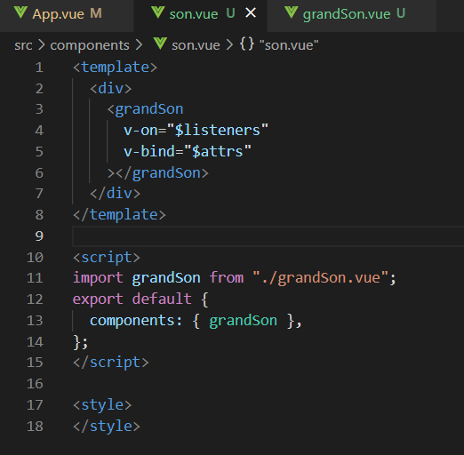

这时，往后的所有后代只要**每层都写上**`v-on="$listeners"`  ` v-bind="$attrs"`，就能直接调用祖上的属性和方法了，当然想用到属性别忘了写**props**，方法直接`this.$emit`就好


## 服务端渲染

### Nuxt.js

Nuxt.js 是一个基于 Vue.js 的通用应用框架，重点是实现了服务端渲染

创建：`npx create-nuxt-app [name]`

Nuxt.js 会依据 `pages` 目录结构自动生成模块的路由配置。

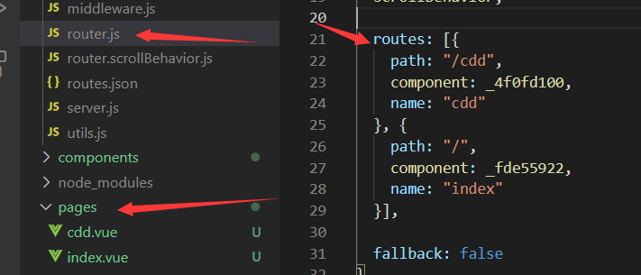


### 电商后台管理项目迁移到`nuxt`过程：

关闭`eslint`语法检查，注释掉`nuxt.config.js`中的这一配置项


目录下新建一个`src`文件夹，保持与`vue`项目目录的一致性会顺眼一点，新建时发现有的文件夹没有，新建一个就行了：


然后更改目录指引就可以了


发现`body`自带`margin`值，为了把它去掉，写一个全局样式引入，`@`代表上面定义的`srcDir`


按需引入`element`，一样要安装`babel-plugin-component`，只不过不用配置`babel.config.js`

然后在`nuxt.config.js`中引入：


这个按需引入的`element-ui`文件就是正常的按需引入写法

然后还需一个配置项：


`nuxt`里面是不需要有个`div`的`id`为`app`的；

发现自定义的样式被UI组件库覆盖了，暂时没有办法完美解决，只能通过`!important`一个个给自定义样式全部加上解决；

`layouts`文件夹是布局文件夹，里面用到`<nuxt>`标签，相当于`router-view`，当然在`nuxt` 里面也可以继续使用它，并且我这里就是继续使用，因为发现使用`<nuxt>`标签不能传入自定义事件；

可以配置多个布局文件，只需在页面中写明要引用哪个布局文件即可，写法为：


因为我这个项目的主要页面都是显示在`home`组件中的`router-view`，所以这个设计写法就映射到了`nuxt`中的布局，于是乎要把`home`组件中的代码改个名字，放到`layouts`目录下：

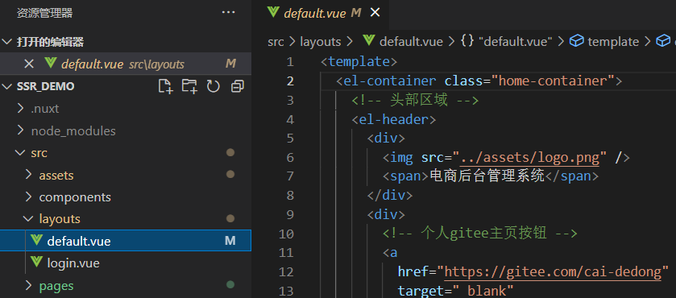

而登录界面就单独显示就好，因为一个`login`组件就是一整个页面：


不要忘了在`login`组件里面写上` layout: "login"`

因为`nuxt`是自动完成路由功能的，所以如果想要自定义路由，得在`nuxt.config.js`中定义：

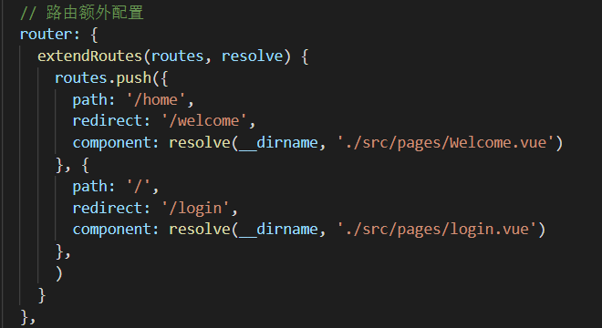


暂时没有办法保持原页面目录结构，只能把页面组件全部剪切到`pages`目录下

# Vue3

## 双向绑定

Vue2中的`.sync`在三代已经废除

`v-model`

一、组合式API

**用在组件上**：默认的props是`modelValue`，默认的emits是`update:modelValue`

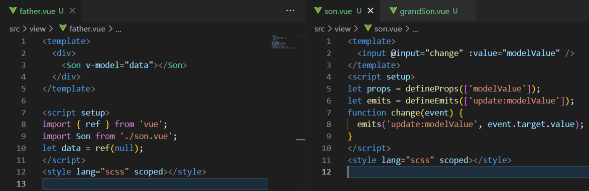

可以写别名：`v-model:别名="data"`

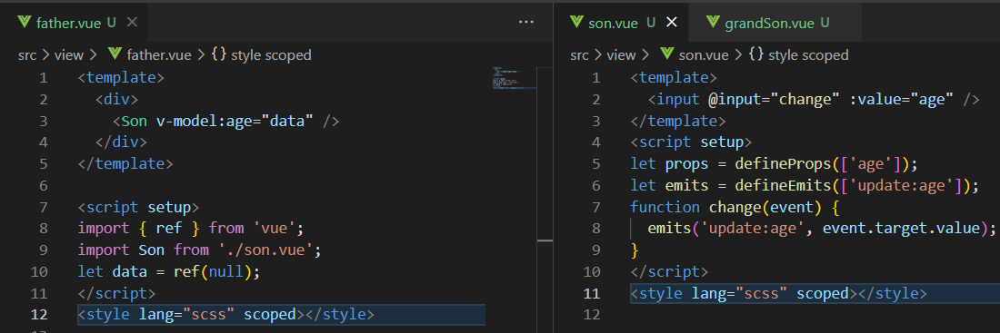

用了别名之后可以传递多个`v-model`，子组件的配置项`props`、`emits`也得写分别声明

**用在标签上**：和Vue2一样

二、选项式API

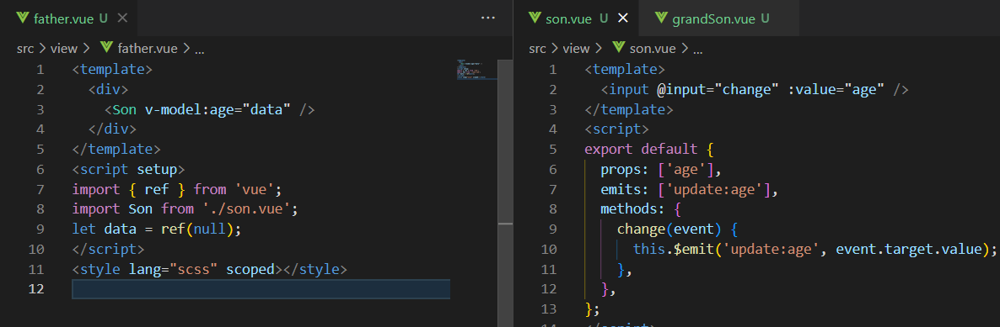

其他特性和组合式API逻辑一样

## 条件、列表渲染

当 `v-if` 与 `v-for` 一起使用时，`v-if` 具有比 `v-for` 更高的优先级

```VUE
//因为v-if优先级高，所以v-if访问不到todo，页面报错
<li v-for="todo in todos" v-if="!todo.isComplete">
  {{ todo.name }}
</li>

//可改用template循环，这样更直观
<template v-for="todo in todos">
  <li v-if="!todo.isComplete">
    {{ todo.name }}
  </li>
</template>

```

`v-for`：**用法与Vue2相同**

## 全局属性

`Vue.prototype`已经被废弃，改成`app.config.globalProperties`：

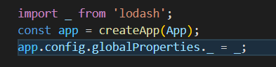

组件中使用：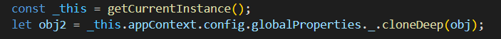


## ref和reactive

ref通常用来定义基本类型数据
reactive用来定义：对象（或者数组）类型数据
ref也可以用来定义对象或者数组类型的数据，内部会通过reactive转为代理对象

`ref`使用：

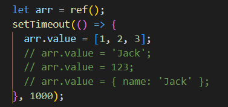

关键点：一定要`.value`赋值，不能直接给整个`ref`的引用赋值，否则会改变原有地址（`reactive`同理），丢失页面响应式

`reactive`使用：要么对象，要么数组

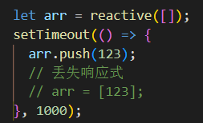

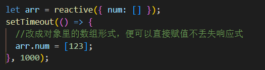


## computed（计算属性）

详写：`getter`和`setter`

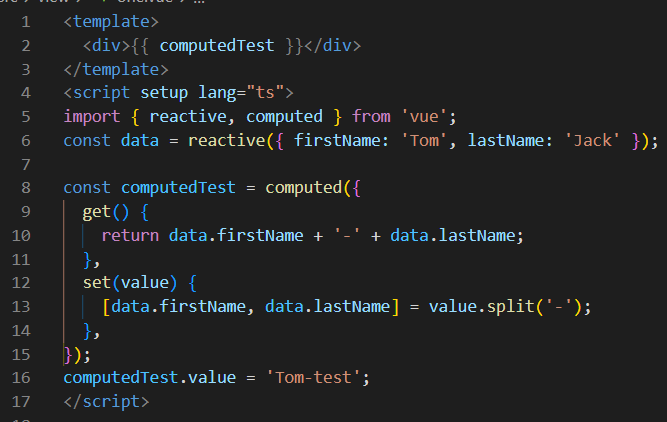

简写：直接箭头函数`return`

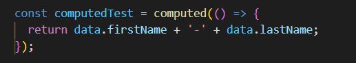

## watch（侦听器）

参考：https://zhuanlan.zhihu.com/p/528715632

`ref`：

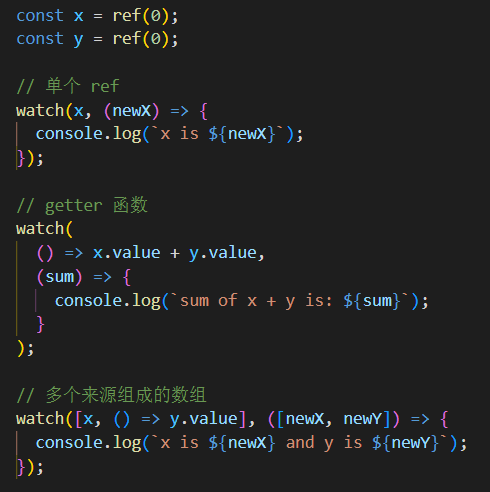

`reactive（即proxy数据）`：


如果直接监听整个`reactive`，此时默认开启deep深度监听；监听值为proxy对象时，oldValue值将出现异常，此时与newValue相同

如果使用`getter`函数返回响应式对象，那么响应式对象的属性值发生变化，是不会触发 watch 的回调函数的，这时需要手动写上deep：

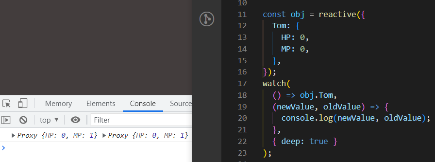

`watchEffect`：初始化时会自动执行一次；

获取不到旧值，在改回调函数里面得到的值都是更新过的值，且没有深度监视

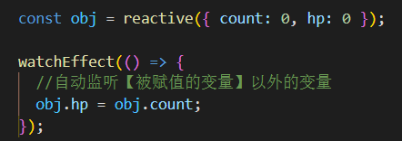

## 模板引用（ref）

用在DOM元素、组件上

父元素调用子元素的方法，注意要`.value`

父元素：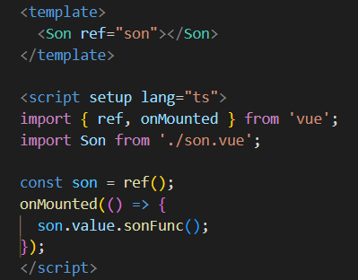		子元素（选项式）：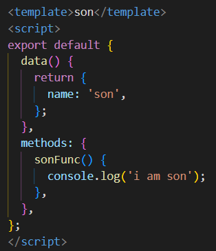

如果子元素用的是`<script setup>`，就得`defineExpose`主动暴露


因为使用了 `<script setup>` 的组件是**默认私有**的：一个父组件无法访问到一个使用了 `<script setup>` 的子组件中的任何东西

## 父子通信

1、**传递props**

如果使用的是`<script setup>`，则需要`defineProps(['属性名'])`或者`defineProps({属性名:类型名})`，否则还是跟Vue2选项式的写法一样

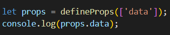

2、**emit事件**

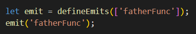

## CSS深度选择器

**:deep(某种选择器)**或者**::v-deep(某种选择器)**（同sass的写法）

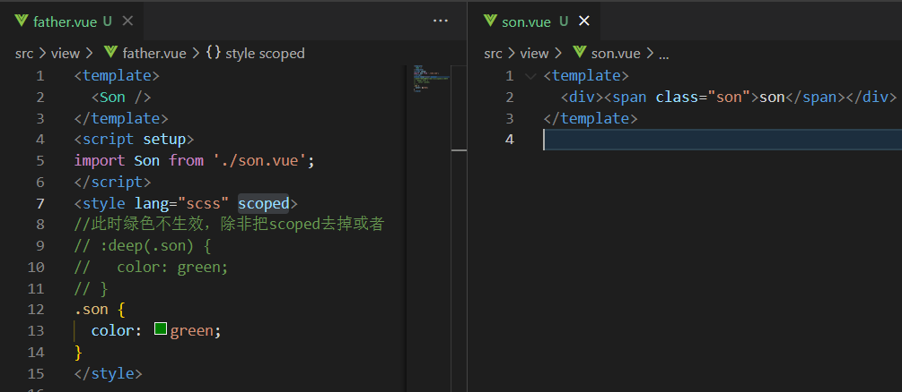


**容易踩的坑注意：**

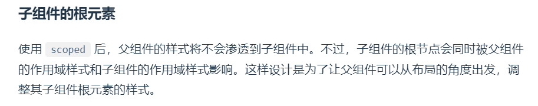

例如：可以看到父和子都对**.son**作了颜色控制，且**.son**写在了子元素的根节点上，但是生效的是父元素指定的**style**，这时候除非子元素用更高优先级的选择器控制，否则还是父元素的**style**生效

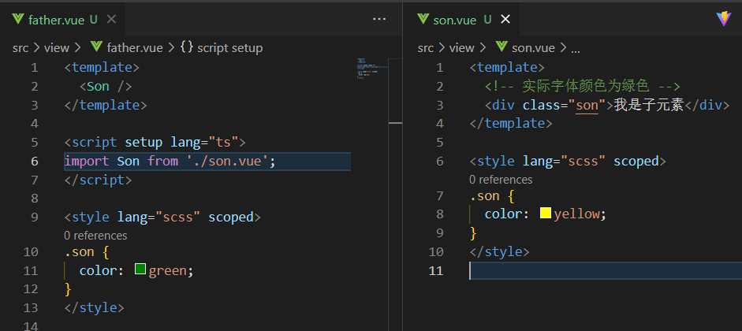

如果想禁用这种效果并且用的是`<script setup>`，需要加个额外的`script`标签：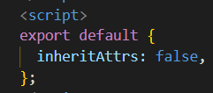

## CSS变量由script传入

单文件组件的 `<style>` 标签支持使用 `v-bind` CSS 函数将 CSS 的值链接到动态的组件状态

```HTML
// <script>
const myColor = ref('red')
// <style>
p {
  color: v-bind('myColor');
}
```


## 透传 Attributes

**一**、简单来说就是父组件传递子组件，却没有被子组件声明为`props`或`emits`的 `attribute`，可以理解为**漏网之鱼**，并且会自动被添加到子组件的根元素上，如果子组件还包含着其他组件，则会一直传下去

子组件未接收任何`attribute`：

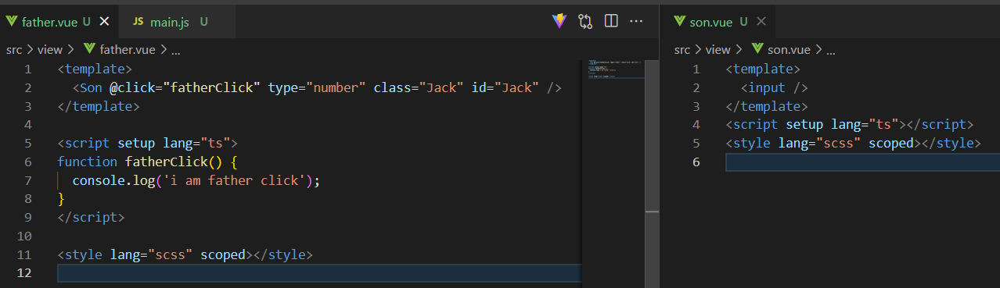

但是都被添加到根元素上：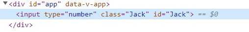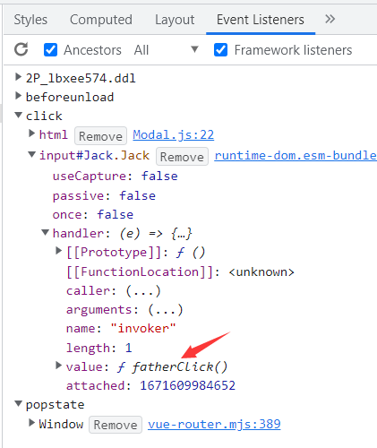

**二**、如果想中断透传，或者想指定透传给子组件里的某个元素上面，则可以在子组件里面加上：

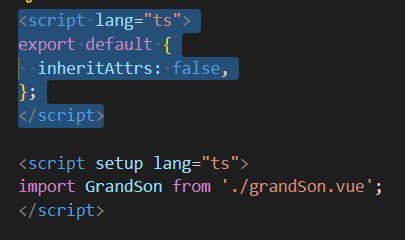

注意：如果用的不是`setup`语法糖则不用再写多一个`script`标签

然后在` v-bind="$attrs"`指定给哪个元素透传就可以了：

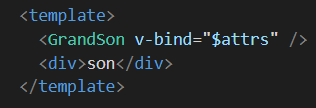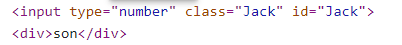

可以看到`div`上没有被透传任何东西

**三**、在`script`中访问这些透传的`attributes`时注意，其中所有事件会被默认加上`on`前缀，并且变成小驼峰命名

父组件：传过去`click`事件

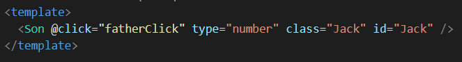

子组件：拿到的是`onClick`事件

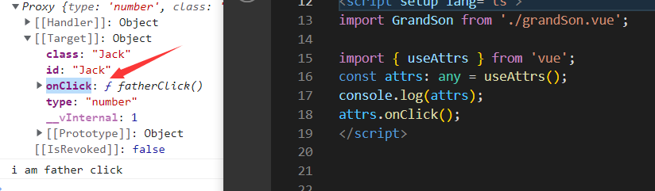

**四**、如果子组件有多个根节点，注意要指定`$attrs`或者中断透传，否则会有警告

## 插槽

和Vue2一样，没什么变化：https://cn.vuejs.org/guide/components/slots.html


## 依赖注入

父组件：

```JS
import { provide, ref } from 'vue';

let fatherData = ref('i am fatherData');
provide('fatherData', fatherData);
```

子组件：

```JS
import { inject } from 'vue';
let data = inject('fatherData');
```


## 获取组件实例的用处

`forceUpdate`、`nextTick`等等

注意：如果不用`proxy`而用`ctx`，生产环境下会有问题


## 异步组件

`defineAsyncComponent`里面记得要`return`

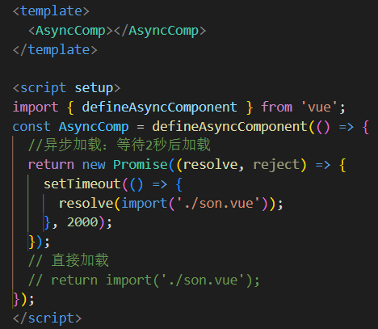

## 组合式函数

利用 Vue 的组合式 API 来封装和复用**有状态逻辑**的函数，是一种复用手段

诞生目的：替代mixins，以解决它的弊端：**不清晰的数据来源**、**命名空间冲突**、**隐式的跨 mixin 交流**：

```JS
//demo.vue文件
  mixins: [ a, b, c, d, e, f, g ], 
  mounted() {
    console.log(this.name)
    // 你猜这个name来自于哪个JS文件？会不会和其他混入文件发生同名？
    //（虽然vscode可以直接CTRL+左键前往定义处查看来自哪里，但是不够直观，且依然有同名冲突的风险）
  }
```

例子，组件引入两个组合式函数：

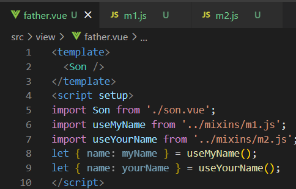

组合式函数里面可以写各种组合式API（生命周期钩子、响应式API、依赖注入等等）：

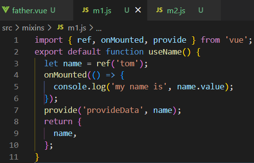

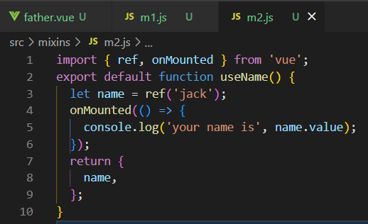


## 自定义指令

一、全局注册

钩子函数里面常用的两个参数：`el`为指令绑定到的元素，这可以用于直接操作 DOM；`bingding`包含传递给指令的`value`等各种属性

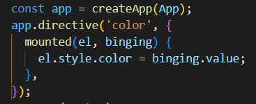

可选用的生命周期钩子函数除了**beforeCreate**其他都有：

还提供了个函数形式的简写方式：

使用：

```vue
<div v-color="color">Message</div>
```

可以顺便传参数和修饰符对象，举例传了个参数`age`和修饰符`funcModify`


得到的`bingding`是：


另外参数可以是动态的：

```VUE
 <div v-color:[arg]="'pink'">test</div>
```

二、局部注册

在 `<script setup>` 中，任何以 `v` 开头的驼峰式命名的变量都可以被用作一个自定义指令：


选项式API：


**注：当在组件上使用自定义指令时，它会始终应用于组件的根节点，而组件可能含有多个根节点；当应用到一个多根组件时，指令将会被忽略且抛出一个警告，且指令不能通过 `v-bind="$attrs"` 来传递给一个不同的元素。总的来说，不推荐在组件上使用自定义指令。**


## transition（过渡效果）

要素：围绕CSS属性`transition`：过渡可以为一个元素在不同状态之间切换的时候定义不同的过渡效果

- 过渡类：

1. `v-enter-from`：进入动画的起始状态。在元素插入之前添加，在元素插入完成后的下一帧移除。
2. `v-enter-active`：进入动画的生效状态。应用于整个进入动画阶段。在元素被插入之前添加，在过渡或动画完成之后移除。这个 class 可以被用来**定义进入动画的持续时间、延迟与速度曲线类型**。
3. `v-enter-to`：进入动画的结束状态。**在元素插入完成后的下一帧被添加** (也就是 `v-enter-from` 被移除的同时)，在过渡或动画完成之后移除。
4. `v-leave-from`：离开动画的起始状态。在离开过渡效果被触发时立即添加，在一帧后被移除。
5. `v-leave-active`：离开动画的生效状态。应用于整个离开动画阶段。在离开过渡效果被触发时立即添加，在过渡或动画完成之后移除。这个 class 可以被用来定义离开动画的持续时间、延迟与速度曲线类型。
6. `v-leave-to`：离开动画的结束状态。**在一个离开动画被触发后的下一帧被添加** (也就是 `v-leave-from` 被移除的同时)，在过渡或动画完成之后移除。

- `<Transition>` 仅支持单个元素或组件作为其插槽内容。如果内容是一个组件，这个组件必须仅有一个根元素。

​		过渡效果开始：`v-enter-from`、`v-enter-active`、`v-enter-to`

​		过渡效果结束：`v-leave-from`、`v-leave-active`、`v-leave-to`

- 可以命名：`<Transition name="Jack">`，此时需要改前缀`.Jack-enter-active`

- 自定义过渡类名，例如在使用第三方类时很有用：` <Transition enter-active-class="animate__animated animate__tada">`

​		属性：

可以覆盖掉默认的过渡类效果：


- 原生JS监听过渡效果结束（transitionend、animationend），需要对DOM元素添加事件监听：


- 监听 `<Transition>` 组件：加上**钩子函数**（Vue的CSS过渡类是默认实现了调用`done()`效果的，所以如果改用钩子函数，某些需求的实现效果是需要主动调用`done()`的）

  函数分为进入和离开：`@before-enter`、`@enter`、`@after-enter`和`@before-leave`、`@leave`、`@after-leave`


- 钩子函数可以和CSS过渡类并用，但可以CSS规则会干扰过渡效果，这时候可以`:css="false"`来跳过CSS过渡类，但这时候钩子函数就全权负责控制什么时候过渡结束了。

- 属性`mode`过渡模式：适用场景：组件切换时，进入和离开的元素同时开始过渡动画：

  

  有时候并不想要这样的效果，可以加个属性`mode='in-out'`：（先进后出）

  

  `mode='out-in'`：（先出后进）：

  

- 属性`appear`，DOM元素初次渲染时就应用一次过渡效果

## transitionGroup

和transition的区别在于是针对`v-for`循环列表作动画效果、支持多个元素作为插槽内容

- 过渡模式在这里不可用，因为我们不再是在互斥的元素之间进行切换。
- 列表中的每个元素都**必须**有一个独一无二的 `key` attribute。

- 平滑删除效果：，需要`v-move配合`：

  该动画内部的实现，Vue 使用了一个叫 [FLIP](https://aerotwist.com/blog/flip-your-animations/) 简单的动画队列

## KeepAlive

缓存组件实例状态`<KeepAlive>`

- 可以`<KeepAlive :include="['a', 'b']">`来指定需要缓存的组件；用`exclude`可以排除组件。
- 使用 `<script setup>` 的单文件组件会自动根据文件名生成对应的 `name` 选项，无需再手动声明（**注意**：需要缓存的组件如果使用了setup语法糖，但是script标签里面没有任何东西，那么是不会自动生成`name`选项的）。如果用选项式API，则需要在组件写上对应的`name`选项

# Vue Router（V4版本）

V4版本是Vue3专用的，V3版本对应Vue2

## 创建


## 路由传参

`params`和`query`

- **params**：

用`params`必须和`name`一起传，不能用`path`


且路由配置中要写好`name`


**版本V4.1.4中，用`params`进行路由传参已被废除**


- **query:**

和`path`或者`name`都可以


## 编程式路由


访问路由信息：


## 路由模式

hash 模式是用 `createWebHashHistory()` 创建的

HTML5 模式是用 `createWebHistory()` 创建 HTML5 模式，推荐使用这个模式，需要配合Nginx做设置：

```
location / {
  try_files $uri $uri/ /index.html;
}
```


# Vuex（V3版本）

**对应Vue2**

## 基本配置


`main.js`中引入：


## 在组件中使用

一、通过`this.$store`访问


二、通过四个map方法访问：

- （store的方法）`mapMutations、mapActions`放在**methods**里面 
- （store的数据）`mapState、mapGetters`放在**computed**里面


然后就可以直接`this.increment()`、`this.count`类似使用；

这四个map方法的参数也可以换成对象的写法：

```JS
...mapMutations({myIncrement:'increment'})  //组件中就可以this.myIncrement()来使用；其他三个map方法类推
```


# Vuex（V4版本）

**对应Vue3**

通过调用 `useStore` 函数，来在 `setup` 钩子函数中访问 store。等于在选项式 API 访问 `this.$store` 

```JS
import { useStore } from 'vuex';
const store = useStore();
```

注意：如果是在一个js文件中，正确的使用应该是

`import store from '/store/index.js'`

`store.commit('updateUserData');`

而不是跟在setup里面一样`useStore`


# Vue Cli

创建：**vue create [name]**，然后按提示操作即可

## 模式与环境变量

- 在项目根目录中创建下列文件来指定环境变量：

```
.env                # 在所有的环境中被载入
.env.[mode]         # 只在指定的模式中被载入
# mode默认有三种：development | production | test，也可自定义，例如stage，这时要在命令行后面加参数后缀：
如：vue-cli-service build --mode stage

//环境文件的内容为：键=值
//如：VUE_APP_NAME=Jack
```

**（指定模式优先级最高）**

- 只有 `NODE_ENV`，`BASE_URL` 和以 `VUE_APP_` 开头的变量才能被访问
- 访问环境变量是通过`process.env`


## 基本配置文件


# Vite

## 模式与环境变量

与Vue Cli不同之处：

- 只有以 `VITE_` 为开头的变量才能被访问
- 访问环境变量是通过`import.meta.env`


## 基本配置文件


## 配置@别名

**vite.config.js配置**


安装插件，提供智能路径提示：

插件扩展设置：

```
  "path-intellisense.mappings": {
    "@/": "${workspaceFolder}/src",
    "/": "${workspaceFolder}",
    "lib": "${workspaceFolder}/lib",
    "global": "/Users/dummy/globalLibs"
  },
  "path-intellisense.autoTriggerNextSuggestion": true,
```


# 问题合集

## 一、第三方库安装版本

如果用`TS`，在使用第三方库的时候，要注意有没有对应的`TS`版本，比如`lodash`，就有个`@types/lodash`

直接安装`npm i lodash`之后使用会提示：

这时需要在项目根目录下新建一个`tsconfig.json`，里面建个空对象即可；红色警告没有了但是有提示：

根据提示改用`npm i @types/lodash`，上述提示消失，变成：

完善`tsconfig.json`即可：

**（如果一开始安装的就是`@types/lodash`，就可以不用搞配置文件，没有任何报错）**

## 二、视图更新

常见视图不更新的问题：例如一个数组`arr : [{name:'jack'}]`，现在让里面的这个对象加一个属性`this.arr[0].money=100`，发现视图没有更新，原因如下：


解决方案有三种：


**this.$forceUpdate()也行，但是能不用就不用**

