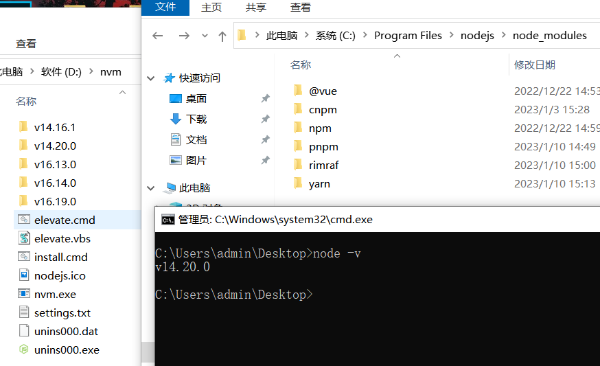
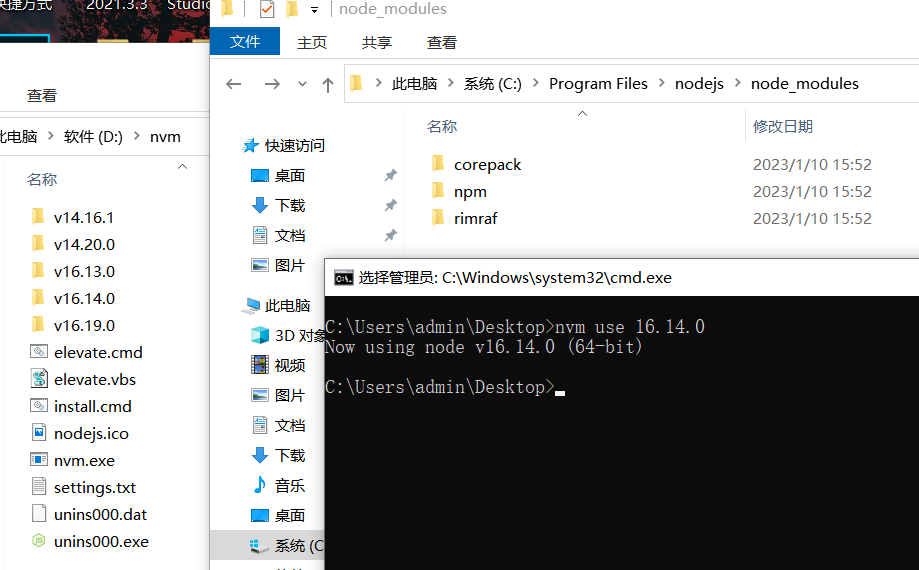
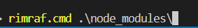

# nvm

使用要素：

1、**管理员权限打开cmd窗口**

2、切换国内下载镜像，在nvm安装目录下的`setting.txt`中加上：

node_mirror: https://npm.taobao.org/mirrors/node/
npm_mirror: https://npm.taobao.org/mirrors/npm/

去官网装个14版本的`node`，然后下个`nvm`好切换版本：https://github.com/coreybutler/nvm-windows/releases

如果直接用`nvm`安装第一个`node`版本的话，有可能到时候会`npm i`报错

`nvm`选择最新版本的setup的压缩包下载、安装即可

用法：

`nvm ls available`查看可下载的`node`版本

`nvm ls`已安装的版本

`nvm install [版本号]`安装版本

`nvm uninstall [版本号]`删除版本

`nvm use [版本号] ` 切换版本：

切换举例，现在版本`14.20.0`，当前node版本的全局依赖项在C盘可以看到安装列表（`npm root -g`查看node全局安装位置），左边文件夹是nvm已安装的node版本

现在切换其他版本，右键刷新一下文件列表，可以看到对应的全局依赖项改变了：

# npm

换国内资源链接：
npm config set registry https://registry.npm.taobao.org
检查是否换了：
npm config get registry

清除缓存：npm cache clean --force

查看node、npm版本：node -v、npm -v

依赖安装：

npm install `依赖名` --save-dve， 简写：npm i `依赖名` -D ，自动把模块和版本号添加到devdependencies。开发环境中要用到的	

npm install `依赖名` --save ，简写：npm i `依赖名` -S ，自动把模块和版本号添加到dependencies。生产环境中要用到的

加后缀`-g`可对全局依赖进行操作

依赖卸载：

npm un `依赖名`

node_moudle包的删除：直接右键删除的话就是用资源管理器来删，速度很慢，可以装`npm i rimraf -g `来删除

使用技巧：cmd命令输入rim然后按tab键，就会自动展开为`rimraf.cmd`，接着按空格再输入想要删除的文件名。这个过程按tab键也可以自动展开，省时间：

`npm dedupe`（`npm ddp`）：

使用`npm`包时会遇到`A`包依赖`B`包，`C`包也依赖`B`包，于是存在安装了两个`B`包的情况.

 而当`A`、`C`两个包依赖的`B`包版本要求有同一版本可以满足时，实际只需要安装1个`B`包。

通过 可以去简化依赖树，解决这个问题。

`npm list`（`npm ls`）：

查看当前目录下项目的依赖项，默认是目录全展开，可加后缀`-depth=0`进行收缩

`npm root -g`查看全局依赖位置

