名词解释：

`module`，`chunk` 和 `bundle` 其实就是同一份逻辑代码在不同转换场景下的取了三个名字：

我们直接写出来的是 `module`，是开发中的单个模块

`webpack` 处理时是` chunk`，是指webpack在进行模块依赖分析的时候，代码分割出来的代码块

最后打包出来的是结果是 `bundle`。

# 安装

确保安装了node，然后在工作目录下`npm init -y`

然后在目录下本地安装：`npm i webpack webpack-cli -D`

这时我用的不是全局安装webpack，所以直接`webapack`是不行的，要：`npx webpack`

但是如果在`package.json`里面设置脚本，就不用写npx了：

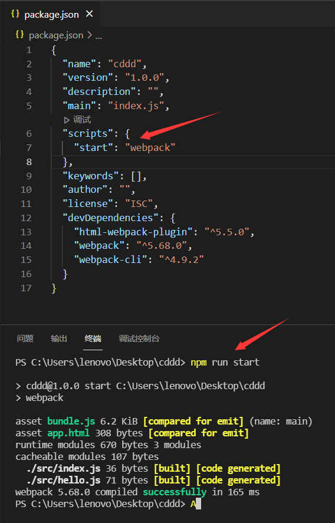

当然前提是本地目录有：

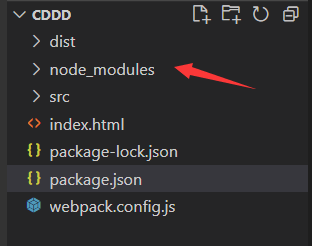

修改源文件保存自动打包：`npx webpack --watch`。这样就不必每次修改代码都要手动`npx webpack`了


**HtmlWebpackPlugin**

作用：简化 HTML 文件的创建，安装：`npm install html-webpack-plugin -D `

在项目根目录创建文件`webpack.config.js`，它的配置：

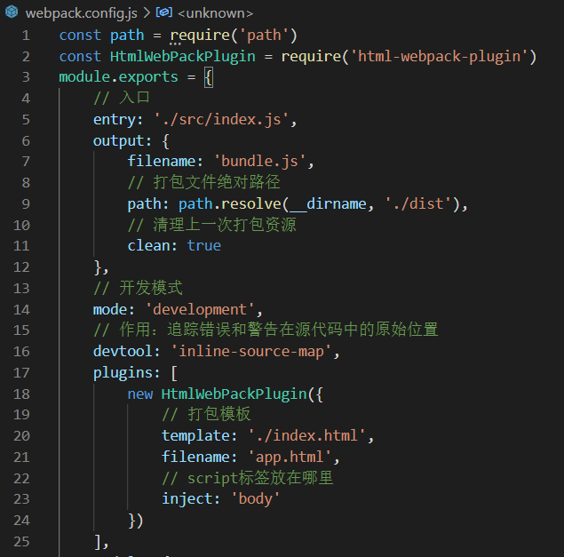

# 资源模块

**`webpack5`新特性**

作用：资源模块(asset module)是一种模块类型，它允许使用资源文件（字体，图标等）而无需配置额外 loader。

- `asset/resource` 发送一个单独的文件并导出 URL。之前通过使用 `file-loader` 实现。
- `asset/inline` 导出一个资源的 data URI。之前通过使用 `url-loader` 实现。
- `asset/source` 导出资源的源代码。之前通过使用 `raw-loader` 实现。
- `asset` 在导出一个 data URI 和发送一个单独的文件之间自动选择。之前通过使用 `url-loader`，并且配置资源体积限制实现。

重点是type属性，用于指定类型：

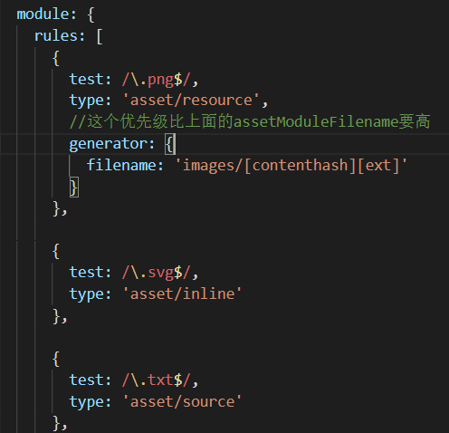

# 管理资源

## loader

`webpack` 只能理解 `JavaScript` 和` JSON `文件，这是 `webpack` 开箱可用的自带能力。**loader** 让 `webpack `能够去处理其他类型的文件，并将它们转换为有效模块，以供应用程序使用，以及被添加到依赖图中。

有两个属性：`test`和`use`

`test`：识别出哪些文件会被转换

`use`：进行转换时，应该使用什么loader

例如：

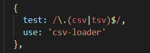

多个`loader`就用数组，只有一个也可以这么写：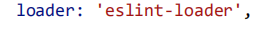

## 加载CSS

需要`style-loader`和`css-loader`

安装：`npm i style-loader -D`，以后的安装也类似


`style-loader`的作用是在打包后的`html`文件的`head`标签里写入`style`标签并写入样式

但是后面会把CSS样式抽离出来便于管理，所以后面也就用不到`style-loader`了

use数组中执行顺序：从右到左

## 抽离和压缩CSS

作用：在生产环境中节省加载时间

两个插件：

抽离：`mini-css-extract-plugin  `

压缩：`css-minimizer-webpack-plugin`

安装后定义：


抽离出来的样式会以`link`标签形式被加载到打包后的`heml`文件中；还可以设置打包后的样式单独放到一个文件夹中：

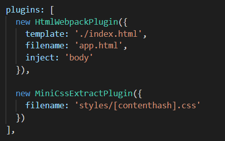


`loader`设置：


压缩设置：


## 压缩JS

```console
npm install terser-webpack-plugin --save-dev
```

配置：


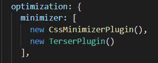

# babel-loader

`babel`和`webapck`结合需要`babel-loader`

结合的作用：`webpack`本身只能做JS模块化的打包，并不支持JS转化，所以为了防止浏览器版本过低，不支持ES6+代码，要使用`babel`：它可以将ES6+转成ES5

要安装三个东西：

`npm i babel-loader @babel/core @babel/preset-env -D`

配置：

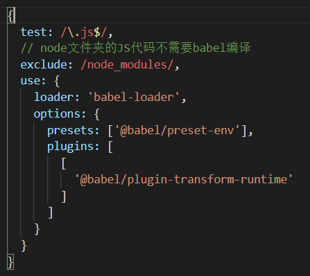

还要安装两个插件：

`@babel/runtime`     `babel/plugin-transform-runtime`，也都是`-D`安装

作用：帮助`babel`兼容ES6语法


# webpack-dev-server


#  缓存

作用：提高打开速度，节省流量

打包后的dist文件夹部署到服务器上时，如果资源的文件名没有更改，浏览器会以为没有对代码进行修改，从而使用它的缓存版本（即使我们已经修改了代码）

解决办法：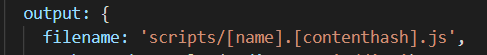

根据资源内容生成唯一hash值，并命名到文件名中


## 缓存第三方库

因为这些东西我们很少、甚至不会修改，所以可以利用浏览器的长效缓存机制，命中缓存来消除请求。减轻服务器获取资源压力。

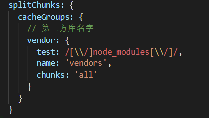

`vendor`将会被单独打包出来：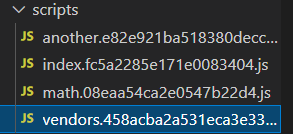


# 拆分开发环境和生产环境

创建一个文件夹`config`，存放配置文件

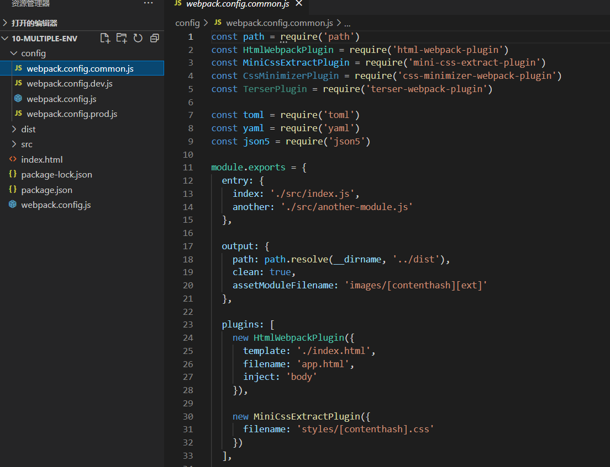

common存放的是公用的配置，dev和prod文件则只需写明和common文件不一样的配置即可：

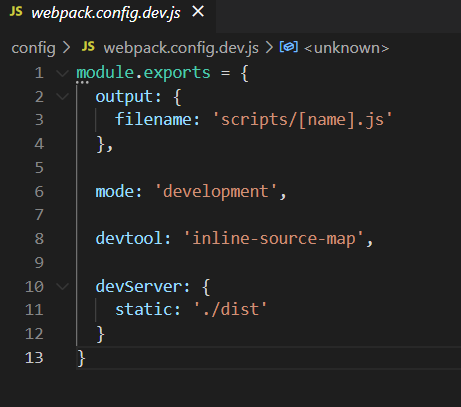

`webpack.config.js`作用则是`merge`配置文件，用到的插件`webpack-merge`

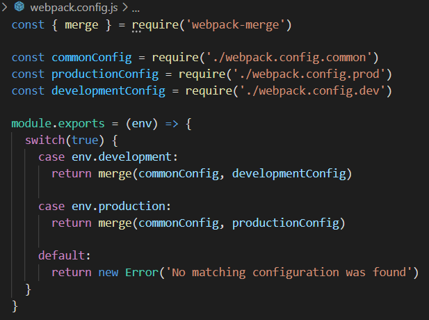

然后在`package.json`写明脚本即可：

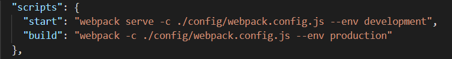


# 从零开始搭建vue的webpack配置

教训：缺少模块记得尝试删掉package-lock.json，并且删掉node_moudules文件夹，重新npm i 


引入element-ui：还要在main.js中：`import 'element-ui/lib/theme-chalk/index.css';`


