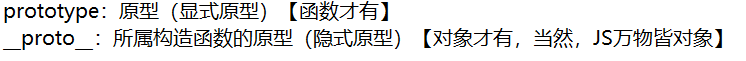
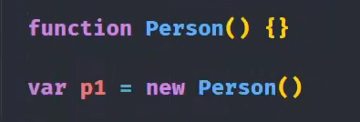
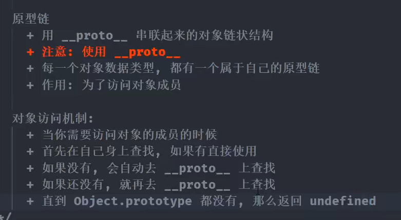
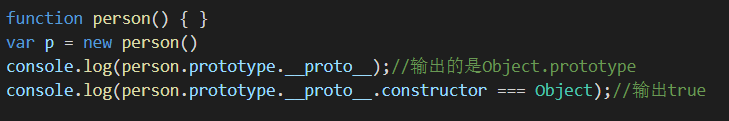

# 概念：

**例子：**

# **这些东西有什么用呢？**

答：**prototype 属性可以给函数和对象添加可共享(继承)的方法、属性，而`_proto_`是查找某函数或对象的原型链的方法**

例子说明：

**注：[[Prototype]]与`__proto__`同义**

变量P身上本来没有a的，但是我往它爹（`__proto__`）身上添加了a，我又偏要在变量p身上输出a，没办法，js只好往它爹（`__proto__`）身上找，如果还找不到，就往它爷爷身上找（`__proto__`.`__proto__`），但是这里在它爹（`__proto__`）身上找到了，便能输出a了

# constructor

prototype（原型对象）里面均含有constructor，它指向对象的构造函数

