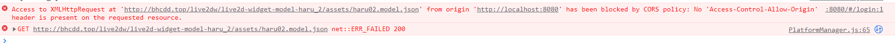
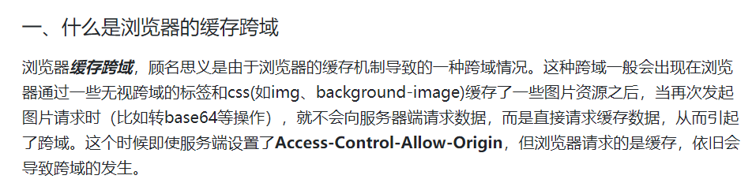
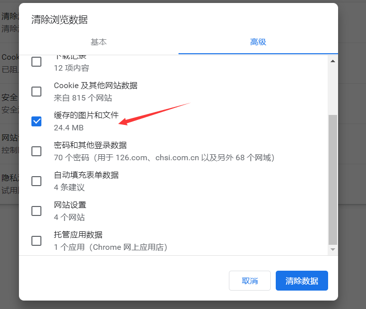
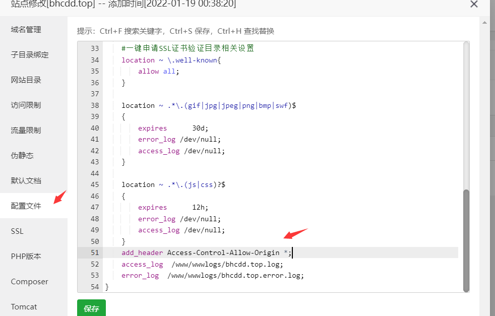
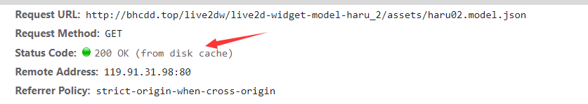

# 跨域

问题：生产模式中显示跨域

在用`nuxt`想把原有的项目进行`SSR`移植处理，然后在处理看板娘的时候，用的是直接引入我服务器上的`json`文件，但是这时候谷歌浏览器显示跨域了，这时候确实是需要在宝塔上面的`nginx`进行设置，但是设置了半天没生效；最后才想得到会不会是浏览器本身的问题，然后用`edge`浏览器试了下，居然行得通了。然后我再回过头来查谷歌浏览器依旧显示跨域的原因，摸索了半天发现居然清除谷歌浏览器的缓存就可以了！！

解释：

谷歌清除缓存：

宝塔中设置跨域，直接点网站名设置：

用`edge`测试的时候，也要注意删了缓存再测试，否则可能看板娘使用的是缓存显示，并不是网络请求。所以会出现即使在宝塔上面删除了跨域设置，看板娘依旧会显示的问题

来自缓存：

