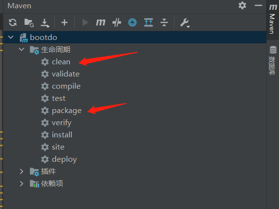
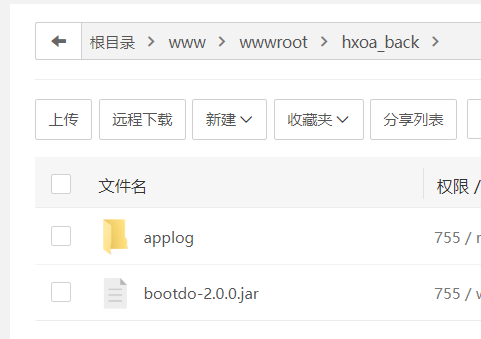

# 基础

## **一、概念**

先学会：服务器、域名基础：https://www.bilibili.com/video/BV18a4y1Y7e9

在腾讯云买了个轻量级应用服务器，加上域名不贵。总共50一年（后悔了，应该直接买三年的）

介绍【宝塔系统】：集成了各种设置，如数据库、Nginx等，现在不需要慢慢一一设置了，直接一键安装就好

然后安装宝塔系统

https://www.bilibili.com/video/BV1QY411p76N

接着各种设置

https://www.bilibili.com/video/BV1aV411n7SH/?spm_id_from=333.788.recommend_more_video.2

注意登入宝塔时要输入腾讯云API密钥，跟着提示设置就好

端口不能乱设置，有些会和浏览器自带的冲突。这里我选了6666刚好冲突了，导致宝塔进不去了，相关文章：

https://blog.csdn.net/qq_45464560/article/details/116884716

 

如果要改登录端口，改之前要在服务器安全组/防火墙那里放行要改的端口，然后在宝塔改就行了

## **二、域名解析**

如果要添加二级域名，以设置多个网站，可根据以下步骤：

 

接着设置宝塔，这个路径下新建文件夹，文件夹放的是你的网站文件：

 

接着设置添加站点，注意根目录要设置对路径：

 

 

## **三、宝塔设置**

然后如果要设置多个二级域名指向同一网站，可以：

 

写这个的原因，是因为我发现工信部查我的域名，上面显示的网站是有www前缀的，而有这个前缀不能访问我的网站。原因是我之前没在腾讯云DNS解析设置www

 

注意：

1、腾讯云DNS解析（在哪里买的服务器哪里就会有免费的DNS解析服务给你【大概吧】）

2、宝塔设置

两个步骤少一个都不行（设置了之后腾讯那边解析可能有些延迟，立即生效不了，等一下就好）

 

# 三步开启HTTPS

1、前端代码中每个网络请求都得是HTTPS

2、宝塔申请证书，点一下即可，别忘了点**强制HTTPS**

3、如果你的项目是要求nginx到后端不同端口的，记得要保留原来的http，不要改成https：

​	

 

 

# **服务端用`cmd`**

 点击终端时

提示要ssh密码，这时安装一个插件就行了

#  spring项目的打包和上线

## 前端打包处理

把网络请求路径改一下即可打包：

**前端发起的请求总是同域的，由nginx处理跨域就好**

**重点**是跨域处理：

协议、域名相同，但是端口不同，80端口跨到8089端口，这个问题就是由nginx处理

## 上传数据库

然后不要忘了**点击导入**，我这里有个坑就是忘了点击导入，结果启动后端的时候就报错说一堆表找不到

## 后端打包处理

确定好端口号和启动模式

填写服务器的IP地址和数据库的用户名和密码（要和服务器的数据库设置保持一致）

先清理掉旧的打包文件夹target，即可打包

创建个文件夹把后端打包文件放进来

宝塔安装这个，启动的时候它会让你安装容器，选择安装tomcat8（自带JDK1.8，看项目情况安装什么版本)。

然后添加项目，点击确定即可部署后台

## 放行端口号

在安全菜单栏里面确保要用的端口被放行就好了，也可以上云服务器官网确认一下

# 端口占用解决

有时候可能后端代码要用的端口，宝塔提示被占用了

1、查出这个端口被哪个线程占用

netstat -anp | [grep](https://so.csdn.net/so/search?q=grep&spm=1001.2101.3001.7020) [端口号]

2、结束这个进程

kill -s 9 [线程号]

# 不要忘了更新宝塔面板版本

之前碰过的很多问题，例如后端代码更新了之后，还得要重新设置JAVA一键项目、反复上传后端代码才能更新成功；以及`Mongodb`的安装失败等等问题，其实这些问题都是宝塔面板版本太老旧的锅，点击右上角的修复按钮即可，会自动修复并更新面板问题

# 更换服务器厂商要做的转移

因为腾讯云服务器过期，换了个华为云的服务器，总共要做的步骤：

一、在旧服务器厂商进行**域名转出**

二、在新服务器厂商进行**域名转入（国家规定，转入要主动续费一年）**

三、转移旧服务器所有文件资源等内容到新服务器

四、转入完毕填写域名解析（可以ping一下看看是否解析成功）

五、在新厂商办理新增接入备案，在旧厂商办理取消接入

六、在[全国互联网安全管理服务平台](http://www.beian.gov.cn/portal/index)变更备案信息
