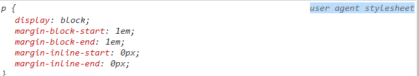
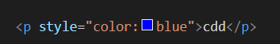
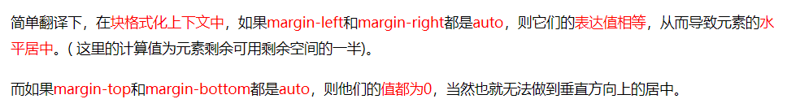
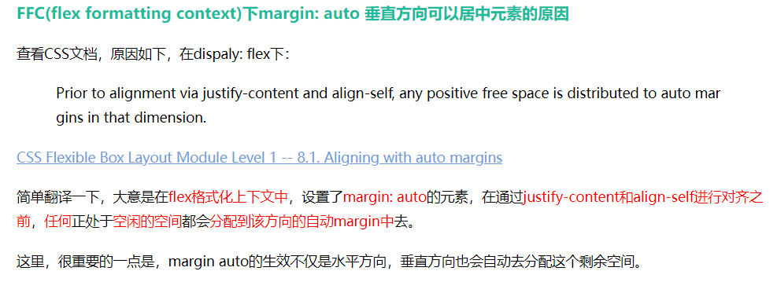
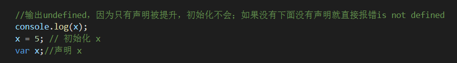
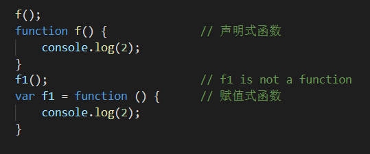
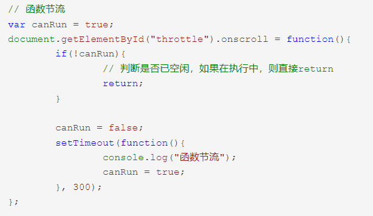
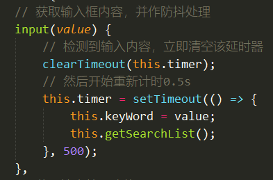

# HTML

每个 HTML 文件里开头都有个很重要的东西，Doctype，知道这是干什么的吗？

答：告诉浏览器按照何种规范解析页面

常见的 DOCTYPE 声明

HTML 5：<!DOCTYPE HTML>


浏览器自带样式`user agent stylesheet`：


前端页面有哪三层构成，分别是什么？作用是什么？

结构层：由 HTML 或 XHTML 之类的标记语言负责创建，仅负责语义的表达。解决了页面“内容是什么”的问题。

表示层：由CSS负责创建，解决了页面“如何显示内容”的问题。

行为层：由脚本负责。解决了页面上“内容应该如何对事件作出反应”的问题。


## 为什么标签要语义化？

```
1. 标签语义化对于搜索引擎友好，利于SEO
2. 更容易让屏幕阅读器等其他设备读出网页内容
3. 去掉或者丢失样式的时候，页面仍然能够呈现清晰的结构
4. 便于团队的开发与维护
```

## 对浏览器内核的理解

```
主要分为：渲染引擎和JS引擎
渲染引擎：主要负责获取页面的html，css，然后加载到页面上
JS引擎：主要负责解析和执行JavaScript来实现网页的动态效果
```

## 请描述一下 cookies，sessionStorage 和 localStorage 的区别？

cookie是网站为了标示用户身份而储存在用户本地终端（Client Side）上的数据（通常经过加密），是服务器发送到用户浏览器并保存在本地的一小块数据，它会在浏览器下次向同一服务器再发起请求时被携带并发送到服务器上。
cookie数据始终在同源的http请求中携带（即使不需要），记会在浏览器和服务器间来回传递。
sessionStorage和localStorage不会自动把数据发给服务器，仅在本地保存。

存储大小：
    cookie数据大小不能超过4k。
    sessionStorage和localStorage 虽然也有存储大小的限制，但比cookie大得多，可以达到5M或更大。

有期时间：
    localStorage    存储持久数据，浏览器关闭后数据不丢失除非**主动**删除数据；
    sessionStorage  **数据在当前浏览器窗口关闭后自动删除。**
    cookie          设置的cookie过期时间之前一直有效，即使窗口或浏览器关闭


## **session**


服务端的程序如何去识别客户端的状态，大家知道，http是无状态的

比如现在有个用户A，它访问了服务器程序，那服务器程序如何知道下一次再访问的时候还是A呢？

因此，对于这一块就要用到非常重要的概念，session，当然，这个session可不是浏览器的，而是服务器的，它是用来存储用户的信息的。


当访问服务器某个网页的时候，只要发起了http请求（包括请求html,css,img,js等等），就会在服务器端的内存里开辟一块内存，这块内存就叫做session，而这个内存是跟浏览器关联在一起的。当程序需要为某个客户端的请求创建一个session的时候，服务器首先检查这个客户端的请求里是否已包含了一个session标识 - 称为session id，如果已包含一个session id则说明以前已经为此客户端创建过session，服务器就按照session id把这个session检索出来使用，如果检索不到，就会新建一个。如果客户端请求不包含session id，则为此客户端创建一个session并且生成一个与此session相关联的session id，然后把这个session id返回给客户端，并在客户端的**cookie**中保存起来。

综上所述，cookie 和 session 的关系是：服务端用 session 来保存用户的状态，然后客户端用 cookie 来保存 session ，服务器端把 session 种植到 cookie 中，然后下次访问时，cookie 会携带着 session ，进而达到一个身份认证的效果。


 **4.解决跨域的方法？？？**

对最主要的AJAX跨域来说（也就是平常调接口时）：

1）（后端）服务器配置CORS(跨域资源共享)

2） （后端）node.js或nginx,反向代理，把跨域改造成同域

3）（前端）将JSON升级成JSONP,在JSON的基础上，利用<script>标签可以跨域的特性，加上头设置


# CSS

## 优先级

最近的祖先样式比其他祖先样式优先级高。

选择器优先级关系：!important > 内联（行内）样式 > ID > 类、伪类、属性 > 标签（元素）、伪元素 > 继承 > 通配符

如果两个选择器的样式都加了!important，那么还是按照它们两个的优先级比较

行内：


## 定位

文档流：是文档中元素在排列时所占用的位置。

相对定位的元素并未脱离文档流，而绝对定位的元素则脱离了文档流。

绝对定位元素相对于*最近的非 `static` 祖先元素*定位，一直往上找直至取`html`为定位

脱离了文档流后并不为元素预留空间，接着文档流中的其他元素会补上这个位置

脱离文档流方法：`float`、`position:absolute`、`position:fixed`

`z-index`只能在`position`属性值为`relative`或`absolute`或`fixed`的元素上有效


## 纯CSS三角形

```css
 	  height: 0;
      width: 0;
      border-top: 80px solid transparent;
      border-left: 80px solid transparent;
      border-right: 80px solid transparent;
      border-bottom: 80px red solid;
```


原理：宽高设置为0，整个元素看起来就只剩下border了，利用border属性，只留一条边有颜色就行了；

全部都有颜色的样子：


## import和link

- **@import** 是 CSS2.1 才出现的概念，所以如果浏览器版本较低，将无法正确导入外部样式文件；`link`标签作为 HTML 元素，不存在兼容性问题。
- 加载页面时，`link`标签引入的 CSS 被同时加载；`@import`引入的 CSS 将在页面加载完毕后被加载。

```css
<style>
@import url(images/style.css);
</style>
```


## 居中

水平居中：

```css
1、margin:0 auto			
2、display:flex;  
   justify-content:center;
```

水平垂直居中：

1、给父元素定位`relative`，子元素`absolute`，然后`left：50%，top：50%，transform：translate（-50%，-50%）`。

需要translate往左上移动自身宽高一半距离的原因是：left：50%，top50%指的是子元素左上角

2、

```CSS
display:flex;		
justify-content:center;
align-items:center;
```

3、

```CSS
父元素：display:flex;		
子元素：margin:auto;
```

但是如果没有`flex`布局，则只是水平居中，这是因为CSS文档中规定的BFC（block formatting context）：



**自适应格式化上下文**：




注意：设置了`margin:auto`后再设置父元素的`justify-content`/`align-items `或者子元素`align-self`则不生效，这里存在优先级的问题，`margin`的优先级更高一些


## 盒模型

 盒模型： 内容(content)、填充(padding)、边界(margin)、 边框(border)；

**标准盒子模型（W3C盒子模型）**中，**width 和 height 指的是内容区域**的宽度和高度。增加内边距、边框和外边距不会影响内容区域的尺寸，但是会增加元素框的总尺寸。

**IE盒子模型（怪异盒模型）**中，**width 和 height 指的是内容区域+border+padding**的宽度和高度。


# JS

## 声明提升

**声明提升(hoisting)**：函数声明和变量声明总是会被悄悄地被"提升"到方法体的最顶部。

 只有声明的变量会提升，初始化的不会。




undefined和is not defined的本质区别在于：变量是否被声明。

undefined：**变量未赋值**或者**函数没有返回值时返回**。

声明式和赋值式：




## 节流、防抖

- 函数节流: 指定时间间隔内只会执行一次任务；

  有什么用？	应用场景：用户不断上拉刷新数据，这样会很频繁的发送数据请求，增加服务器压力。于是可以设置一个变量作为节流阀，每次要请求数据的时候都判断变量是`true`还是`false`，如果是`true`代表正在请求数据，则直接`return`拒绝此次请求，反之放行请求。然后请求方法里面在开头将变量设置为`true`，在末尾设置为`false`。

  亦或者也像防抖一样设置一个`setTimeout`，例子：

  

- 函数防抖: 任务频繁触发的情况下，只有任务触发后超过一定时长，任务才会执行；

  有什么用？	应用场景：用户在搜索框输入文字，要等待用户停止输入超过一定时间后，请求数据任务才执行。

  例子：


## for循环+延时

考点为立即调用函数写法

```js
1、for (var i = 0; i < 6; i++) {
      (function (i) {  //如果这里不写参数，则输出6个6；因为下面要输出i，如果这里没有i，则会继续向上寻找
        setTimeout(function () {
          console.log(i);
        }, 1000)
      })(i)
}
//或者var改成let就可以了
2、for (let i = 0; i < 6; i++) {
        setTimeout(function () {
          console.log(i);
        }, 1000)
}
```

## JS引擎知识

**JS是单线程的，同一个时间只能做一件事；**

**js执行顺序：先同步后异步**

遵循事件循环机制，当JS解析执行时，会被引擎分为两类任务，同步任务（synchronous） 和 异步任务（asynchronous）。对于同步任务来说，会被推到执行栈按顺序去执行这些任务。对于异步任务来说，当其可以被执行时，会被放到一个 任务队列（task queue） 里等待JS引擎去执行。当执行栈中的所有同步任务完成后，JS引擎才会去任务队列里查看是否有任务存在，并将任务放到执行栈中去执行，执行完了又会去任务队列里查看是否有已经可以执行的任务。这种循环检查的机制，就叫做事件循环(Event Loop)。对于任务队列，其实是有更细的分类。其被分为 微任务（microtask）队列 & 宏任务（macrotask）队列。

宏任务：整体代码script，setTimeout，setInterval。 

微任务：Promise，process.nextTick

**微任务执行优先级高于宏任务**

Promise运行顺序总结：

- **promise的构造函数是同步执行，promise.then中的函数是异步执行。**


## async/await相比promise的优势

**把异步的行为用同步的写法写出来，而非是把异步变成同步；简化了操作，便于维护**

**await是一个让出线程的标志**。await后面的函数会先执行一遍，然后就会跳出整个async函数来执行后面js栈的代码，等本轮事件循环执行完了之后又会跳回到async函数中执行剩下的代码


## 闭包

​	在JS中，变量的作用域属于函数作用域，在函数执行后作用域就会被清理、内存也随之回收，但是由于闭包是建立在一个函数内部的子函数，由于其可访问上级作用域的原因，即使上级函数执行完，作用域也不会随之销毁，这时的子函数——也就是闭包，便拥有了访问上级作用域中的变量的权限，即使上级函数执行完后作用域内的值也不会被销毁。

​	在本质上，闭包就是将函数内部和函数外部连接起来的一座**桥梁。**


## Object.defineProperty()

`Object.defineProperty()`方法会直接在一个对象上定义一个新属性，或者修改一个对象的现有属性，并返回此对象。

```js

    //将要进行变动的对象
    var object1 = {};
    //三个参数分别是：要定义属性的对象、要定义或修改的属性的名称、要定义或修改的属性描述符
    Object.defineProperty(object1, 'property1', {
      // 属性的值
      value: 42,
      // 定义的value是否可别改变，默认false
      writable: true,
    });

    var demoValue = 1;
    // 自定义属性的getter和setter，注意不能自定义就不能写value或者writable了，否则报错
    Object.defineProperty(object1, 'property2', {
      //getter
      get() {
        console.log(demoValue);
      },
      //setter
      set(newValue) {
        demoValue = newValue
      }
    });
    console.log(object1.property2);
```


# Vue

## 组件化和模块化

这是为了解决**高耦合、低内聚、无重用**的3大代码问题

**组件：**把重复的代码提取出来合并成为一个个组件，组件最重要的就是重用（复用）

**目的：复用，解耦。**


**模块：**分属同一功能/业务的代码进行隔离（分装）成独立的模块，可以独立运行，独立管理，每个模块有很多接口，可供调用

**目的：隔离/封装 （高内聚）。**


## 服务端渲染

**简介：**

服务端渲染：页面渲染过程是在服务端完成，最终的HTML字符串，直接通过请求发送给客户端。

客户端渲染：客户端请求页面时，返回是空HTML，通过请求完js，css等，在客户端进行渲染（浏览器）。

**详情：**

​	服务端渲染是先向后端服务器请求数据，然后生成完整首屏html返回给浏览器；而客户端渲染是等js代码下载、加载、解析完成后再请求数据渲染，等待的过程页面是什么都没有的，就是用户看到的白屏。就是服务端渲染不需要等待js代码下载完成并请求数据，就可以返回一个已有完整数据的首屏页面。


​	**搜索引擎无法进行索引的核心原因就是，其在爬取网站数据的时候，是不会执行其中包含的JS过程的；而采用Vue的方式开发的应用，其数据都是来源于`axios`或者其它的`ajax`方法获取的数据！也就是说，想要友好的支持搜索引擎，就必须采用服务器端渲染的相关技术**


服务端渲染

优点：容易 SEO，首屏加载快，因为客户端接收到的是最终的完整的 HTML 页面，而不是传统方式：需要把JS文件下载并执行后才显示画面，并且很可能用户的网速很慢，所以这种情况要尽可能的减少页面请求数量

缺点：服务器压力大，即使局部页面的变化也需要重新发送整个页面

客户端渲染

优点：节省后端资源，局部刷新页面，多端渲染，前后端分离
缺点：首屏性能差，白屏，无法（或很难）进行 SEO等


从头搭建一个服务端渲染的应用是相当复杂的，因为还有配置`node`服务器

## Vuex

优点：集中管理共享的数据，易于开发和后期维护；
缺点：刷新浏览器，vuex中的state会重新变为初始状态，解决方案：插件vuex-persistedstate

`npm i -S vuex-persistedstate`

默认使用`localStorage`来固化数据

```vue
import persistedState from 'vuex-persistedstate'
export default new Vuex.Store({
    // ...
    plugins: [persistedState()]
  //或者persistedState({ storage: window.sessionStorage })来改用sessionStorage
})
```


mutations：同步操作，专注于修改State，理论上是修改State的唯一途径。

actions：业务代码、异步操作， 提交的是 mutation，而不是直接变更状态。


