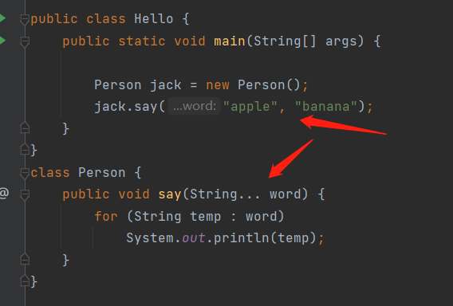
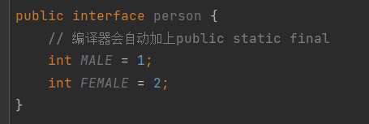
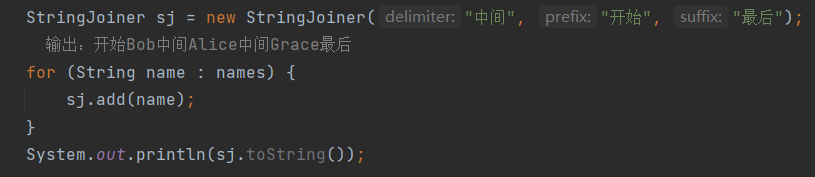
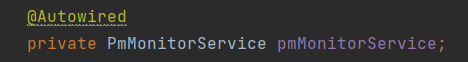
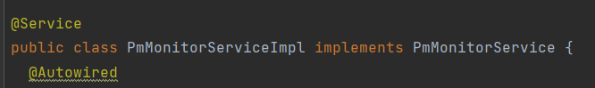
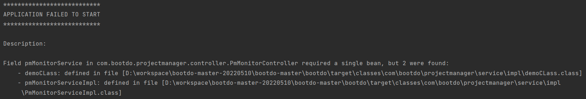

# 基本语法

## 可变参数



调用的时候输入多少个参数都可以，都会变成数组存储起来

## 子构造方法

如果父类没有默认的构造方法，子类就必须显式调用`super()`并给出参数以便让编译器定位到父类的一个合适的构造方法。

任何`class`的构造方法，第一行语句必须是调用父类的构造方法。如果没有明确地调用父类的构造方法，编译器会帮我们自动加一句`super();`

子类**不会继承**任何父类的构造方法。子类默认的构造方法是编译器自动生成的，不是继承的。

## 转型

- 可以安全地向上转型为更抽象的类型，因为父有的东西，子肯定都有；
- 可以强制向下转型，最好借助`instanceof`判断，因为子有的东西，父不一定有；

## 抽象

如果一个`class`定义了方法，但没有具体执行代码，这个方法就是抽象方法，抽象方法必须用`abstract`修饰。

因为无法执行抽象方法，因此这个类也必须申明为抽象类，使用`abstract`修饰的类就是抽象类。我们无法实例化一个抽象类

**抽象类无法被实例化**

无法实例化的抽象类有什么用？因为抽象类本身被设计成只能用于被继承，因此，抽象类可以强迫子类实现其定义的抽象方法，否则编译会报错。因此，抽象方法实际上相当于定义了“规范”。

## 接口

如果一个抽象类没有字段，所有方法全部都是抽象方法，就可以把该抽象类改写为接口：`interface`

```
interface Person {
    void run();
    String getName();
}
```

一个类只能继承自另一个类，不能从多个类继承。但是，一个类可以实现多个`interface`


所谓`interface`，就是比抽象类还要抽象的纯抽象接口，因为它连字段都不能有（也不是绝对，看下一段）。因为接口定义的所有方法默认都是`public abstract`的，所以这两个修饰符不需要写出来（写不写效果都一样）。

因为`interface`是一个纯抽象类，所以它不能定义**实例字段**。但是，`interface`是可以有**静态字段**的，并且静态字段必须为`final`类型



## 字符串

`StringBuilder`，它是一个可变对象，可以预分配缓冲区，这样，往`StringBuilder`中新增字符时，不会创建新的临时对象

`StringJoiner`用于方便拼接字符串




# @Autowired



这里只是写了一个接口引用，但是下面居然能直接调用它的非静态方法


原因就是这个注解起的作用：自动寻找有哪个类implements了这个接口，并把这个类赋给引用



比如这里有一个类implements了这个接口，那么项目就会自动将这个类注入到上方的引用中

如果有两个类同时引用了这个接口呢？会直接编译报错：



# GenerateAllSetter插件

要给DTO传值，这个插件可以按ALT+ENTER自动生成该类的所有set方法
