**本文Linux采用VM虚拟机安装，版本为centOS 7.9**

# 相关软件及准备

`xshell`和`xftp`必不可少，填个邮箱免费下载使用：https://www.xshell.com/zh/free-for-home-school/

基本的VM下载和安装不用说，百度一堆

检查虚拟机的服务有没有被禁用：


然后是安装centOS:https://blog.csdn.net/qq1808814025/article/details/120154274

注意网络连接


centOS中打开终端：

先输入su，再输入密码以打开root权限

然后修改网卡配置：`vi /etc/sysconfig/network-scripts/ifcfg-ens33`【有可能不是ens33，建议cd到这个路径下看是esc几】

`ONBOOT`改成yes：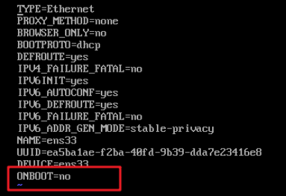

```
这是vim编辑器，默认是命令模式，操作方法是按i键进入修改模式，按ESC退出修改模式并返回命令模式；输入:wq即可保存并退出
命令模式下常用操作：
输入dd可删除一整行；
按v可以进入视图模式，这时按方向键可以移动光标并多选，按下d即可多行删除；
按u可撤销上一次操作
大写ZZ直接退出编辑器
```

之后终端输入`service network restart`重启网络就能联网了

（后面某些情况发现联网又失败，见此文章：）

https://blog.csdn.net/sy755754582/article/details/90247098


cd到`/etc/yum.repos.d`目录下`rm -rf *`清空当前目录下的文件，也就是清空原有的yum库，避免后续yum安装冲突

接着更换国内镜像源：`wget -O /etc/yum.repos.d/CentOS-Base.repo http://mirrors.aliyun.com/repo/Centos-7.repo`


安装举例：`yum`安装谷歌浏览器【当然是安装了图形界面的centOS才考虑装，纯命令行的不用；其实作为程序员应该习惯用纯命令行的方式，推荐用xshell来连接Linux使用，因为Linux自带的命令行界面不能随滚轮上下翻页】

这先需要建立repo源，repo是什么？为什么要建立？

可以理解为让系统知道该从什么地址去安装、升级软件，因为不可能你一句`yum install 某某软件`之后系统就知道该从什么镜像地址下载；

centOS 7的自带Base.reop中默认是没有chrome的（就是上述镜像源的`CentOS-Base.repo`），就好比win10系统不可能出厂自带英雄联盟一样，顶多自带个`Edge`浏览器

额外涉及到的知识点：`rpm`是什么？可以理解为多个repo的压缩包，例如某个软件的安装需要多个repo，那么直接下载这个软件的`rpm`包，然后直接安装这个包就得到了repo，举例安装`mysql`：安装后便得到对应的repo


回到正题，接下来建立谷歌浏览器的repo：

```shell
vim /etc/yum.repos.d/google-chrome.repo
```

然后写入：

```shell
[google-chrome]
name=google-chrome
baseurl=http://dl.google.com/linux/chrome/rpm/stable/$basearch
enabled=1
gpgcheck=1
gpgkey=https://dl-ssl.google.com/linux/linux_signing_key.pub
```

安装：`yum -y install google-chrome-stable --nogpgcheck`，这里可能会提示镜像连接失败等等错误，连续试几次就好

## 常用操作命令

https://blog.csdn.net/weixin_44191814/article/details/120091363

输入su，之后输入密码可进入root模式；或者直接sudo再接命令也一样

按tab键可自动补全命令，如匹配到多个命令，连续按两次可列出匹配到的所有命令

whereis [软件名] **#查找软件位置**

ifconfig或者ip a（等同于ip addr）**#查看ip地址**

ps aux|grep [进程名] **#查找进程**


这行的意思是：查询的grep命令本身

netstat -tunlp **显示tcp、udp的端口和进程等相关情况**

pkill [name]    **根据进程名称杀死**

netstat -tunlp|grep [端口号] **#查看具体某个端口占用情况**

## 其他小命令

systemctl  set-default graphical.target   **#设置开机默认图形桌面启动** 

systemctl  set-default multi-user.target  **#设置开机默认命令行启动**

yum -y update **#升级所有包同时也升级软件和系统内核**

yum -y upgrade **#只升级所有包，不升级软件和系统内核**

传说中的删库跑路法：rm -rf /*，也就是从根目录下删除所有文件，最后连系统都不存在了


# 安装项目运行环境

大概总过程:https://blog.csdn.net/hx_76/article/details/123956632

## JDK和maven

https://blog.csdn.net/wang121213145/article/details/124314157

https://www.cnblogs.com/fuzongle/p/12825048.html

注意`vi /etc/profile`的时候，这个JAVA_HOME的路径要设置为如下所示，也就是安装后的实际文件夹；如设置错误将导致后面安装maven的时候会提示JAVA_HOME不正确


## mysql

https://blog.csdn.net/a774630093/article/details/79270080

其中注意开启3306端口：https://blog.csdn.net/qq_15110681/article/details/125630635

开启外部机器连接权限：GRANT ALL PRIVILEGES ON *.* TO 'root'@'%' IDENTIFIED BY '123456' WITH GRANT OPTION;

## nginx

https://blog.csdn.net/qq_37345604/article/details/90034424

添加到环境变量：https://blog.csdn.net/qq_43795348/article/details/121733715，就可以在任意路径使用命令

启动命令：nginx

停止命令：nginx -s quit

重载命令：nginx -s reload

proxy_pass代理转发规则：https://www.jb51.net/article/227243.htm

总结：看代理转发路径端口号后面，**但凡有斜杆出现**，那么代理真实路径等于proxy_pass+匹配部分后面的路径，也就是不包含匹配部分，反之则包含。

# 启动后端

1、项目所用到的数据库系统（例如用到了mysql和MongoDB）中创建后端用到的数据库

2、上传后端代码直接`java -jar 后端打包文件.jar`（war文件也是同样的命令）

3、数据库导入sql文件

# 启动前端

设置nginx：前端打包代码路径随便放，之后在root参数设置好就行，没有硬性规定一定得是哪个路径


之后浏览器输入server_name的路径就可以访问了

# 安装https

报错：


重启一下就好：systemctl restart snapd.service

# chrome和chromedriver

https://blog.csdn.net/China_hdy/article/details/126739461

chromedriver要解压放到/usr/bin中去赋予权限


## selenium设置

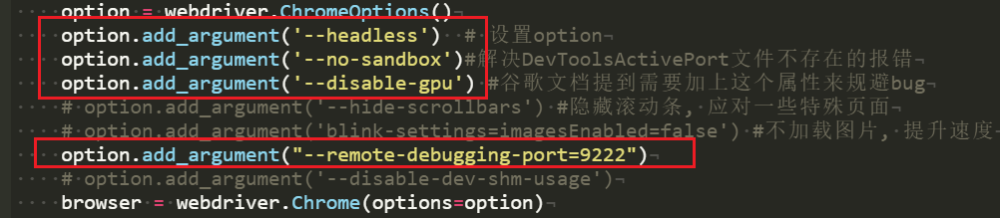

设置这四个就行，其他的设置的话，发现会存在爬取文字内容对不上号的问题

# python

## pip安装

yum -y install epel-release

yum install python-pip

pip install --upgrade pip

## 软链接（关系到使用什么版本的Python）

输入python再按两下tab键，可以看到有什么版本的Python被安装了

**进入到该目录中**

cd /usr/bin/

**查询python软链接，如果有红色闪烁，代表链接的文件已经不见了**

ls -l /usr/bin/python*

**删除python软链接**

rm -rf /usr/bin/python


**查询pip软链接**

ls -l /usr/bin/pip*

**删除pip软链接**

rm -rf /usr/bin/pip


**创建软链接**

ln -s /usr/bin/python3 /usr/bin/python

（此时输入命令python时，用的是python3）

ln -s /usr/bin/python2 /usr/bin/python

（此时输入命令python时，用的是python2）


# 境外服务器搭梯子

## shadowsocks（方法一，裸连，容易被墙，已弃用）

大致流程：https://www.itwordsweb.com/linux_doc/ss.html

注意：在服务器中输入相应的梯子命令时，过程中有两次出错，一次直接断开服务器连接了，不知道为啥，不过等上去再输入

cd /usr/local/src

./shadowsocks.sh 2>&1 | tee shadowsocks.log

之后，按流程进行，还是成功完成了


过程中还有点插曲，梯子服务搭建时一直反复报错：Another app is currently holding the yum lock； waiting for it to exit...

输入rm -f /var/run/yum.pid解决，再重复上面的梯子搭建过程就行

### 开启BBR加速，拉满服务器带宽

服务器输入命令，直接一键下载、安装：（会提示重启服务器，按提示输入y重启就好）

wget --no-check-certificate https://github.com/teddysun/across/raw/master/bbr.sh && chmod +x bbr.sh && ./bbr.sh

然后输入以下命令查看是否已经开启BBR

lsmod | grep bbr

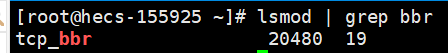

这样则成功开启了

该脚本作者文章（要翻墙）：https://teddysun.com/489.html

## V2Ray（方法二，推荐）

买一个域名，配合Cloudflare中转V2Ray流量，能隐藏服务器真实IP地址

服务器的V2Ray脚本安装文章：

https://github.com/233boy/v2ray/wiki/%E4%BD%BF%E7%94%A8Cloudflare%E4%B8%AD%E8%BD%ACV2Ray%E6%B5%81%E9%87%8F#%E6%8F%90%E9%86%92

### 域名、Cloudflare操作

**修改域名DNS服务器**：哪里买的域名，就在哪里修改DNS服务器为Cloudflare的DNS服务器，例如我在namesilo买的域名：


红框中的地址来源于Cloudflare添加站点时的提示：

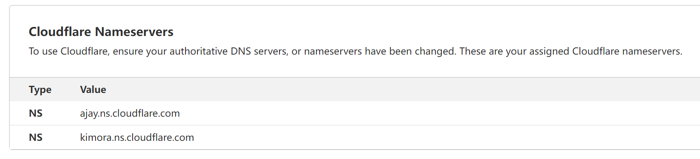

**其他步骤上面文章操作即可**

### 服务器操作

大致简化流程：

1、服务器输命令：bash <(curl -s -L https://git.io/v2ray.sh)

2、传输协议选择 WebSocket + TLS (即是选择 4 )，V2Ray 端口随便，不要是 80 和 443 即可，**然后输入你的域名，域名解析 Y ，自动配置 TLS 也是 Y** ，其他就默认吧，一路回车。等待安装完成，此时已自动开启BBR加速

3、输入命令：v2ray url，即可生成vmess url 链接，粘贴到客户端V2RayN即可上网

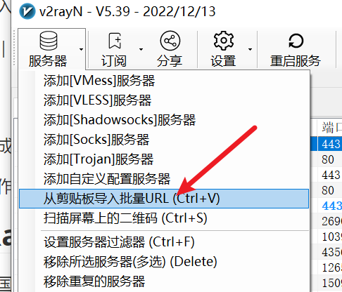

# 已经被墙的服务器，怎么SSH连接

保证最起码有一个机场能用的节点，不用全局代理，回车选中就好，例如：

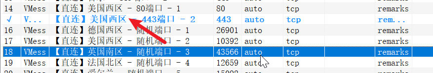

然后打开Xshell，右键服务器点属性，点击代理：

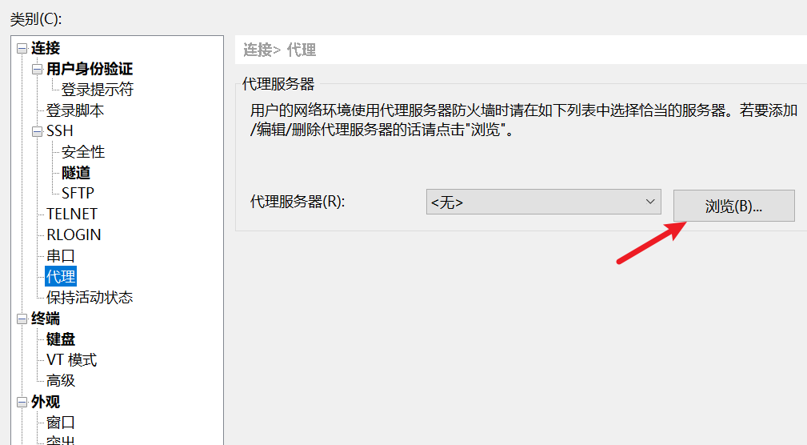

以下**类型**、**主机**、**端口**号为固定填写：

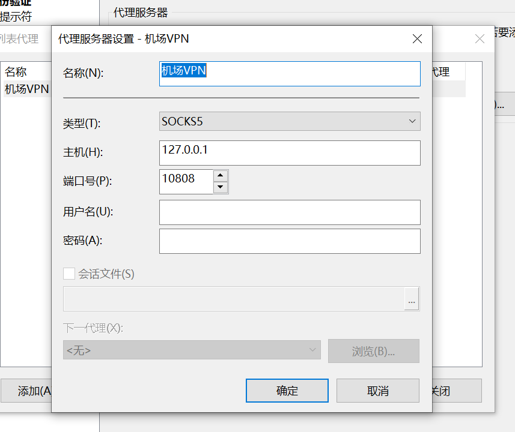

然后确保选中配置：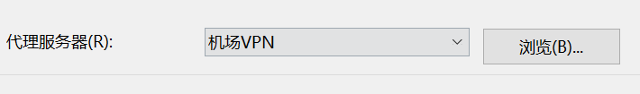

然后在客户端操作，确保为10808

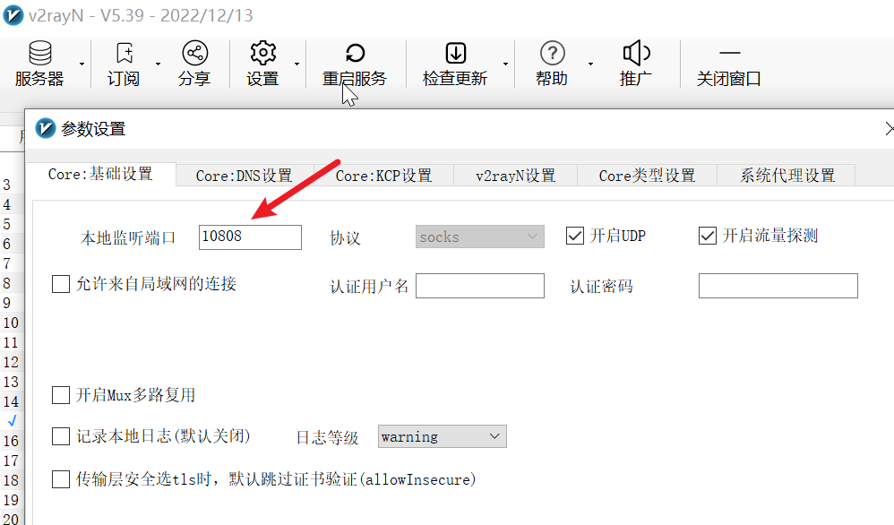

此时便可直接连接：

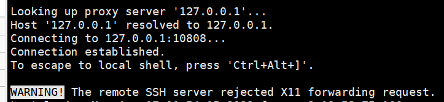
