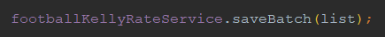
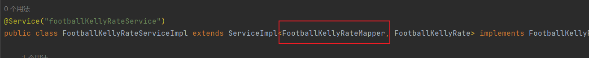
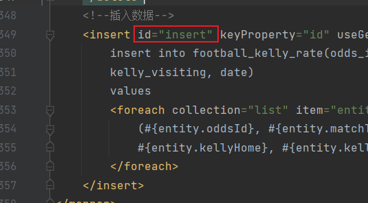

# mybatis-plus

使用mp自带的批处理插入时，

如果对应的Mapper.xml中有id="insert"的sql时，会报错：

**There is no getter for property named 'list' in 'class com.bootdo.footBallWeb.entity.FootballKellyRate'**

解决办法：给它换个名字即可，例如`insertBatch`