# spring开发经历

启动报错时，要看完整的报错信息，不要只看最开始的错误提示，因为报错是嵌套起来的，可能真正的错误藏在里面

## application.yml配置

必须有个空格，否则语法报错：

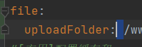

## 引入`Mongodb`

本地：

安装过程：https://blog.csdn.net/crsitin_spade/article/details/121383699

结合spring开发，指名用哪个数据库：

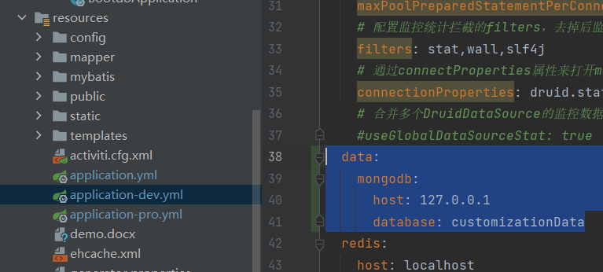

增删改查：核心就是用到了`MongoTemplate`这个类；也可以改用经典的三层结构来做，但是这里我选择直接在控制层做增删改查

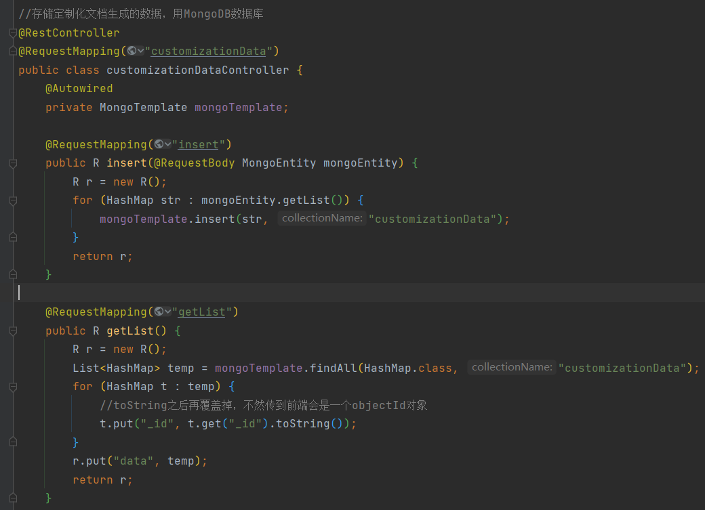

服务器上安装：这里用的是宝塔举例，一定要将宝塔面板更新到最新版本

首先安装

然后改bindIp，目的是为了开发者能在本地的数据库可视化工具上远程操作服务器数据库

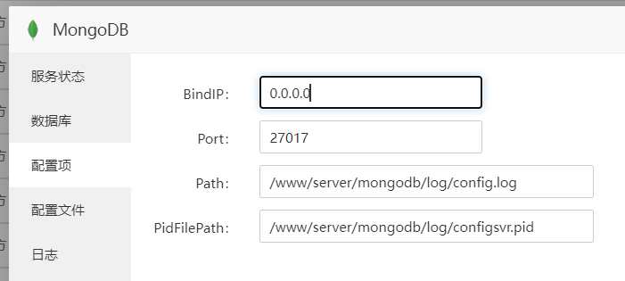

添加数据库：

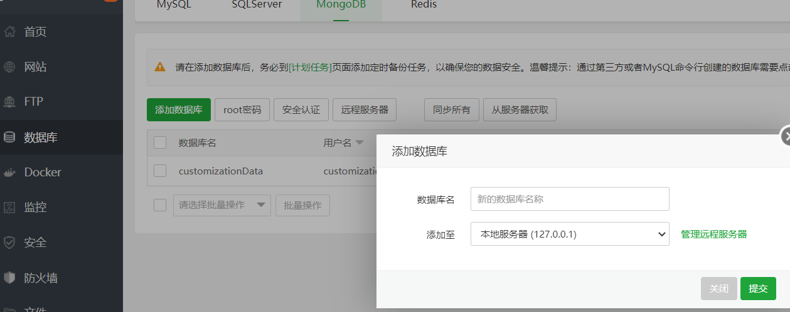

以上是不设置数据库账号密码的情况，容易被黑掉数据库来勒索

设置admin账号：https://blog.csdn.net/hangbobo/article/details/112382132

在宝塔上添加一个数据库：这三个输入框都可以随便取

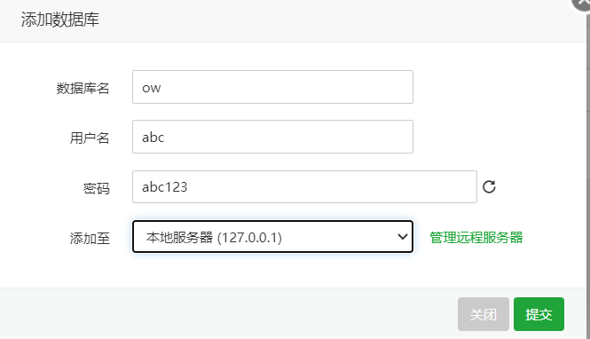

之后对服务器mongodb数据库的操作，建议在Navicat上操作

连接：这里的**验证数据库**以及用户名和密码就是刚刚添加数据库时填写的信息

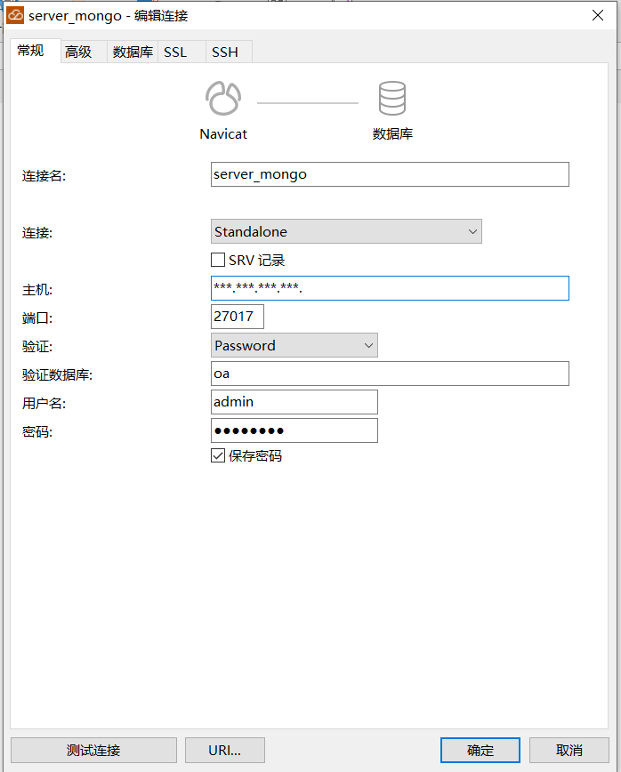

之后的导入SQL文件等都是在Navicat上直接右键MongoDB里面的数据库进行导入

## 接收前端数据

1、正常的用VO接收

2、用`Map<String, Object> map`接收

3、用`JSONObject obj`接收

其中2和3接收处理的一样的步骤；其中`Map`如果对于某个key的value是数组的操作：

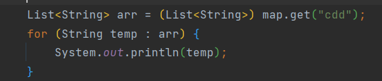

## 多文件上传

## 上传文件方式改变

​	因为一个需求要改变传输方式：显示上传进度。用户本地传输到后端的进度可以直接用axios的onUploadProgress回显进度，但是后端拿到文件后，如果用FTP连接存进服务器，是很费时间的，文件越大越明显，这就导致了前端axios显示的进度条早就100%了，但还是得等很久后端才返回上传成功的信息；但如果不用FTP，直接存进后端项目所在的服务器内是很快的

​	之前后端的写法在处理文件上传的时候，一直是FTP连接；并且我存放文件的位置也是与后端项目同处一个服务器，这样的话有点脱裤子的感觉，好比两个人就坐在一起，明明可以直接面对面交流，非要给对方打电话交流；明明都在同一个服务器了，其实可以直接访问该服务器的其他路径存放文件的；当然如果有专门存放文件的服务器的话，还是需要FTP连接来读取文件的

​	现在改为：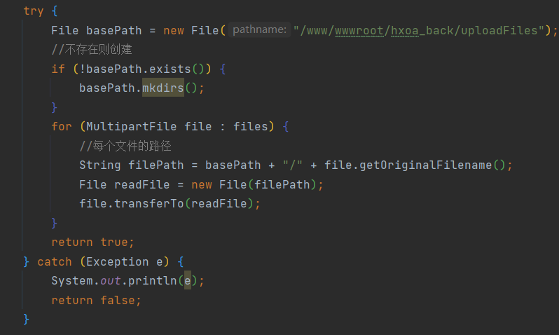

**注意：**这种方式存储要注意服务器路径文件是否有权限介意写入，没有权限就会存储失败

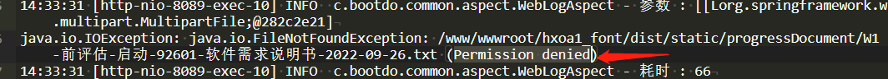

宝塔右键文件夹设置权限：

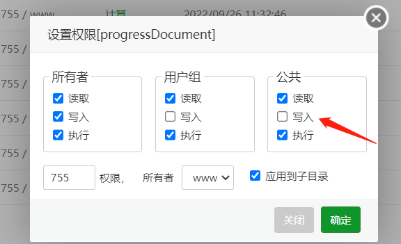

## 上传文件过大

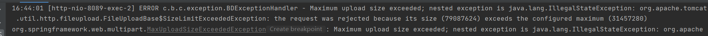

在这里设置就好：

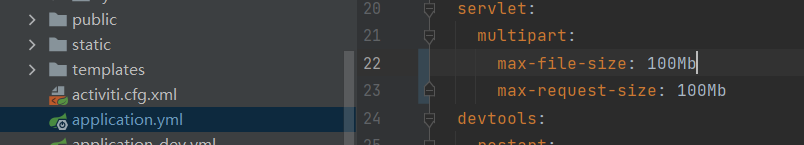

## 上传大文件，服务器响应时间长

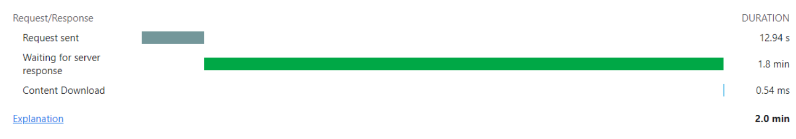

解决：nginx接口代理改成本地，响应时间就控制在了1秒左右（之前填的是网站域名，后面改成服务器IP地址，其实改成本地地址才是正确的）

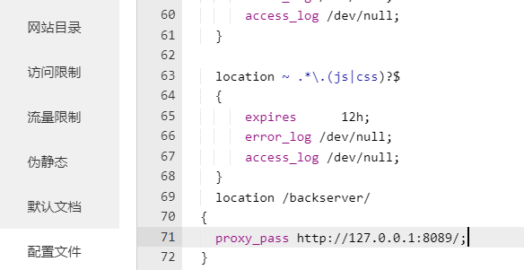

## easy code插件

生成的xml文件默认是放在mapper文件夹，但是要根据你的controller写在哪个包，放在哪个包：

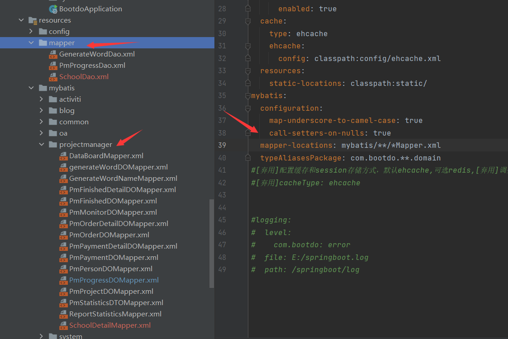

## 调用Python

场景：springboot里面调用Python脚本

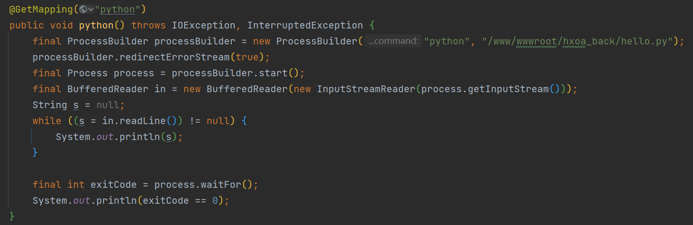

Python脚本：

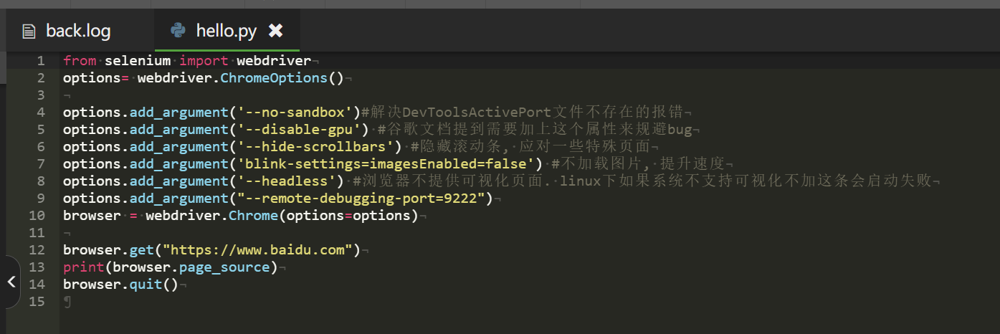

服务器上安装了Python3，Chrome、Chromedriver（版本号需一一对应）、selenium

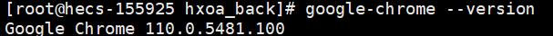

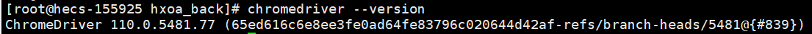

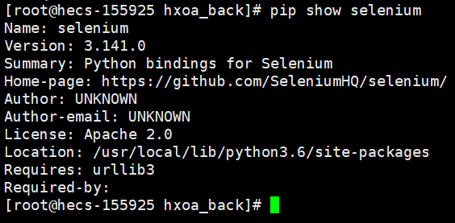

本地机器也同样配置好了需要的环境，但是部署到centos7 上就报错`chrome not reachable`

在公司弄了一天查遍国内外各大网站没搞定，回去之后再仔细想想

`netstat -tunlp`命令：

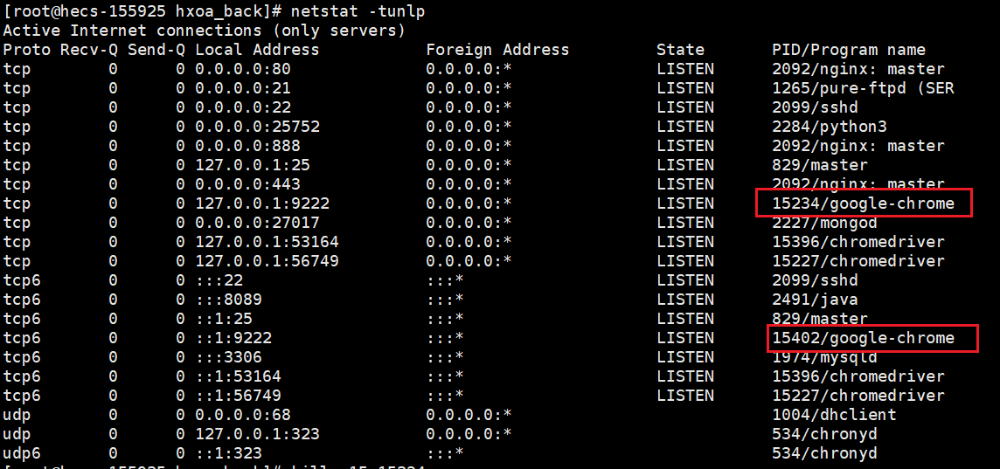

发现两个浏览器相关的进程还在挂着，想了想是我回去之后，又一顿乱操作脚本，忘记browser.quit()了，随后根据PID杀了这两个进程：

然后就发现接口调用Python脚本居然通了（看过的最初的文章说的就是因为忘记browser.quit()导致进程一直被占用，后续的脚本调用就会失败，但是我白天在公司明明记得确认过服务器进程了是没有google-chrome的）

# 小问题

1、更新后端代码的时候，直接上传覆盖war文件；这时启动的话会报错数据库表外键重复；然后这时我一般重启一下`tomcat`或者再上传一般后端代码就好了，当时觉得很悬乎，赶时间上线用就没深究为什么；现在不用宝塔，用centOS安装研究后发现是因为，后端在启动的时候会自动往数据库里面生成一些大写命名的表，这些表里面用到的外键和新上传的后端代码自动生成的表的外键名重复了

解决办法：先上传并启动后端，再导入sql文件

后面再研究为什么会自动生成这么大写命名的表格

2、List<String>转List<Integer>

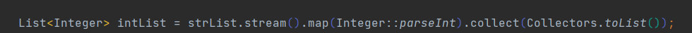

3、在VSCODE中习惯了alt+鼠标左键进行多选，IDEA中设置：

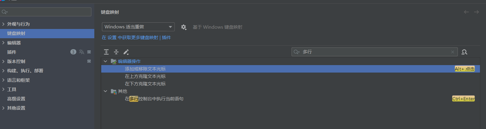

# sql经历

`Mapper.xml`文件中sql关键字大写，同理如果还有其他格式调整也在这里调

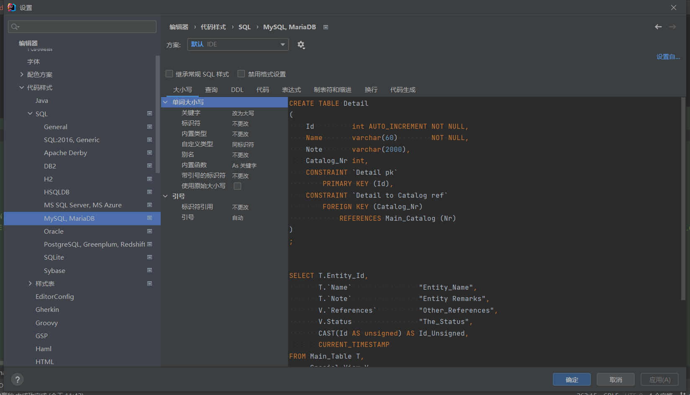

要求对多个项目状态同时模糊搜索，例如前端发请求搜索：“未启动、结束”

用`INSTR`，参数为（搜索字符串，字段）

`ORDER BY`的时候，如果发现结果不对，看看要排序的字段类型是不是数值类型，如果不是要+0：

查询数据库返回对象类型：例如数据库查出5条记录，我要得到这5条记录的全部字段

`Mapper`：

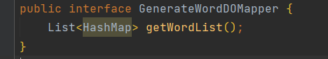

`Mapper.xml`:

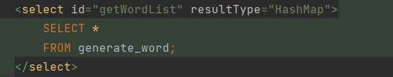

注意别忘了配置这个，如果不配置的话，某个字段为空值时mybatis便不会返回这个字段的值

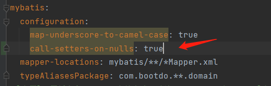

缺点：返回的参数名都是和数据库一样的下划线命名，而不是驼峰命名

解决办法：用`resultMap`，可以对某一列字段进行参数自定义对应：

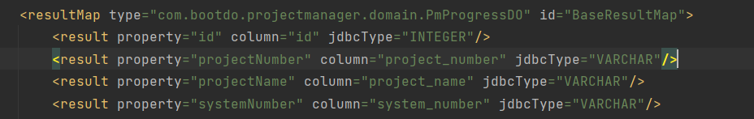

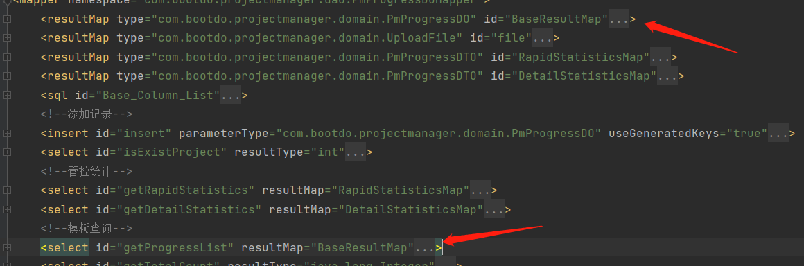

查询数据库返回数组类型：例如我就想查某一列而已

`Mapper`：

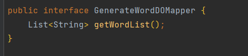

`Mapper.xml`:

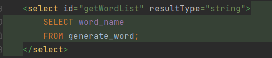