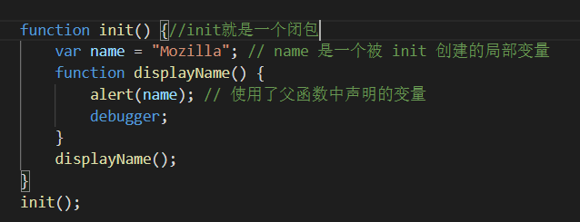
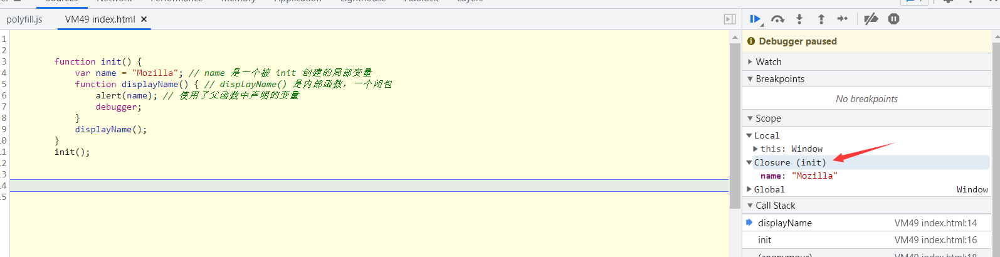

# JavaScript

## **IIFE（ 立即调用函数表达式）**

是一个在定义时就会立即执行的函数

```
(function () {
    statements
})();//这里如果有参数，会传给上面的括号
```

如果重新声明 JavaScript 变量，该变量的值不会丢失。

如果变量在函数内没有声明（没有使用 var 关键字），该变量为全局变量。

如果要在字符串中使用双引号，用转义符号：\"   
或者'	"love"	'  总之最外层包裹字符串的引号（不管单双），不能和里面的相同

如果数字与字符串相加，返回字符串


运算符：
绝对等于（值和类型均相等）： ===
 不绝对等于（值和类型有一个不相等，或两个都不相等）：！==
【switch 语句会使用恒等计算符(===)进行比较，也就是说值、类型都要一样】

null 和 undefined 的值相等，但类型不等

className=“XXX”给元素完全修改为改类所含的样式
className+=" XXX"（注意要有空格）给元素添加类所含样式
className=className.replace("XXX","") 移除类所含样式


在 JavaScript 中函数也是对象，对象则有方法，apply 和 call 就是函数对象的方法。
这两个方法异常强大，他们允许切换函数执行的上下文环境（context），即 this 绑定的对象。
call() 和 apply() 是预定义的函数方法。 两个方法可用于调用函数，两个方法的第一个参数必须是对象本身。
这两个函数的意义就在于：即使是A对象里面的函数，B对象也能用
function myFunction(a, b) {
    return a * b;
}
myObject = myFunction.call(myObject, 10, 2);     // 返回 20


function myFunction(a, b) {
    return a * b;
}
myArray = [10, 2];
myObject = myFunction.apply(myObject, myArray);  // 返回 20
两个方法都使用了对象本身作为第一个参数。 两者的区别在于第二个参数： apply传入的是一个参数数组，
也就是将多个参数组合成为一个数组传入，而call则作为call的参数传入（从第二个参数开始）。


在方法中，this 表示该方法所属的对象。
如果单独使用，this 表示全局对象。
在函数中，this 表示全局对象。
在函数中，在严格模式下，this 是未定义的(undefined)。
在事件中，this 表示接收事件的元素。
类似 call() 和 apply() 方法可以将 this 引用到任何对象。

var关键字定义的变量可以先使用后声明。
let关键字定义的变量需要先声明再使用。
let实现块级作用域，let 声明的变量只在 let 命令所在的代码块 {} 内有效，在 {} 之外不能访问。
const关键字定义的常量，声明时必须进行初始化，且初始化后不可再修改。
const 的本质: const 定义的变量并非常量，并非不可变，它定义了一个常量引用一个值。使用 const 定义的对象或者数组，其实是可变的。
（相当于可以对他人送你的车进行改装，但是不能直接卖了换一台）

在相同的作用域或块级作用域中，const、let声明过后的变量均不能重置，var声明过后的变量也不能用const、let重置

javascript:void(0) 该操作符指定要计算一个表达式但是不返回值。

函数表达式可以存储在变量中：
var x = function (a, b) {return a * b};
这种就是匿名函数 ，函数存储在变量中，不需要函数名称，通常通过变量名来调用。

## 箭头函数

// ES5
var x = function(x, y) {
     return x * y;
}

// ES6
const x = (x, y) => x * y;		//箭头后面只有一行代码且不加花括号，默认自带return；
				如果有多行代码要写，要带花括号，并且这时候手动加上return


这里使用 const 比使用 var 更安全，因为函数表达式始终是一个常量。

ES5 中如果函数在调用时未提供隐式参数，参数会默认设置为： undefined
ES6 支持函数带有默认参数：function myFunction(x, y = 10)	//意思就是说如果调用函数时只写了一个参数，那就默认第二个参数为10

JavaScript 函数有个内置的对象 arguments 对象：
x = findMax(1, 123, 500, 115, 44, 88);

function findMax() {
    var i, max = arguments[0];
.........
}
这样可以快速引用参数


## 闭包（Closure）

概念：内层的作用域访问它外层函数作用域里的参数/变量/函数时，闭包就产生了。






# JSON

**JSON 是 JS 对象的字符串表示法，它使用文本表示一个 JS 对象的信息，本质是一个字符串
对象：
var person = {
    firstName : "John",
    lastName  : "Doe",
    age       : 50,
    eyeColor  : "blue"
};

 JSON 对象：
 var JSONObject= {
    "name":"德邦",
    "url":"www.LOL.com", 
    "slogan":"一点寒芒先到，随后枪出如龙"
};


普通方法写法：
<script>
function myFunction()
{
    alert("Hello World!");
}
</script>


用for-in来循环对象的属性：
var myObj = { "name":"runoob", "alexa":10000, "site":null };
for (x in myObj) {
    document.getElementById("demo").innerHTML += x + "<br>";
}

可以使用 delete 关键字来删除 JSON 对象的属性：

**要实现从JSON字符串转换为JS对象，使用 JSON.parse() 方法：**
var obj = JSON.parse('{"a": "Hello", "b": "World"}');
同样的也可以使用函数 eval() 将 JSON 文本转换为 JavaScript 对象。

**要实现从JS对象转换为JSON字符串，使用 JSON.stringify() 方法：**
var obj = JSON.stringify({a: 'Hello', b: 'World'}); 	//或者括号里面直接放JS对象的引用


# DOM

addEventListener() 方法用于向指定元素添加事件句柄。
addEventListener() 方法添加的事件句柄不会覆盖已存在的事件句柄。
你可以向一个元素添加多个事件句柄。
你可以向同个元素添加多个同类型的事件句柄，如：两个 "click" 事件。
你可以向任何 DOM 对象添加事件监听，不仅仅是 HTML 元素。如： window 对象。
addEventListener() 方法可以更简单的控制事件（冒泡与捕获）。
removeEventListener() 方法移除由 addEventListener() 方法添加的事件句柄:

element.addEventListener(event, function, useCapture);
第一个参数是事件的类型 (如 "click" 或 "mousedown").

第二个参数是事件触发后调用的函数。

第三个参数是个布尔值用于描述事件是冒泡还是捕获。该参数是可选的。
默认值为 false, 即冒泡传递，当值为 true 时, 事件使用捕获传递。

创建新的 HTML 元素 (节点) - appendChild()
如果我们需要将新元素添加到开始位置，可以使用 insertBefore() 方法
我们可以使用 replaceChild() 方法来替换 HTML DOM 中的元素
要移除一个元素，你需要知道该元素的父元素:{
<div id="div1">
<p id="p1">这是一个段落。</p>
<p id="p2">这是另外一个段落。</p>
</div>

<script>
var parent = document.getElementById("div1");
var child = document.getElementById("p1");
parent.removeChild(child);
</script>
}

一些常用的 HTML DOM 方法：
getElementById(id) - 获取带有指定 id 的节点（元素）
appendChild(node) - 插入新的子节点（元素）
removeChild(node) - 删除子节点（元素）

访问 HTML 元素（节点）
能够以不同的方式来访问 HTML 元素：
通过使用 getElementById() 方法
通过使用 getElementsByTagName() 方法
通过使用 getElementsByClassName() 方法

DOM方法修改样式：
onclick="document.body.style.backgroundColor='lavender';"