# 说明：

**这个笔记记录的只是我在开发过程中，碰到的觉得有必要记录的、新奇的、难以记忆的知识点。**

**一、**

VUE2.0 引入element UI：

https://element.eleme.cn/#/zh-CN/component/quickstart

npm i element-ui

npm install babel-plugin-component -D

再修改babel.config.js按照官网的内容修改

 

**二、**

欢迎界面放了张壁纸，想全填充div，发现el-main自带padding:20px

所以设置0px：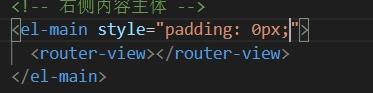

然后壁纸就：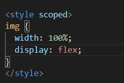

但是有个蛋疼的地方，就是壁纸下面还有一丝丝空白，看着不完美，查了半天原来

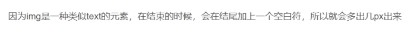 

解决方案如上图img格式：加个display:flex 就好

但是上面的方案导致了其他在el-main里显示的组件都会padding:0px

所以换了个方式，单纯给图片设置：

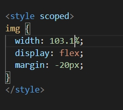 

**三、**

上面壁纸问题的后续有了完美解决方案：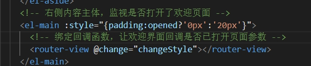

给整个router-view绑定了回调函数，并指定在welcome组件中emit这个函数

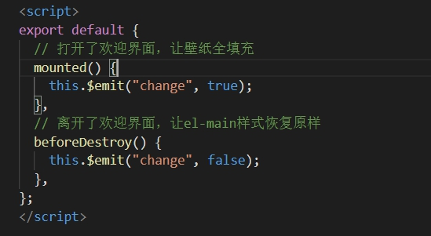 

从而调整父组件的padding

**四、**

下面我想做的是：点击欢迎界面，接着让菜单栏收回

菜单事件

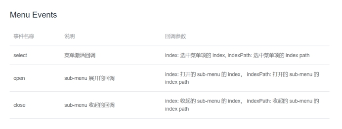 

事件是通过回调完成的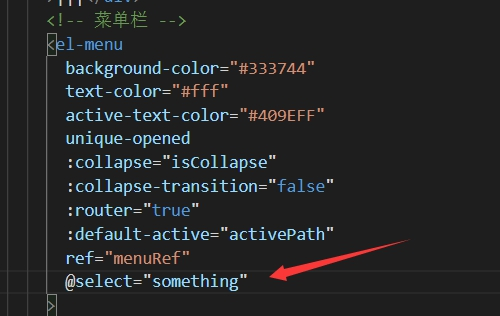

这里不用写括号，下面写函数时写两个参数接收就好

这里表现为当点击二级菜单时才会回调id，但不是我想要的，我要的是点击一级菜单就把id传回来给我

所以这里菜单事件是做不到的，于是我改成点击调用函数，然后调用事件方法

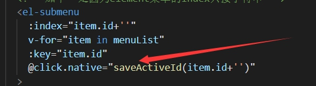 

注意这里要加native修饰符，否则不会生效，因为如果不加的话组件会以为click是它的回调事件

**五、**

与事件用法@不同，方法是通过ref调用

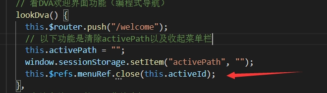 

在菜单栏那里写好ref再调用

**六、**

级联选择器：

如果不加全局样式样式，就会出现显示选择列表过长导致乱套了的现象

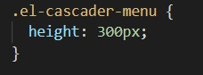 

methods里面，一定不要忘了加this，马虎很多次了

数字转字符串：加  ’ ’ 

字符串转数字：+   0

**七、**

loadsh第三方插件中的深拷贝和拷贝函数，拷贝出来的值都一样，但是深拷贝和原来不绝对相等，也就是obj1===obj2是false的；但是浅拷贝就相等

 

**八、**

看板娘官方仓库：

https://github.com/raoenhui/live2d-example

注意https://l2dwidget.js.org/lib/L2Dwidget.min.js

这个CDN引入的js才完全有效，百度出来的虽然能显示，但是没有对话框

我要做的：让看板娘只存在于登录界面，但是这个插件官方并没有给出销毁函数

解决方案：通过在login界面初始化看板娘，并且设置组件路由，如果离开了登录界面就用原生JS 的document API查询类名拿到DOM元素节点，设置样式为display:none隐藏

**九、**

Element UI如果要设置某个组件的特定细节样式，但是不知道这个类叫什么，可以F12调试看

​	这里差点步入歧途，我发现开发模式和线上部署到服务器之后的样式不一样，我以为是什么不可避免的BUG，正准备打开线上的样式F12调试一个一个对级联选择器中的各种小样式更改。

但是忽然我想到我开发模式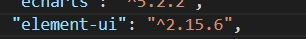

而线上模式我为了减少打包体积，用的CDN引入，并且版本还是2.15.7的。然后我马上把线上模式组件导入改成import，果不其然，样式正常了

教训：注意版本差别，哪怕只差0.0.1

同理，接下来也碰到了同样的问题：CDN引入的Vue.JS文件和开发模式的差了0.1个版本（2.6和2.5），导致部分页面的按钮不能显示出来

 

 