# 说明：

**这个笔记是我在21年6月份左右时配合学习Vue3所写的项目，但是由于某些原因只写到了一半，所记录的也都是些当时觉得有必要记录下来的问题**。

安装less时，直接使用官网的全局安装行不通，因为版本太高了，于是：

1、npm uninstall less-loader			//先卸载原来的
2、npm install less-loader@6.0.0

 

**一、**

路由：

VUE3路由跟二代有点区别，入口文件的写法：

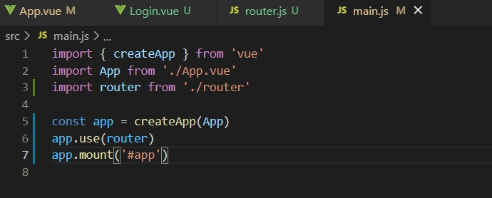 

 **二、**

路由文件的写法：

 

 **三、**

遇到一个align-items不能居中的问题，因为没有指定父元素的高度导致的：

https://blog.csdn.net/weixin_42878211/article/details/108296972

 **四、**

导入路径没有自动补全提示的问题：装个插件

https://blog.csdn.net/qq_34877350/article/details/107967929

注意要开启这个插件的这个选项，否则在引入CSS文件的时候不会生效，原理就是开启补全文件后缀功能：

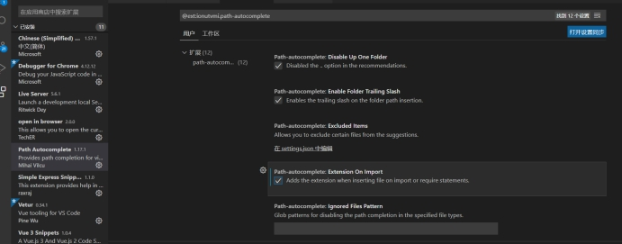 

 

 **五、**

Element plus组件库按需引入：

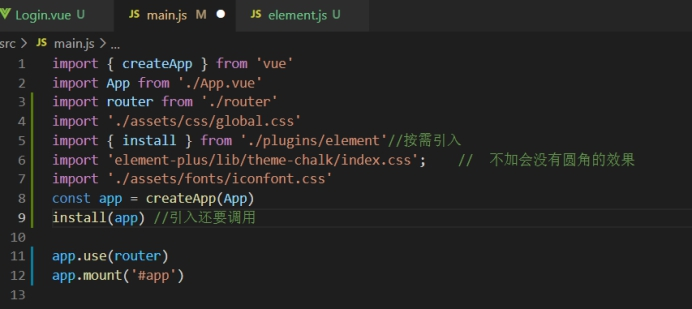 

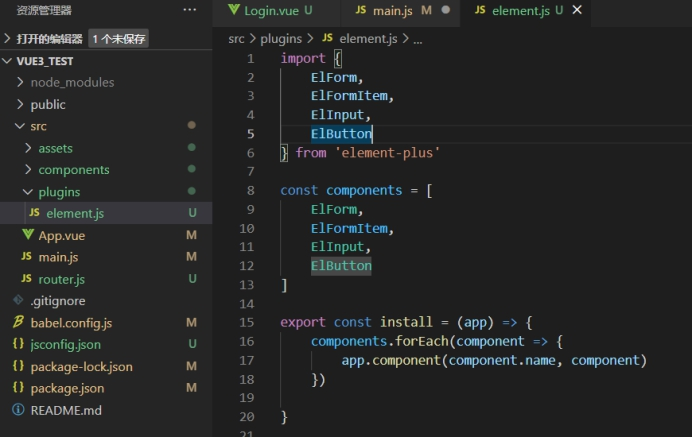 

 

**六、**

Vue3中的method是这么写的：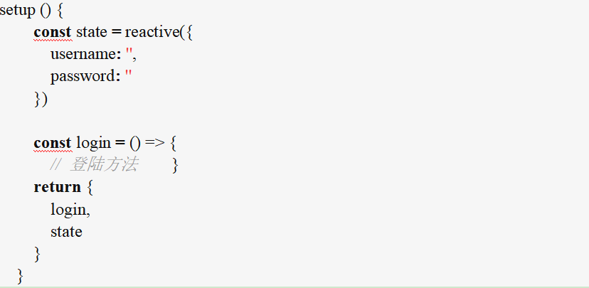

因为由于在执行setup函数时候，还没有执行created生命周期方法，所以在setup函数中，是无法使用data和methods的。

 

 **七、**

问题，表单重置：

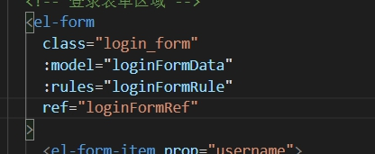 

表单头元素绑定好ref之后，在setup写逻辑：

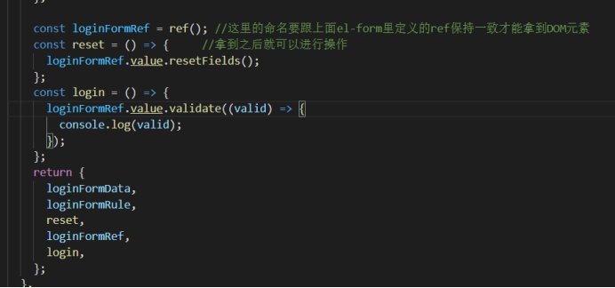 

登录功能：

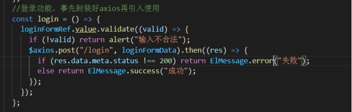 

存储TOKEN值并且跳转到主页，这里要先import路由文件：

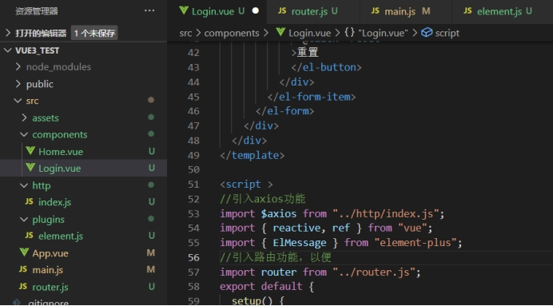 

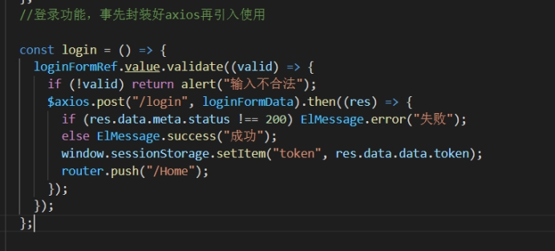 

 

拦截器设置：

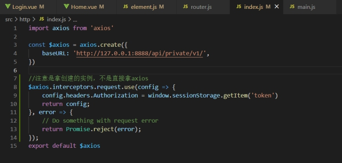 

 

**八、**

获取左侧菜单栏的时候碰到的问题：

直接用数组给定义的reactive对象直接赋值是不行的，这样会丢失响应式，V-for也识别不到

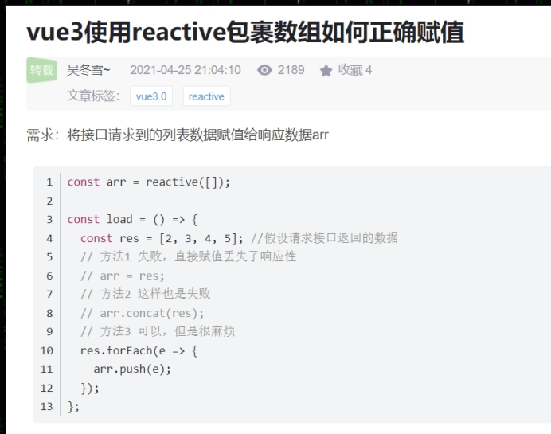 

注意！如果直接这么定义数组的话，这个数组确实能接收到数据，也确实存储了。但是VUE监测不到！因为它既不是ref定义也不是reactive定义，即它不是响应式数据，所以VUE监测不到，自然页面就显示不出效果

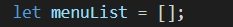 

同理，这个取反效果，也一定要ref，否则什么都不定义直接等于一个布尔值的话，取反是取反了，但是VUE监测不到

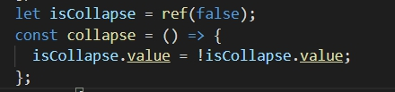 

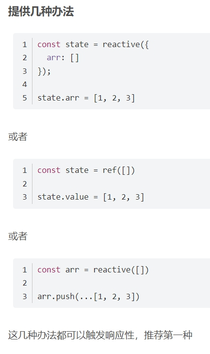 

 **九、**

 

V-slot:default缩写是#default，scope是自定义名字

官网对这个插槽的解释

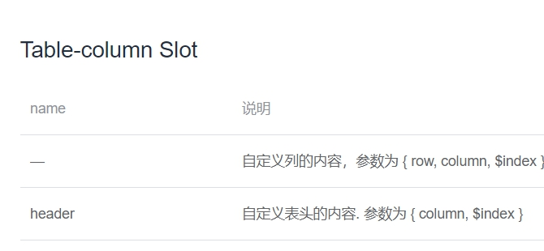 

 **十、**

碰到一个需要设置成中文的问题，因为element-plus内部默认是英文的。

而这时候我的版本是最新的：

 

又恰好最近官方做了点更新：

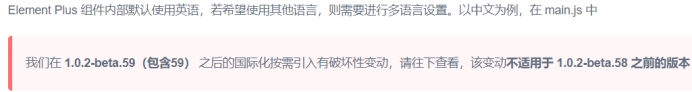 

导致我在网上找的设置中文的文章99%都没用，浪费了我极大的精力和时间

正确方法：https://blog.csdn.net/qq_45747841/article/details/119169126

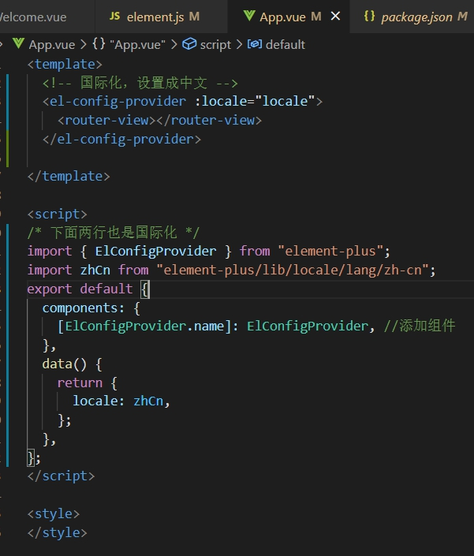 

 

 

 **十一、**

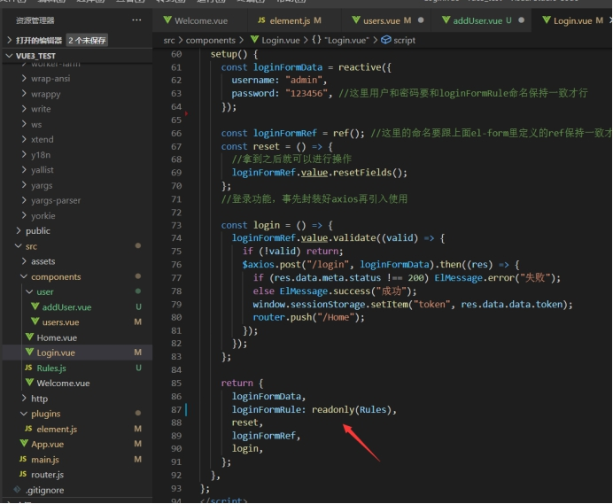 

这里发现检查规则很多组件都在用，干脆把它单独拿出来了，用法就是这种A:B带冒号的写法，加个readonly意思是只读，不修改

 

小知识：导入子组件时，最好大写字母开头，这样在模板里面显示子组件标签的颜色才会是绿色

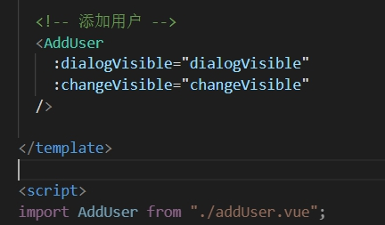 

 

 **十二、**

又是粗心大意，这个错误浪费了我一个晚上的时间

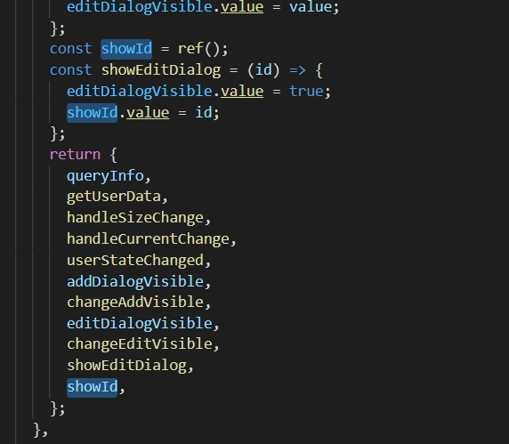 

这个错误主要原因是showId定义了之后，紧接着在下面函数里就使用了，导致这个变量不是暗色的，我便误以为这个变量已经return出去了。

 

 **十三、**

子组件监听props：

鉴定props的多个值

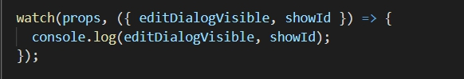 

鉴定一个值：

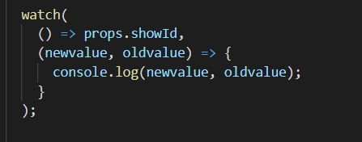 

 

两个参数都是可选的，所以也可以这么写：

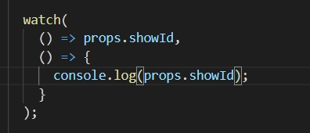 

 **十四、**

XXXXX' is constant，碰到这种问题一般都是直接跟响应式对象直接赋值的关系

今天碰到的问题就是这个，有一下几种方式解决：

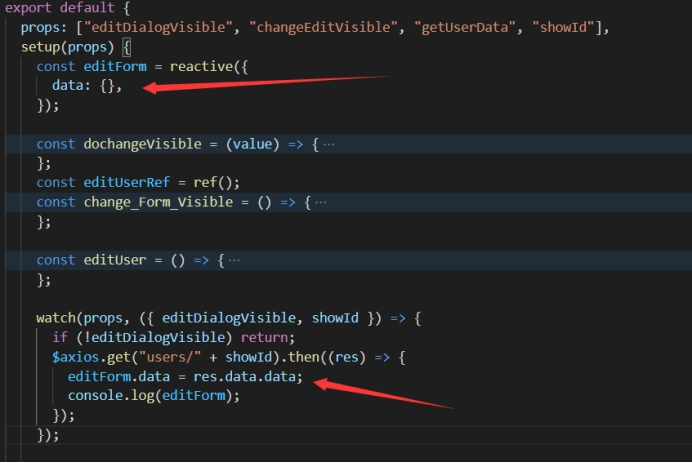 

给reactive里面再加一个对象，意思就是不直接赋值给reactive，而是赋值给reactive里面的一个对象，这样就不会触发赋值错误，注意上面表单的使用也要是这样设置：

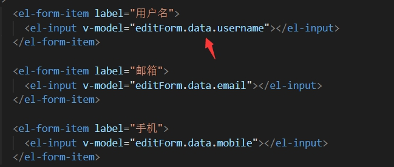 

另一种方法就是用ref，这样目前觉得比较简单：

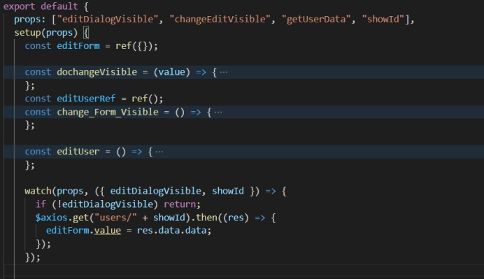 

 

 

 

 **十五、**

碰到个傻逼问题：DevTools failed to load source map: Could not load content for

Console.log出现这个黄色警告，对代码没影响，但是看着很恶心，网上说的方法都没用，其实重启一下浏览器就解决了。其实就是安装在谷歌浏览器上的VUE调试插件引起的

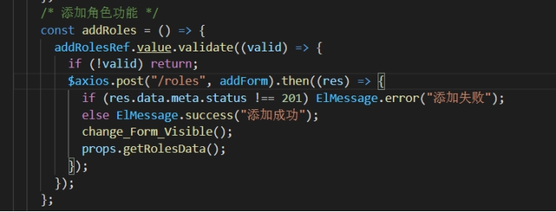 

设计到更新列表的操作，尽量放到then里面，因为发现有的VUE文件不放到里面的话，页面不会及时刷新