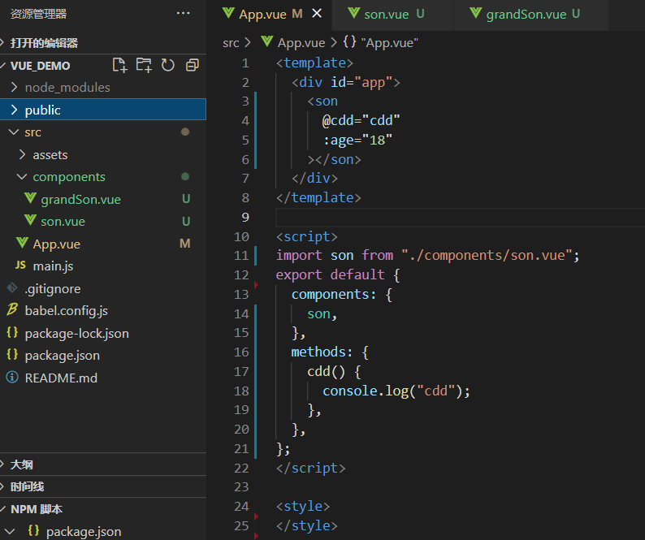
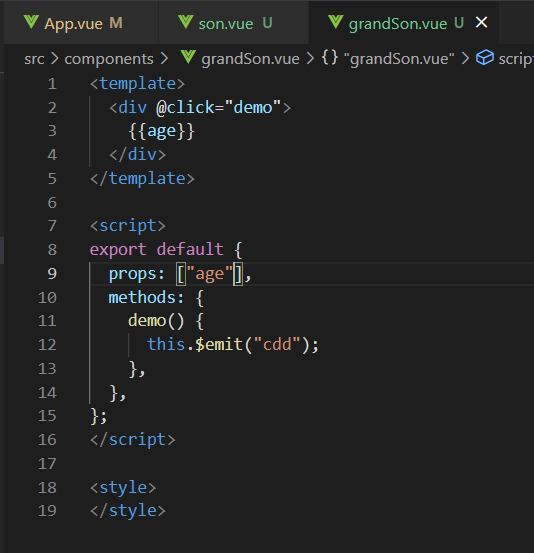

# 过滤器

Vue.js 允许你自定义过滤器，被用作一些常见的文本格式化。由"管道符"指示
`{{data|methods}}`，也可以再添加methods，用	|	间隔。添加之后它们之间的执行顺序是从左到右的：

# v-model

v-model 指令用来在 input、select、textarea、checkbox、radio 等表单控件元素上创建【双向数据绑定】，
根据表单上的值，自动更新绑定的元素的值。
【v-model修饰符】：
一、.lazy：      在默认情况下， v-model 在 input 事件中同步输入框的值与数据，但你可以添加一个修饰符 lazy ，
		       从而转变为在 change 事件中同步：
	`<input v-model.lazy="msg" >`	//效果为等输入完毕后点击其他地方才会更新

二、.number：当你需要用数据作运算的时候，要把他转化为为number类型，因为v-model默认是string类型：
	`<input v-model.number="age" type="number">`

三、.trim：      如果要自动过滤用户输入的首尾空格，可以添加 trim 修饰符到 v-model 上过滤输入：
	`<input v-model.trim="msg">`

复选框如果是多个则绑定到同一个数组：
`<input type="checkbox" id="runoob" value="Runoob" v-model="checkedNames">`
`data: {
    checkedNames: []
  }`

# $listeners和$attrs

用处：组件想要用到它的祖上组件绑定给它的子组件的属性或者事件时，通常的方法就是无限的写props一代一代的传下去

但是有了这两个属性后就不用了，直接在祖上组件的子组件（也就是第二代组件）上写这两个属性之后，往后的组件就可以直接调用祖上组件所绑定给子组件的东西了

例子：

这里是父给子绑定了一个方法和一个属性，子组件确实可以直接调用，但是孙组件就不行了，更不用说往后的后代组件了

所以这时候给子组件写上 `v-on="$listeners"`  ` v-bind="$attrs"`：

这时，往后的所有后代都能直接用祖上组件所绑定的事件和方法了：

