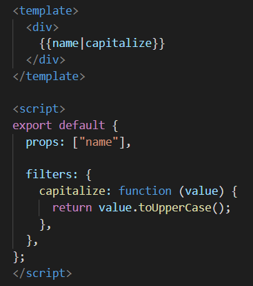
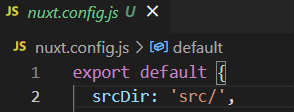
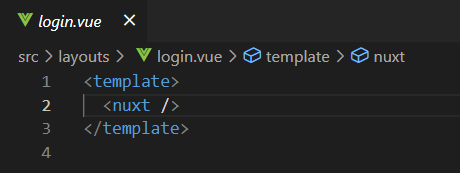

# 过滤器

Vue.js 允许你自定义过滤器，被用作一些常见的文本格式化。由"管道符"指示
`{{data|methods}}`，也可以再添加methods，用	|	间隔。添加之后它们之间的执行顺序是从左到右的：




# v-model

v-model 指令用来在 input、select、textarea、checkbox、radio 等表单控件元素上创建【双向数据绑定】，
根据表单上的值，自动更新绑定的元素的值。
【v-model修饰符】：
一、.lazy：      在默认情况下， v-model 在 input 事件中同步输入框的值与数据，但你可以添加一个修饰符 lazy ，
		       从而转变为在 change 事件中同步：
	`<input v-model.lazy="msg" >`	//效果为等输入完毕后点击其他地方才会更新

二、.number：当你需要用数据作运算的时候，要把他转化为为number类型，因为v-model默认是string类型：
	`<input v-model.number="age" type="number">`

三、.trim：      如果要自动过滤用户输入的首尾空格，可以添加 trim 修饰符到 v-model 上过滤输入：
	`<input v-model.trim="msg">`


复选框如果是多个则绑定到同一个数组：
`<input type="checkbox" id="runoob" value="Runoob" v-model="checkedNames">`
`data: {
    checkedNames: []
  }`


# `$listeners`和`$attrs`

用处：组件想要用到它的祖上组件绑定给它的子组件的属性或者事件时，通常的方法就是无限的写props一代一代的传下去

但是有了这两个属性后就不用了，直接在祖上组件的子组件（也就是第二代组件）上写这两个属性之后，往后的组件就可以直接调用祖上组件所绑定给子组件的东西了

例子：	

```
下面这个例子的父子关系：
<App>  
	<son> 
		<grandSon> 
		</grandSon>
	</son>
</App>
```


这里是父给子绑定了一个方法和一个属性，子组件确实可以直接调用，但是孙组件就不行了，更不用说往后的后代组件了

所以这时候给子组件写上 `v-on="$listeners"`  ` v-bind="$attrs"`：


这时，往后的所有后代都能直接用祖上组件所绑定的事件和方法了：


# 服务端渲染

## Nuxt.js

Nuxt.js 是一个基于 Vue.js 的通用应用框架，重点是实现了服务端渲染

创建：`npx create-nuxt-app [name]`

Nuxt.js 会依据 `pages` 目录结构自动生成模块的路由配置。


### 电商后台管理项目迁移到`nuxt`过程：


关闭`eslint`语法检查，注释掉`nuxt.config.js`中的这一配置项


目录下新建一个`src`文件夹，保持与`vue`项目目录的一致性会顺眼一点，新建时发现有的文件夹没有，新建一个就行了：


然后更改目录指引就可以了



发现`body`自带`margin`值，为了把它去掉，写一个全局样式引入，`@`代表上面定义的`srcDir`


按需引入`element`，一样要安装`babel-plugin-component`，只不过不用配置`babel.config.js`

然后在`nuxt.config.js`中引入：


这个按需引入的`element-ui`文件就是正常的按需引入写法

然后还需一个配置项：


`nuxt`里面是不需要有个`div`的`id`为`app`的；

发现自定义的样式被UI组件库覆盖了，暂时没有办法完美解决，只能通过`!important`一个个给自定义样式全部加上解决；


`layouts`文件夹是布局文件夹，里面用到`<nuxt>`标签，相当于`router-view`，当然在`nuxt` 里面也可以继续使用它，并且我这里就是继续使用，因为发现使用`<nuxt>`标签不能传入自定义事件；

可以配置多个布局文件，只需在页面中写明要引用哪个布局文件即可，写法为：


因为我这个项目的主要页面都是显示在`home`组件中的`router-view`，所以这个设计写法就映射到了`nuxt`中的布局，于是乎要把`home`组件中的代码改个名字，放到`layouts`目录下：


而登录界面就单独显示就好，因为一个`login`组件就是一整个页面：



不要忘了在`login`组件里面写上` layout: "login"`


因为`nuxt`是自动完成路由功能的，所以如果想要自定义路由，得在`nuxt.config.js`中定义：


暂时没有办法保持原页面目录结构，只能把页面组件全部剪切到`pages`目录下


