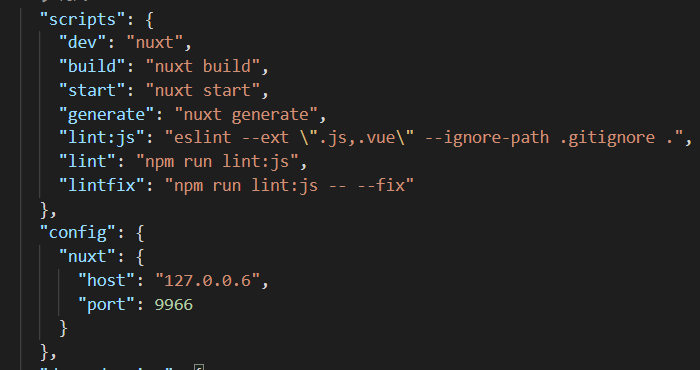
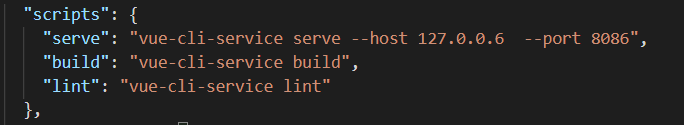

npm install name -save-dve 简写（npm install name -D） 自动把模块和版本号添加到devdependencies。开发环境中要用到的	

npm install name -save 简写（npm install name -S） 自动把模块和版本号添加到dependencies。生产环境中要用到的

换国内资源链接：
npm config set registry https://registry.npm.taobao.org
检查是否换了：
npm config get registry

清除缓存：npm cache clean --force

开发模式项目启动时指定地址和端口号，注意有些端口号是和浏览器自带冲突的

在`nuxt`项目中：

在`vue`项目中：

