# 原生微信小程序基础

## 基础结构

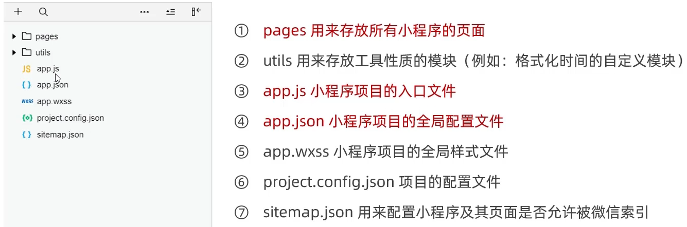

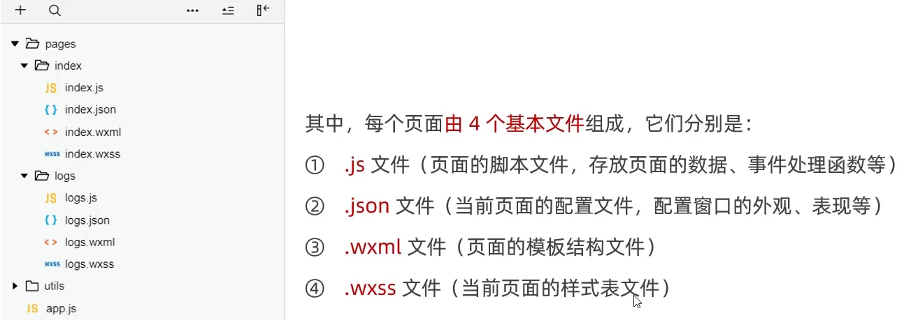

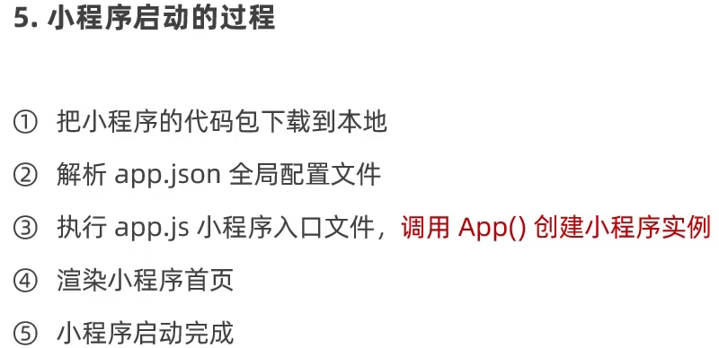

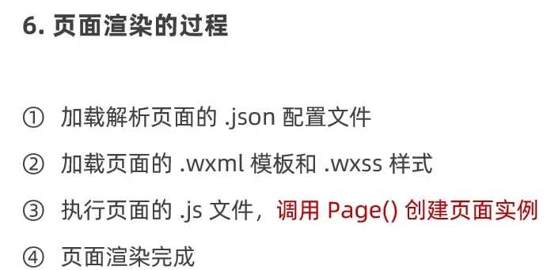

## 基础知识

页面onShow生命周期函数比onReady优先级高

新建页面可直接在app.json中新建，这样会自动生成应有的文件

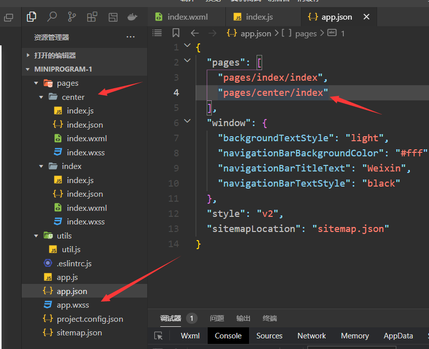

循环遍历一个数组的对象：item这个词是默认写法，当然也可以更改，写法：wx:for-item="person"

这样的话就是{{person.name}}；还有个默认写法是index，即下标。同理也可更改这个写法

并且如果不绑定key的话会有个警告，但不是错误

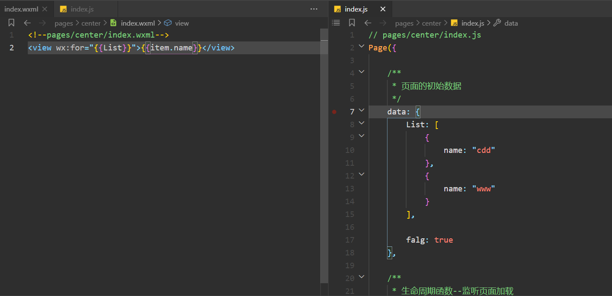

这和VUE写法有点不一样：

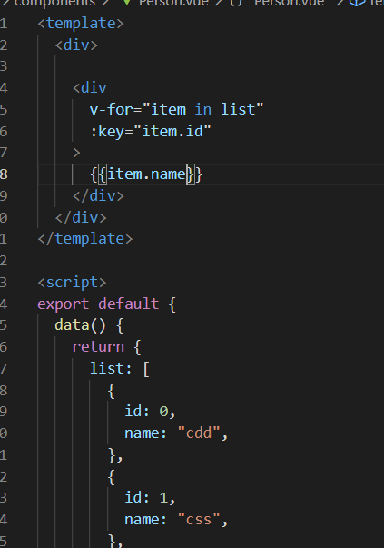

标签<block>：只是一个包裹性的容器，本身不会在页面渲染出任何东西

以下意思为循环三遍输出

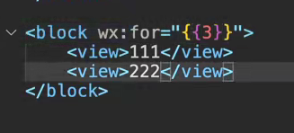

小程序没有click，取而代之是bindtap：

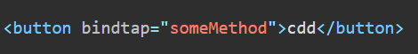

this.setData ( {  } ) 

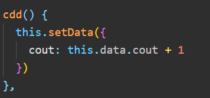

`this.setData` 函数用于将数据从逻辑层发送到视图层 （异步），同时改变对应的 `this.data` 的值（同步）。

小程序里面不能在绑定函数的同时传递参数，得加个参数表示，data-参数名

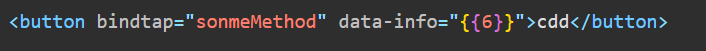

然后可以在方法中用形参event表示出来：event.target.dataset中取到参数

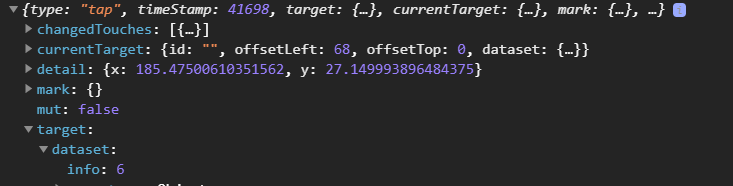

input标签则通过bindinput绑定方法，方法里面event.detail.value获取最新的输入框数据，

 

相当于v-show和v-if：

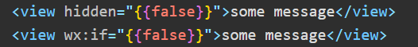

**rpx**：把所有设备的屏幕在宽度上等分为750份

**window配置项：**

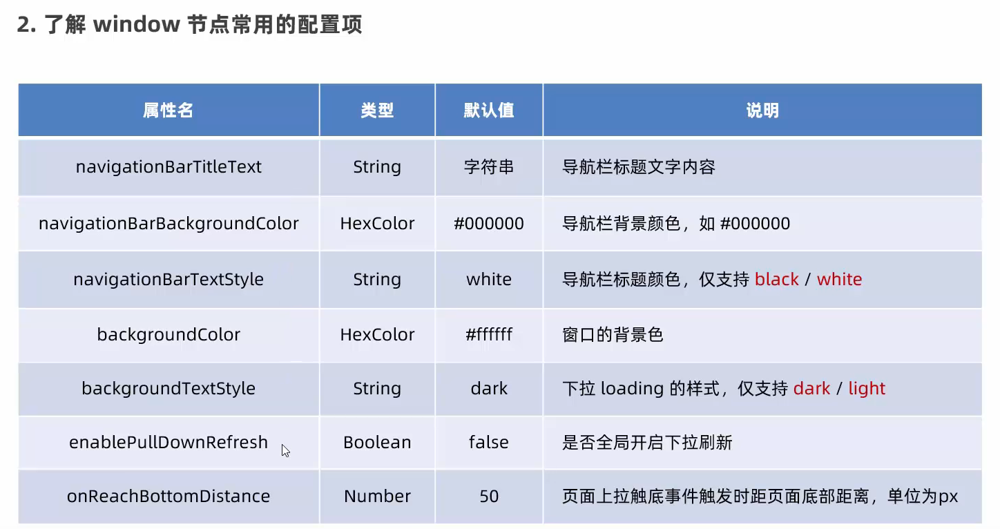

**tabBar：**

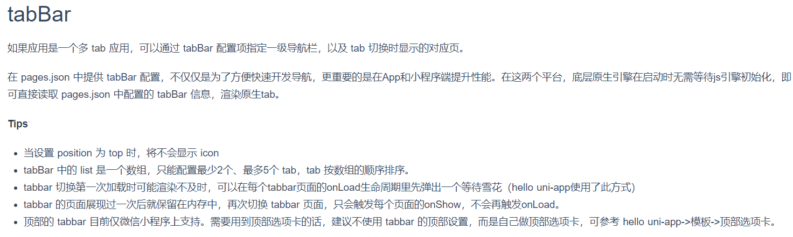

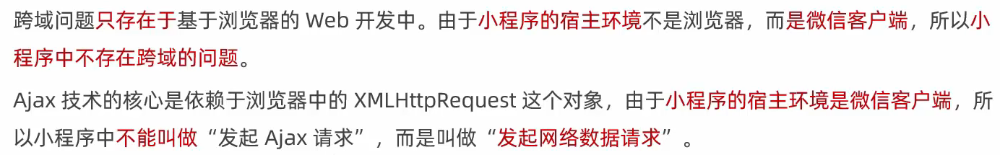

**navigator导航组件**

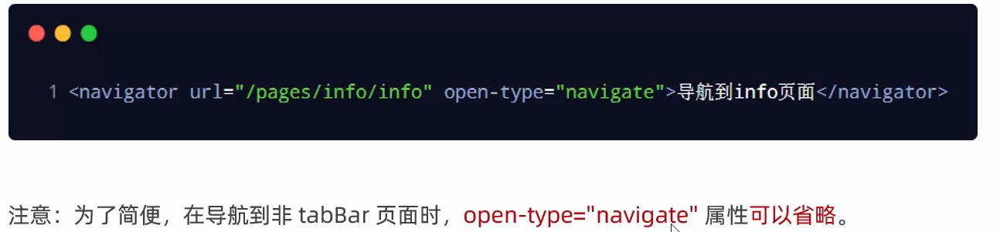

------

# **uni-app**

## 基础

CTRL+B快速关闭文件栏

本人习惯：每个编译器必改的快捷键：

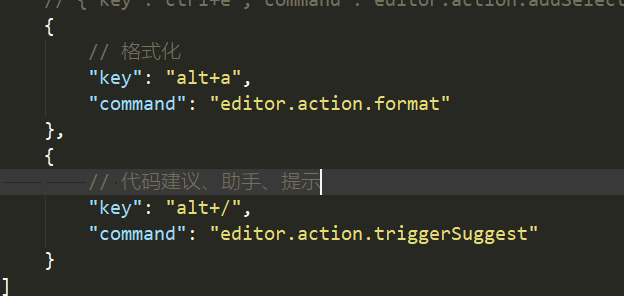

HbuildX 写uni-app装这几个插件检查语法，开启自动检验（然而没啥卵用，有时候无名无故报错，但是页面又不显示报错红色波浪线，这编译器的插件都很垃圾，比不上vscode）

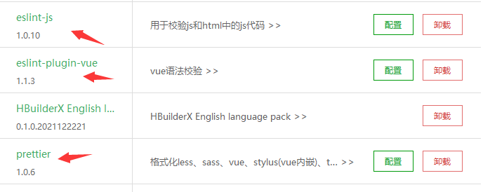

打开其他人的项目：

重新获取 APP ID：

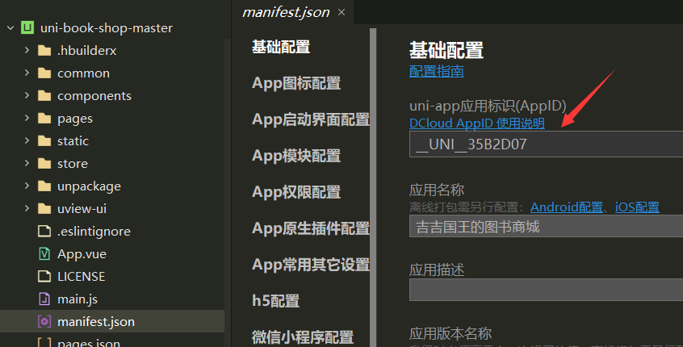

删除小程序ID运行即可

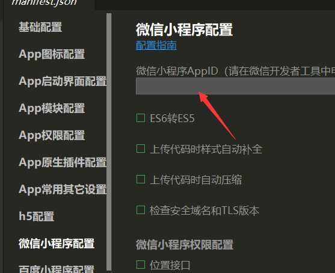

新建组件勾选这个：

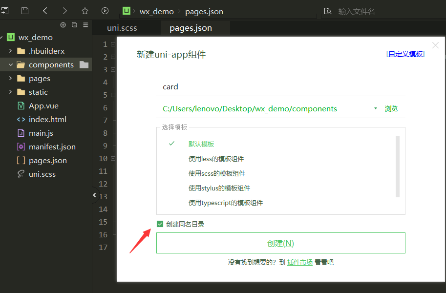

勾选这个，这样可直接在pages中引用，不用像VUE一样要注册、引入等

页面引入样式：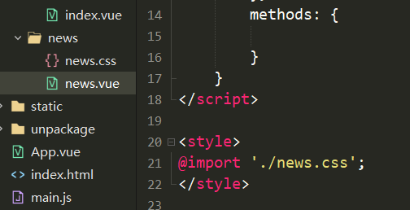

引入uviewhttps://ext.dcloud.net.cn/plugin?id=6682

装一代的话，新建一个uview-ui文件夹，再下载UI压缩包放进去解压，要手动开启这个，注意里面的内容，用不同的UI组件库就改对应的格式，像这个配置意思就是说匹配/uview-ui文件夹下的u-开头的组件

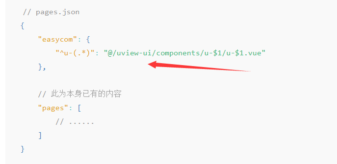

才能显示效果

HbuildX git  https://blog.csdn.net/qq_33769914/article/details/109529007这个插件好用

这编译器很垃圾，无论是插件的语法检查还是git功能都很垃圾

工具→JS代码块设置：习惯了在vscode输入log就弹出的代码助手，这里要自定义设置才有

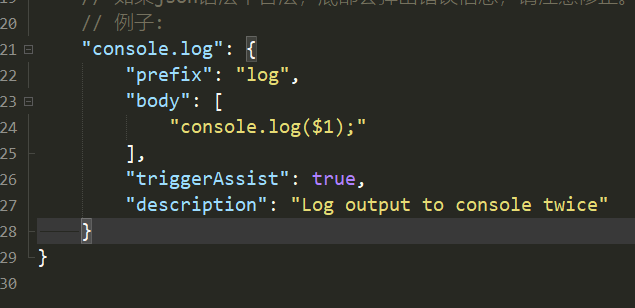

Vant UI

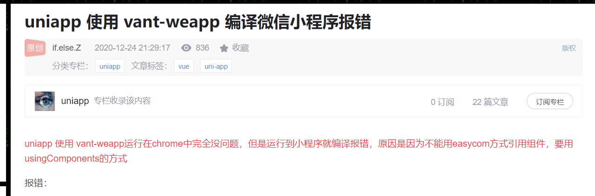

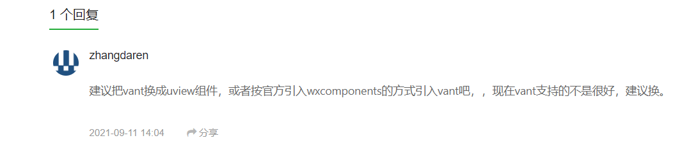

好像对uni-app不友好，只能通过手动导入，不能自动

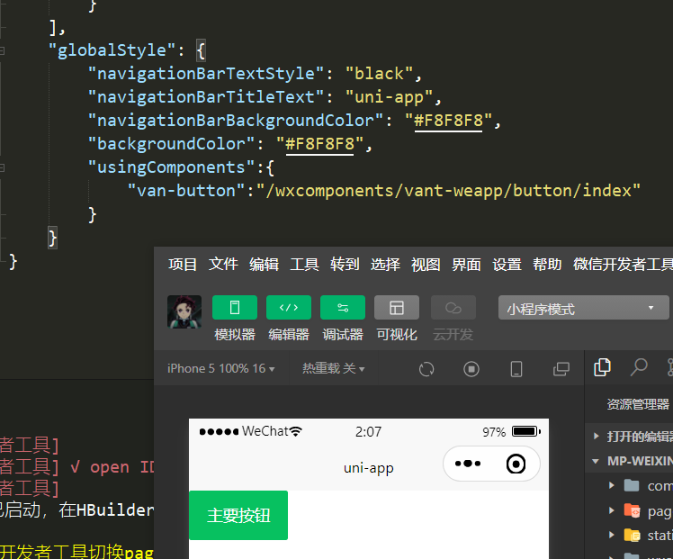

------

## 商城项目

UI库用uni-app官方自研发的uni-ui，官方说这是和uni-app配合性能最好的UI库

并且以后可以直接更新：

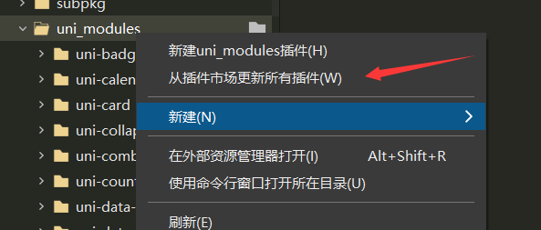

关闭下标[0]警告：要在uniapp修改，不然在微信修改还是会被uniapp自动生成覆盖

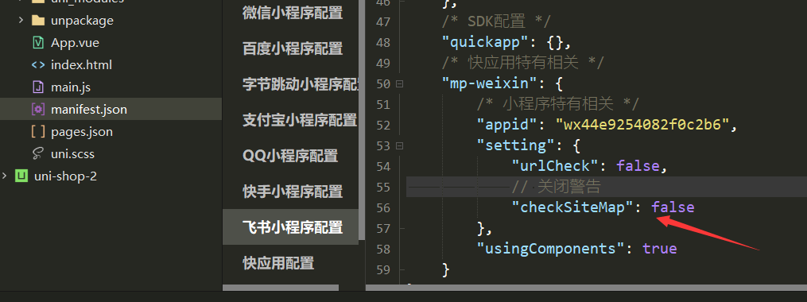

自定义添加对象原本没有的属性：

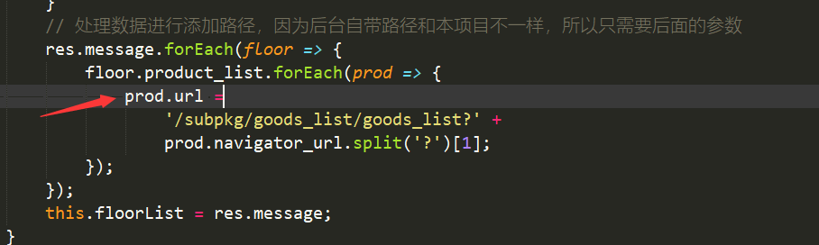

CSS布局知识：

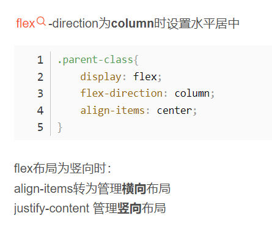

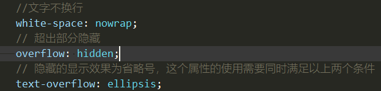

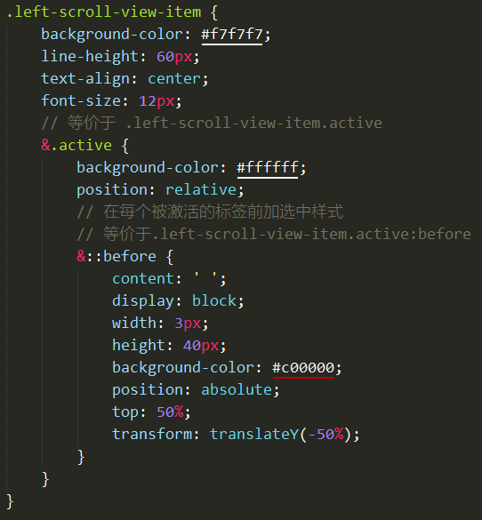

注：CSS3 引入 ::before  是为了将伪类和伪元素区别开来。浏览器也接受由CSS 2 引入的 :before 写法，其他伪元素也类推。。。

伪类元素要配合content属性一起使用

如果全局绑定的时候给第二个参数加上括号，代表挂载的时候会立即执行一次该本地方法

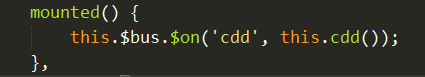

正常写法：

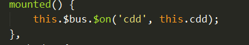

父组件调用子组件的方法：

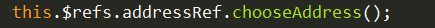

当然用全局事件总线也行：

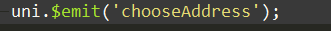

uni-app里，只有页面有生命周期，页面里面定义的子组件是没有生命周期的。所以会发现子组件里面写Onshow等方法是不奏效的

uni-ui可以很随意的修改组件的源代码：

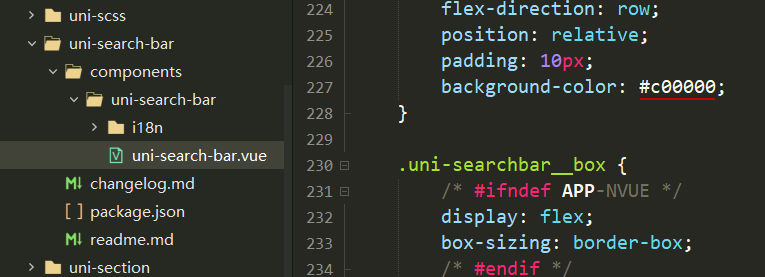

最后别忘了添加信任域名，这样才能在发布的时候成功发送网络请求

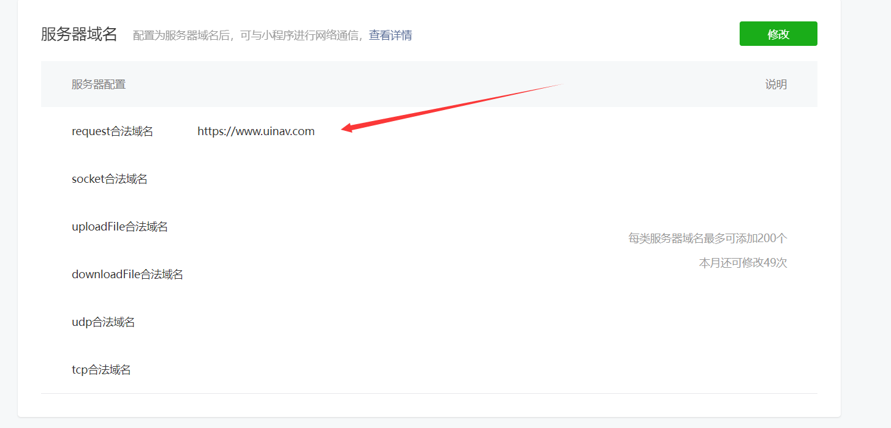

最后如果因为某些原因导致以个人开发者的身份发布失败的话，只能转为体验版给其他人体验了，而且这种方式还得拉为体验人员才能体验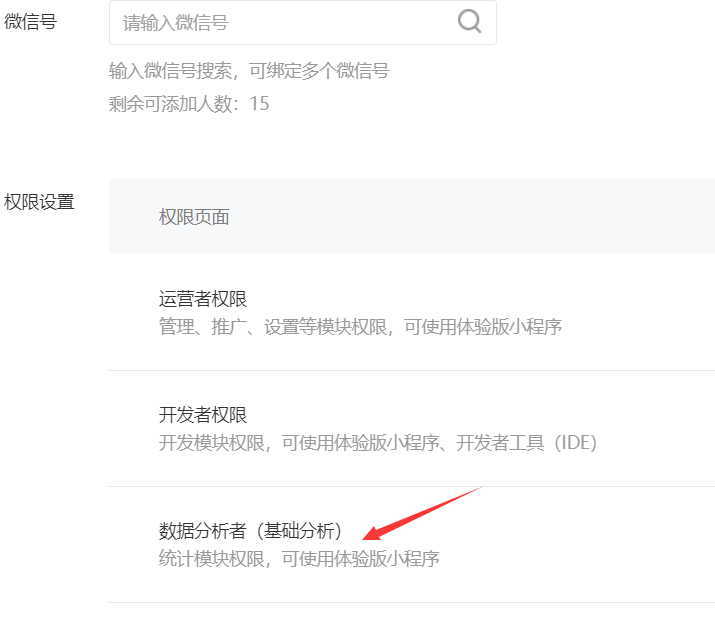
