# 原生微信小程序基础

## 基础结构


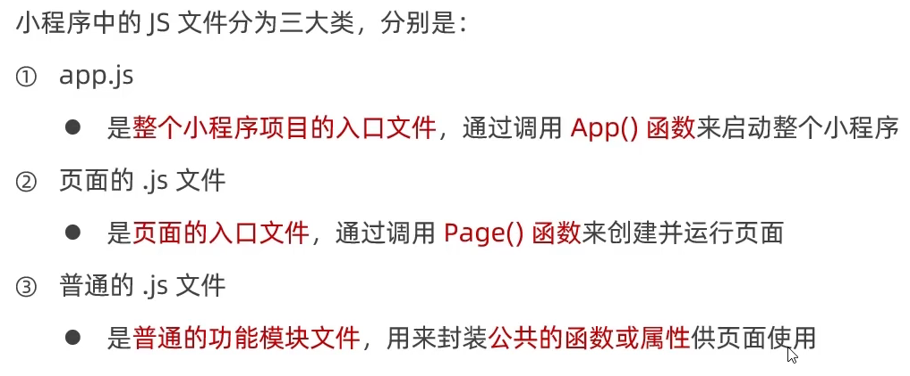


## 基础知识

页面onShow生命周期函数比onReady优先级高

新建页面可直接在app.json中新建，这样会自动生成应有的文件


循环遍历一个数组的对象：item这个词是默认写法，当然也可以更改，写法：wx:for-item="person"

这样的话就是{{person.name}}；还有个默认写法是index，即下标。同理也可更改这个写法

并且如果不绑定key的话会有个警告，但不是错误


这和VUE写法有点不一样：


标签<block>：只是一个包裹性的容器，本身不会在页面渲染出任何东西

以下意思为循环三遍输出


小程序没有click，取而代之是bindtap：


this.setData ( {  } ) 


`this.setData` 函数用于将数据从逻辑层发送到视图层 （异步），同时改变对应的 `this.data` 的值（同步）。


小程序里面不能在绑定函数的同时传递参数，得加个参数表示，data-参数名


然后可以在方法中用形参event表示出来：event.target.dataset中取到参数


input标签则通过bindinput绑定方法，方法里面event.detail.value获取最新的输入框数据，

 

相当于v-show和v-if：


### **rpx**

把所有设备的屏幕在宽度上等分为750份

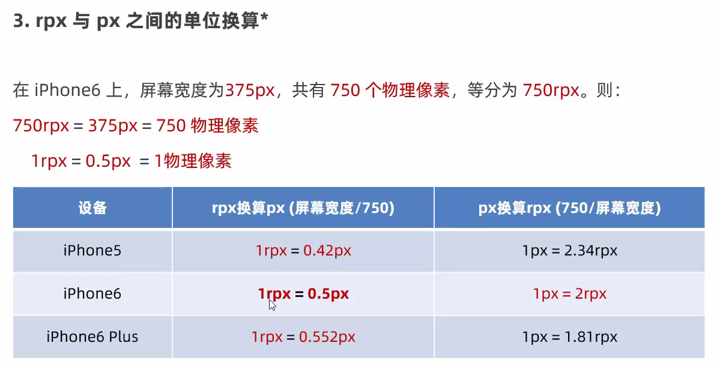


### **window配置项**


### **tabBar**


### **navigator导航组件**


还可以设置后退的导航形式，delta表示后退的层数（可以不写，默认是一层）：

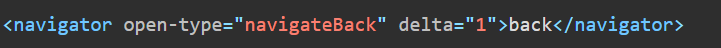

当然也可以不用这个组件，直接用API也行：

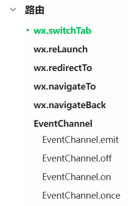


### **WXS**

与 JavaScript 是不同的语言，有自己的语法，并不和 JavaScript 一致

WXS不能调用JS中定义的函数，不能调用小程序的API

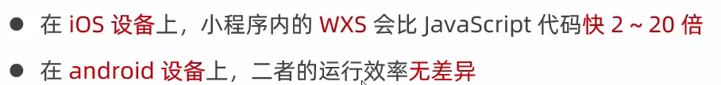

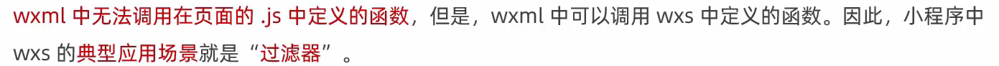

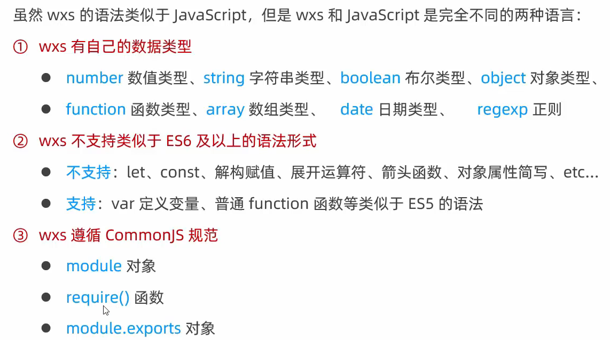

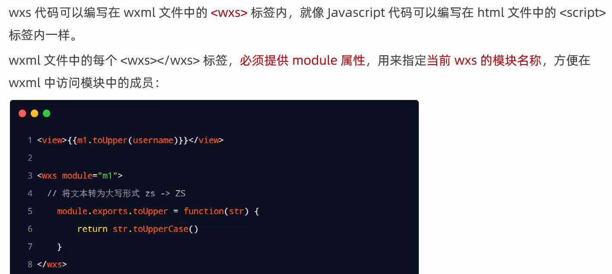


**外部引入：**

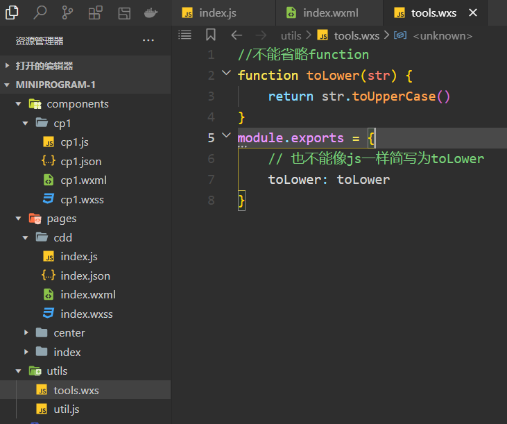

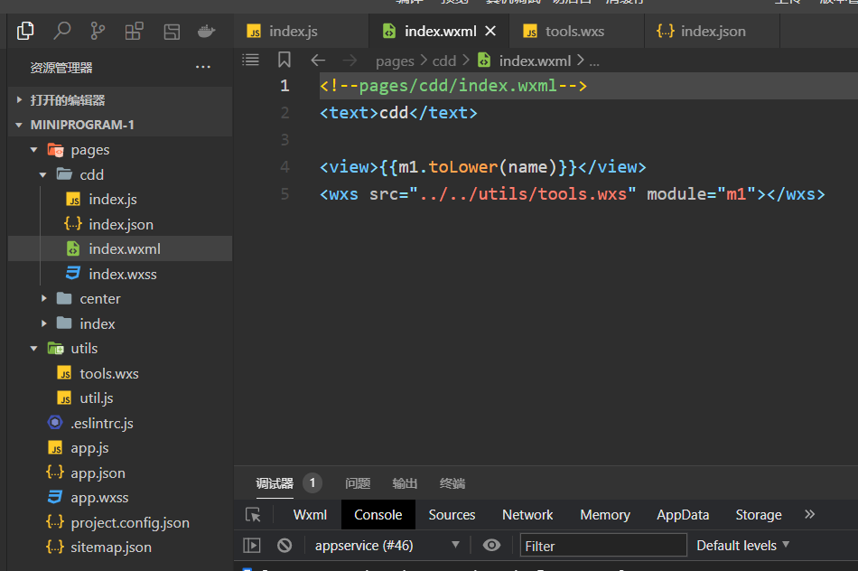


### 自定义组件

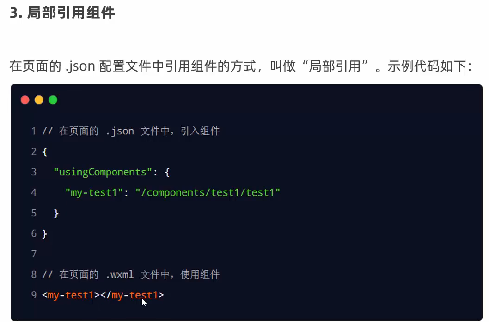

**全局引用则在app.json设置**


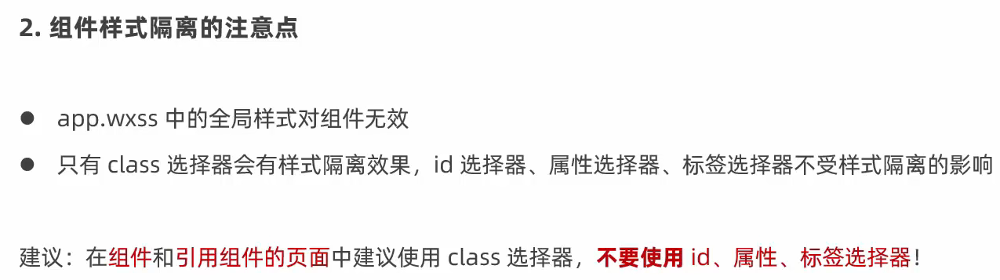

修改组件的样式隔离选项：

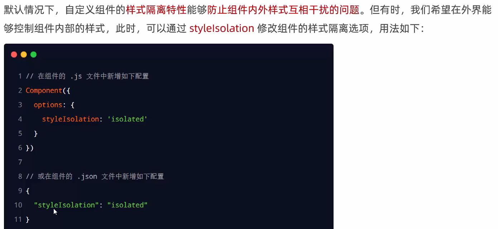

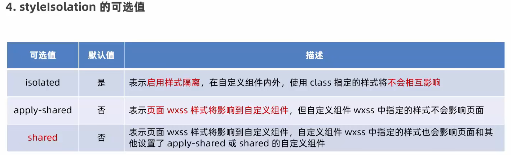

**properties：**

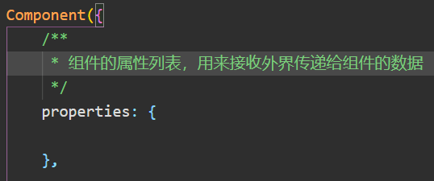

**`data`：组件数据；`properties`：组件属性**

```js
  properties: {
    myProperty: { // 属性名
      type: String,
      value: ''
    },
    myProperty2: String // 简化的定义方式
  },
```

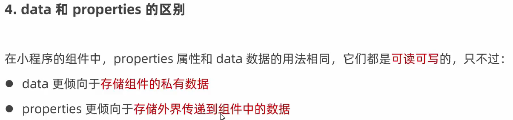

#### 生命周期

组件的生命周期，指的是组件自身的一些函数，这些函数在特殊的时间点或遇到一些特殊的框架事件时被自动触发。

其中，最重要的生命周期是 `created` `attached` `detached` ，包含一个组件实例生命流程的最主要时间点。

- 组件实例刚刚被创建好时， `created` 生命周期被触发。**此时还不能调用 `setData` 。** 通常情况下，这个生命周期只应该用于给组件 `this` 添加一些自定义属性字段。

- 在组件完全初始化完毕、进入页面节点树后， `attached` 生命周期被触发。此时， **`this.data` 已被初始化完毕**。这个生命周期很有用，绝大多数初始化工作可以在这个时机进行。

- 在组件离开页面节点树后， `detached` 生命周期被触发。此时适合做一些清理性质的工作

  用 `lifetimes` 字段声明：

```js
Component({
  lifetimes: {
    attached() {
      // 在组件实例进入页面节点树时执行
    },
    detached() {
      // 在组件实例被从页面节点树移除时执行
    },
  })
```

组件所在页面的生命周期，用`pageLifetimes` 字段声明：

```js
Component({
  pageLifetimes: {
    show() {
      // 页面被展示
    },
    hide() {
      // 页面被隐藏
    },
    resize(size) {
      // 页面尺寸变化
    }
  }
})
```

#### 插槽

默认情况下，一个组件的 wxml 中只能有一个 slot 。需要使用多 slot 时，可以在组件 js 中声明启用。

```js
Component({
  options: {
    multipleSlots: true // 在组件定义时的选项中启用多slot支持
  },
  properties: { /* ... */ },
  methods: { /* ... */ }
})
```

其他的关于插槽的用法和Vue一样 

#### 绑定事件

页面向子组件绑定事件

```html
<component-1 bind:myevent="onMyEvent"></component-1>
```

页面中：

```js
Page({
  onMyEvent(e){
    e.detail // detail里面是子组件传递的数据
  }
})
```

子组件中触发事件，这里步骤和Vue差不多，只不过用的不是`$emit`，换了个名字而已

```js
Component({
  properties: {cout:Number},
  methods: {
    onTap(){
      this.triggerEvent('myevent',{value:this.properties.cout})
    }
  }
})
```

#### 获取组件实例

类似于Vue中使用ref，只不过这里只能用id或者class选择器，加上`this.selectComponent`来实现

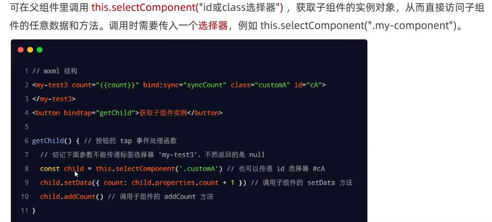

#### behaviors

`behaviors` 是用于组件间代码共享的特性，类似Vue中的mixins

每个 `behavior` 可以包含一组属性、数据、生命周期函数和方法。**组件引用它时，它的属性、数据和方法会被合并到组件中，生命周期函数也会在对应时机被调用。** 每个组件可以引用多个 `behavior` ，`behavior` 也可以引用其它 `behavior` 。

定义：

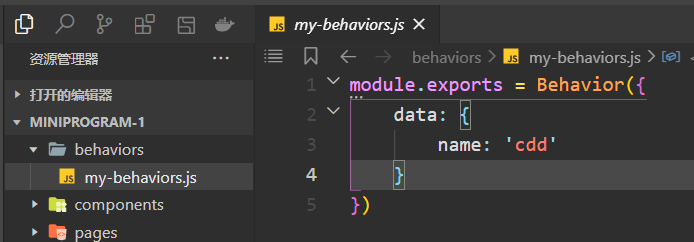

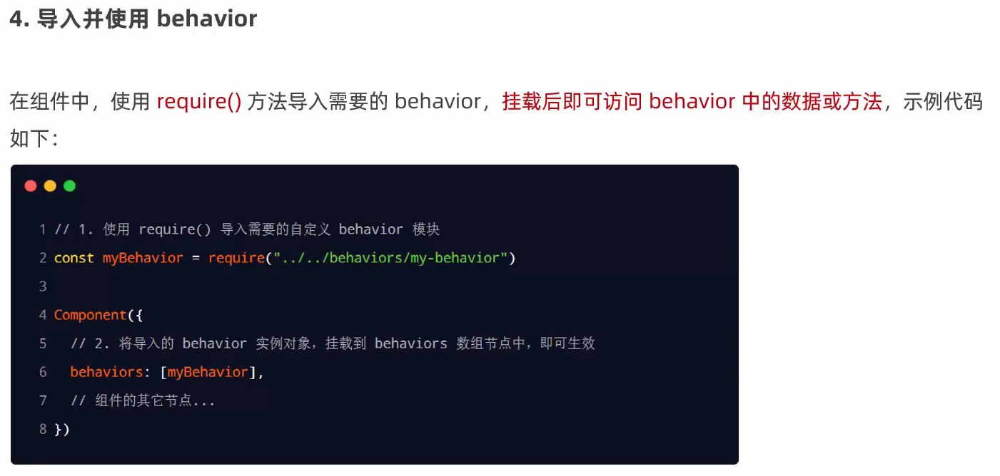

同名冲突（覆盖）规则

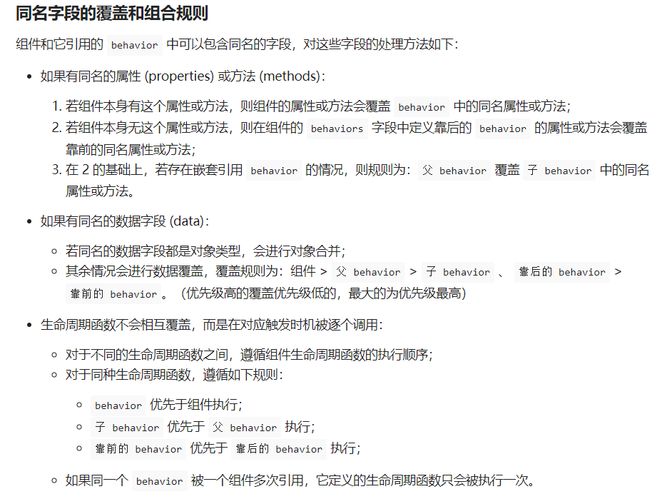

**总结：几乎和Vue中mixins冲突处理规则一模一样**


### 数据监听器

数据监听器可以用于监听和响应任何属性和数据字段的变化，类似于Vue中的watch

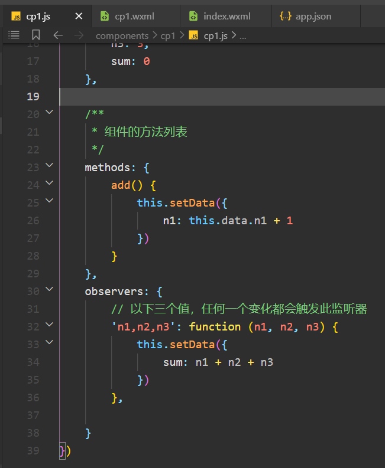

数据监听器支持监听内部数据的变化，可以同时监听多个：

```js
Component({
  observers: {
    'some.subfield': function(subfield) {
      // 使用 setData 设置 this.data.some.subfield 时触发
      // （除此以外，使用 setData 设置 this.data.some 也会触发）
    },
    'arr[12]': function(arr12) {
      // 使用 setData 设置 this.data.arr[12] 时触发
      // （除此以外，使用 setData 设置 this.data.arr 也会触发）
    },
  }
})
```

如果需要监听所有子数据字段的变化，可以使用通配符 `**` 

```js
observers: {
    'some.field.**': function(field) {
      // 使用 setData 设置 this.data.some.field 本身或其下任何子数据字段时触发
      // （除此以外，使用 setData 设置 this.data.some 也会触发）
      field === this.data.some.field //true
    },
  },
```

### 纯数据字段

有些情况下，某些 `data` 中的字段（包括 `setData` 设置的字段）既不会展示在界面上，也不会传递给其他组件，仅仅在当前组件内部使用。

此时，可以指定这样的数据字段为“纯数据字段”，它们将仅仅被记录在 `this.data` 中，而不参与任何界面渲染过程，这样有助于提升页面更新性能。

**属性(`properties`)也可以被指定为纯数据字段（遵循 `pureDataPattern` 的正则表达式）。**

指定“纯数据字段”的方法是在 `Component` 构造器的 `options` 定义段中指定 `pureDataPattern` 为一个正则表达式

```js
Component({
  options: {
    pureDataPattern: /^_/ // 指定所有 _ 开头的数据字段为纯数据字段
  },
  data: {
    a: true, // 普通数据字段
    _b: true, // 纯数据字段
  },
  methods: {
    myMethod() {
      this.data._b // 纯数据字段可以在 this.data 中获取
      this.setData({
        c: true, // 普通数据字段
        _d: true, // 纯数据字段
      })
    }
  }
})
```

```html
<view wx:if="{{a}}"> 这行会被展示 </view>
<view wx:if="{{_b}}"> 这行不会被展示 </view>
```


### 


------


# **uni-app**

## 基础

CTRL+B快速关闭文件栏

本人习惯：每个编译器必改的快捷键：


HbuildX 写uni-app装这几个插件检查语法，开启自动检验（然而没啥卵用，有时候无名无故报错，但是页面又不显示报错红色波浪线，这编译器的插件都很垃圾，比不上vscode）


打开其他人的项目：

重新获取 APP ID：


删除小程序ID运行即可


新建组件勾选这个：


勾选这个，这样可直接在pages中引用，不用像VUE一样要注册、引入等

页面引入样式：

引入uviewhttps://ext.dcloud.net.cn/plugin?id=6682

装一代的话，新建一个uview-ui文件夹，再下载UI压缩包放进去解压，要手动开启这个，注意里面的内容，用不同的UI组件库就改对应的格式，像这个配置意思就是说匹配/uview-ui文件夹下的u-开头的组件


才能显示效果

HbuildX git  https://blog.csdn.net/qq_33769914/article/details/109529007这个插件好用

这编译器很垃圾，无论是插件的语法检查还是git功能都很垃圾

工具→JS代码块设置：习惯了在vscode输入log就弹出的代码助手，这里要自定义设置才有


Vant UI


好像对uni-app不友好，只能通过手动导入，不能自动


------


## 商城项目

UI库用uni-app官方自研发的uni-ui，官方说这是和uni-app配合性能最好的UI库

并且以后可以直接更新：


关闭下标[0]警告：要在uniapp修改，不然在微信修改还是会被uniapp自动生成覆盖


自定义添加对象原本没有的属性：


CSS布局知识：


注：CSS3 引入 ::before  是为了将伪类和伪元素区别开来。浏览器也接受由CSS 2 引入的 :before 写法，其他伪元素也类推。。。


伪类元素要配合content属性一起使用


如果全局绑定的时候给第二个参数加上括号，代表挂载的时候会立即执行一次该本地方法


正常写法：


父组件调用子组件的方法：


当然用全局事件总线也行：


uni-app里，只有页面有生命周期，页面里面定义的子组件是没有生命周期的。所以会发现子组件里面写Onshow等方法是不奏效的


uni-ui可以很随意的修改组件的源代码：


最后别忘了添加信任域名，这样才能在发布的时候成功发送网络请求


最后如果因为某些原因导致以个人开发者的身份发布失败的话，只能转为体验版给其他人体验了，而且这种方式还得拉为体验人员才能体验
