# 基础

**一、**

先学会：服务器、域名基础：https://www.bilibili.com/video/BV18a4y1Y7e9

在腾讯云买了个轻量级应用服务器，加上域名不贵。总共50一年（后悔了，应该直接买三年的）

介绍【宝塔系统】：集成了各种设置，如数据库、Nginx等，现在不需要慢慢一一设置了，直接一键安装就好

然后安装宝塔系统

https://www.bilibili.com/video/BV1QY411p76N

接着各种设置

https://www.bilibili.com/video/BV1aV411n7SH/?spm_id_from=333.788.recommend_more_video.2

注意登入宝塔时要输入腾讯云API密钥，跟着提示设置就好

端口不能乱设置，有些会和浏览器自带的冲突。这里我选了6666刚和冲突了，导致宝塔进不去了，相关文章：

https://blog.csdn.net/qq_45464560/article/details/116884716

 

如果要改登录端口，改之前要在服务器安全组/防火墙那里放行要改的端口，然后在宝塔改就行了

**二、**

如果要添加二级域名，以设置多个网站，可根据以下步骤：

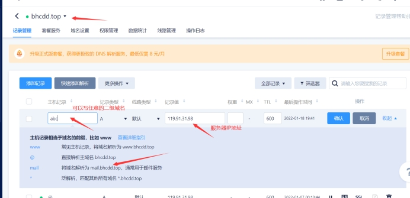 

接着设置宝塔，这个路径下新建文件夹，文件夹放的是你的网站文件：

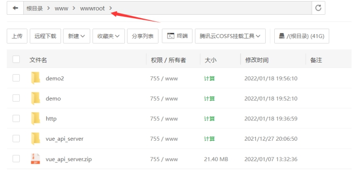 

接着设置添加站点，注意根目录要设置对路径：

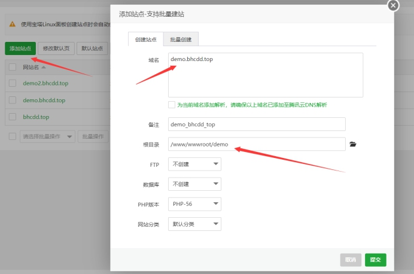 

 

**三、**

然后如果要设置多个二级域名指向同一网站，可以：

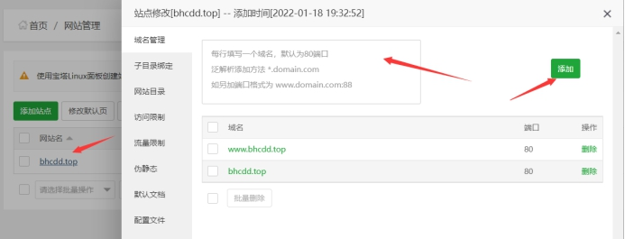 

写这个的原因，是因为我发现工信部查我的域名，上面显示的网站是有www前缀的，而有这个前缀不能访问我的网站。原因是我之前没在腾讯云DNS解析设置www

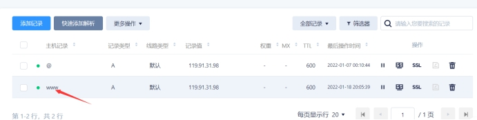 

注意：

1、腾讯云DNS解析（在哪里买的服务器哪里就会有免费的DNS解析服务给你【大概吧】）

2、宝塔设置

两个步骤少一个都不行（设置了之后腾讯那边解析可能有些延迟，立即生效不了，等一下就好）

 

宝塔安装SSL证书：https://cloud.tencent.com/document/product/400/50874

【**我不会**】！！！

折腾了半天发现这好像是要在app.js文件修改相关配置开启HTTPS的（也许吧）

修改后台API配置记得重启PM2管理器，而且我这里折腾的时候不知道什么时候PM2管理器里面配置好的服务器文件不见了，很奇怪

 

 

# **服务端用`cmd`**

 点击终端时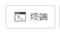

提示要ssh密码，这时安装一个插件就行了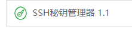

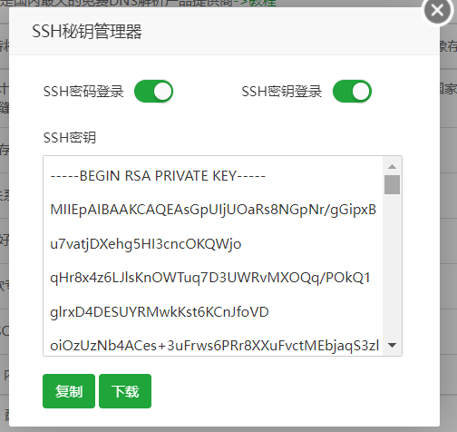

#  spring项目的打包和上线

## 前端打包处理

把网络请求路径改一下即可打包：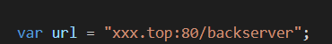

**前端发起的请求总是同域的，由nginx处理跨域就好**

**重点**是跨域处理：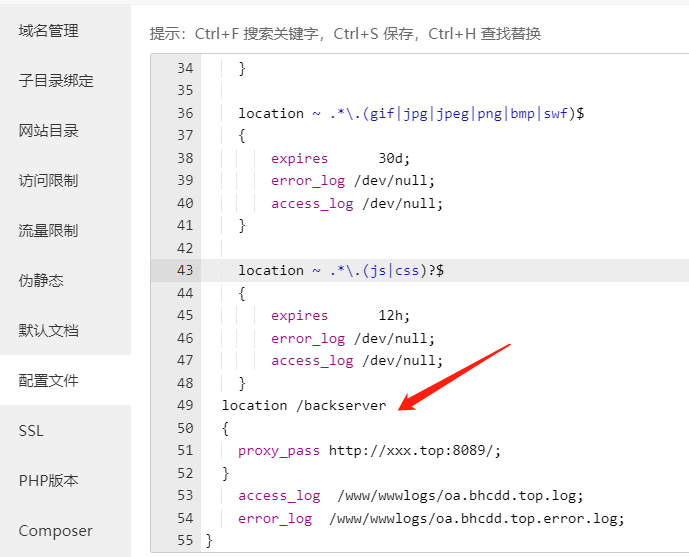

协议、域名相同，但是端口不同，80端口跨到8089端口，这个问题就是由nginx处理

## 上传数据库

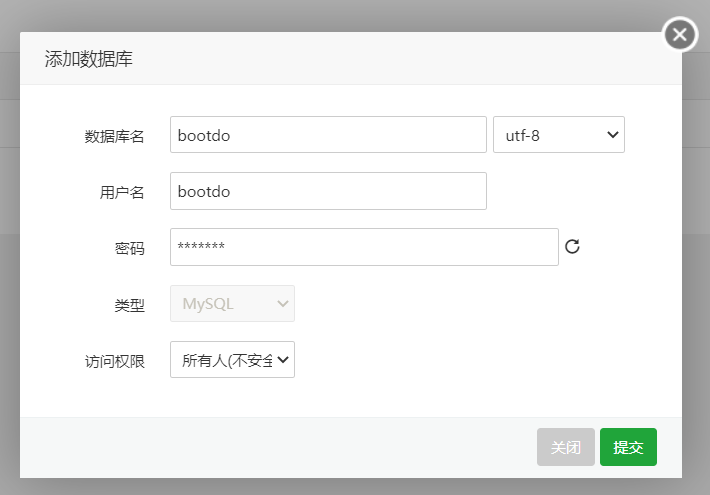

然后不要忘了**点击导入**，我这里有个坑就是忘了点击导入，结果启动后端的时候就报错说一堆表找不到

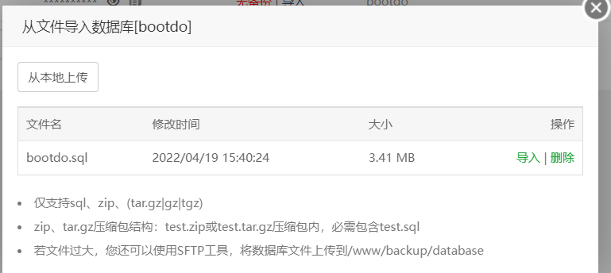

## 后端打包处理

确定好端口号和启动模式

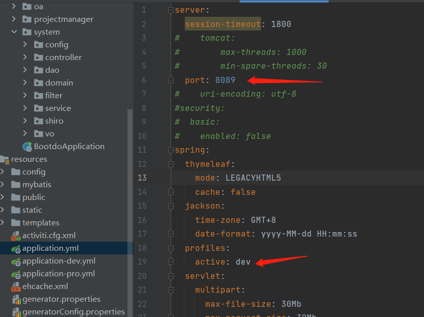

填写服务器的IP地址和数据库的用户名和密码（要和服务器的数据库设置保持一致）

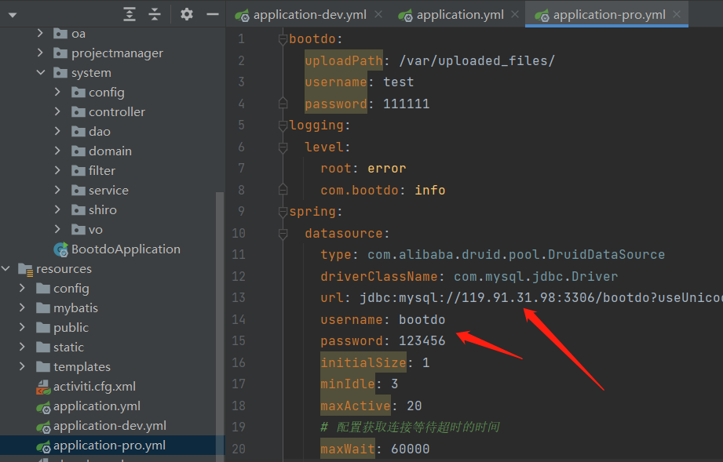

先清理掉旧的打包文件夹target，即可打包

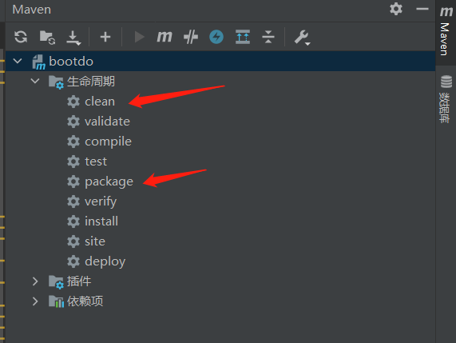

创建个文件夹把后端打包文件放进来

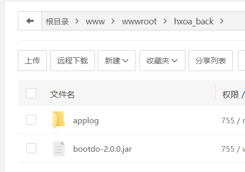

宝塔安装这个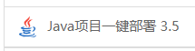，启动的时候它会让你安装容器，选择安装tomcat8（自带JDK1.8，看项目情况安装什么版本)。

然后添加项目，点击确定即可部署后台

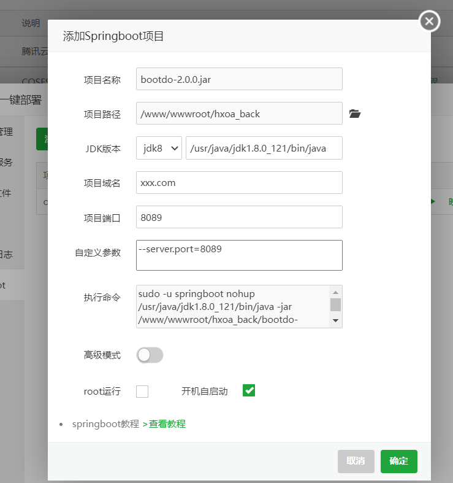

## 放行端口号

在安全菜单栏里面确保要用的端口被放行就好了，也可以上云服务器官网确认一下

